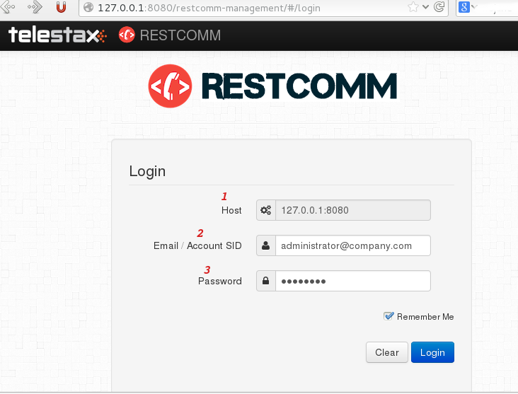
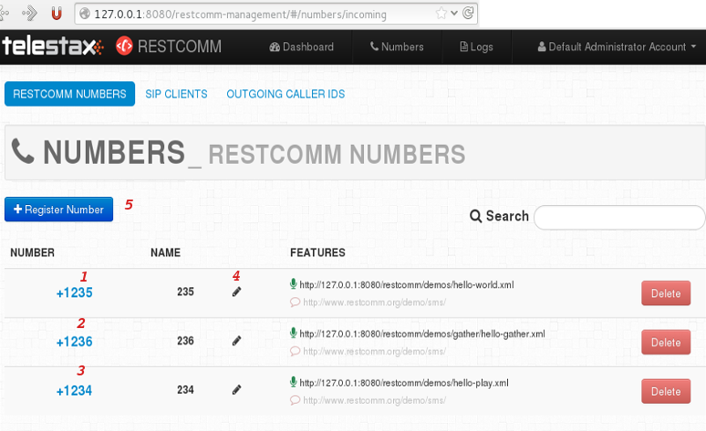

The admin user interface is a great way to perform repetitive Restcomm task in a orderly manner. Care has been taken to make the user experience intuitive for those new to the platform. In this chapter, you will learn how to use some of the features available to create Clients, Phone Numbers, Check Call Logs, Get Speech-to-Text Transcription and many more

= Login Interface

You need to make sure Restcomm is running before you can use the Admin User Interface. When you are running on a local install, open your web browser and go to this url http://127.0.0.1:8080/ . You will see a screenshot similar to the one below

*Login Interface*

[cols=",",options="header",]
|===================================================================================================
|Number |Description
|1 |Host on which Restcomm is running
|2 |You can log in using either the default email address or the default administrator's account SID
|3 |The default password attached to the administrator's account
|===================================================================================================

= Passwords, Sub Accounts Settings

You should always change the passwords of the default Administrator's Account when you are in a production environment. When you click on the Administrators Account at the top right corner of the window, as shown in the screenshot below, you will be able to change passwords and create Sub Accounts.

image:./images/restcomm-admin-ui-12.png[restcomm-admin-ui-12,width=300,height=196]

*Account Settings*

[cols=",",options="header",]
|==========================================================
|Number |Description
|1 |Shows the current Acount profile
|2 |You can create new Sub Accounts
|3 |Descriptive name of the user account
|4 |New password of the current logged in account
|5 |You can activate or suspend an account
|6 |There are three options, Trial, Basic and Full(default)
|7 |List of Sub Accounts
|==========================================================

= Dashboard

This is the default page where you can get an overview of your Restcomm Installation.

image:./images/restcomm-admin-ui-2.png[restcomm-admin-ui-2,width=300,height=250]

*Dashboard*

[cols=",",options="header",]
|================================================================================================================================================
|Number |Description
|1 |Account SID is the default used by the Administrator's account
|2 |The Auth Token is the password that is required for any Restcomm operation. You can click on the hidden button to reveal the hashed password.
|3 |The Debugger lets you troubleshoot any issues you might encounter using Restcomm
|4 |A quick way to get all the API exposed by Restcomm
|5 |Additional information about Calls parsed by Restcomm
|6 |Additional information about SMS parsed by Restcomm
|================================================================================================================================================

= Restcomm Numbers

This will show the default demo applications that come with Restcomm. When you start creating applications and attaching numbers, they will also be displayed on this page.

*Restcomm Numbers*

[cols=",",options="header",]
|======================================================================================================================================================================================================
|Number |Description
|1 |The number 1235 is attached to the hello-world.xml application. You must have configured VoiceRSS text-to-speech to use this application
|2 |The number 1236 is attached to a the Gather verb. It will ask you to enter a number and you can hear the number you enter. You must have configured VoiceRSS text-to-speech to use this application
|3 |The number 1234 plays a pre-recorded file.
|4 |This icon lets you edit the Name of the entry to a more descriptive one.
|5 |This button lets you create a new number that can be attached to a RCML
|======================================================================================================================================================================================================

[[register-number]]
= Register Number

When you click on the Register Number button, you will see a screenshot similar to the one below. This will allow you to create a new phone number that can be attached to a Restcomm application.

image:./images/restcomm-admin-ui-4.png[restcomm-admin-ui-4,width=245,height=300]

*Table Restcomm Numbers*

[cols=",",options="header",]
|================================================================================================================
|Number |Description
|1 |The field to enter the phone number.
|2 |This button will show advanced options if you want to add more features to the phone number like the VoiceUrl
|3 |The friendly name is any descriptive text for your phone number
|4 |See the Rest API link:[Chapter] for more information
|5 |See the Rest API link:[Chapter]for more information
|================================================================================================================

[[edit-update-number]]
= Edit Update Number

Editing a phone number can be done by clicking on the number, the screenshot below shows how you can edit the number 1235. You can change the VoiceUrl to which the number is attached.

image:./images/restcomm-admin-ui-5.png[restcomm-admin-ui-5,width=244,height=300]

*Edit Update Numbers*

[cols=",",options="header",]
|==============================================================================================
|Number |Description
|1 |You can link the phone number to a VoiceUrl application. See the REST API for more details.
|2 |You can link the phone number to a SMS application. See the REST API for more details
|3 |You can link the phone number to a USSD application. See the REST API for more details
|4 |Caller Id lookup requires a CNAM provier
|5 |You can save your changes or press close to discard the changes
|==============================================================================================

= SIP Clients

SIP Client is a feature that allows you to create a Restcomm profile that can be used for P2P or B2BUA calls. This will be empty until you create a new client. You can create a new client by clicking on the Resgister SIP Clent button.

image:./images/restcomm-admin-ui-6.png[restcomm-admin-ui-6,width=248,height=300]

*SIP Clients*

[cols=",",options="header",]
|=====================================================================================================================================
|Number |Description
|1 |The client name. (ex. alice or bob)
|2 |The password that will be used to when you want to register the client with restcomm
|3 |Use to open optional parameters windows
|4 |This can be the full name of the client (ex.Alice Wilkinson) or any descriptive name
|5 |This is where you specify the VoiceUrl that is automatically invoked when the client is called. See the REST API for more details.
|6 |See the REST API for more details.
|7 |This will validate your changes and create the client.
|=====================================================================================================================================

= Outgoing CallerId

Will be available in future release

[[logs]]
= Logs

The log section gives you an overview of current Restcomm system information.

[[logs---calls]]
== Logs - Calls

A list of all calls that have been processed by Restcomm

image:./images/restcomm-admin-ui-7.png[restcomm-admin-ui-7,width=300,height=121]

[[logs---messages]]
== Logs - Messages

A list of all SMS messages that have been processed by Restcomm

image:./images/restcomm-admin-ui-8.png[restcomm-admin-ui-8,width=300,height=124]

[[logs---recordings]]
== Logs - Recordings

A list of all Recordings (using the Record Verb) that have been processed by Restcomm

image:./images/restcomm-admin-ui-9.png[restcomm-admin-ui-9,width=300,height=123]

[[logs---transcriptions]]
== Logs - Transcriptions

A list of all Transcriptions that have (using the Transcribe parameters of the Record Verb) that have been processed by Restcomm.

image:./images/restcomm-admin-ui-10.png[restcomm-admin-ui-10,width=404,height=163]

[[logs---notifications]]
== Logs - Notifications

A list of all Notifications received by Restcomm.

image:./images/restcomm-admin-ui-11.png[restcomm-admin-ui-11,width=300,height=122]
