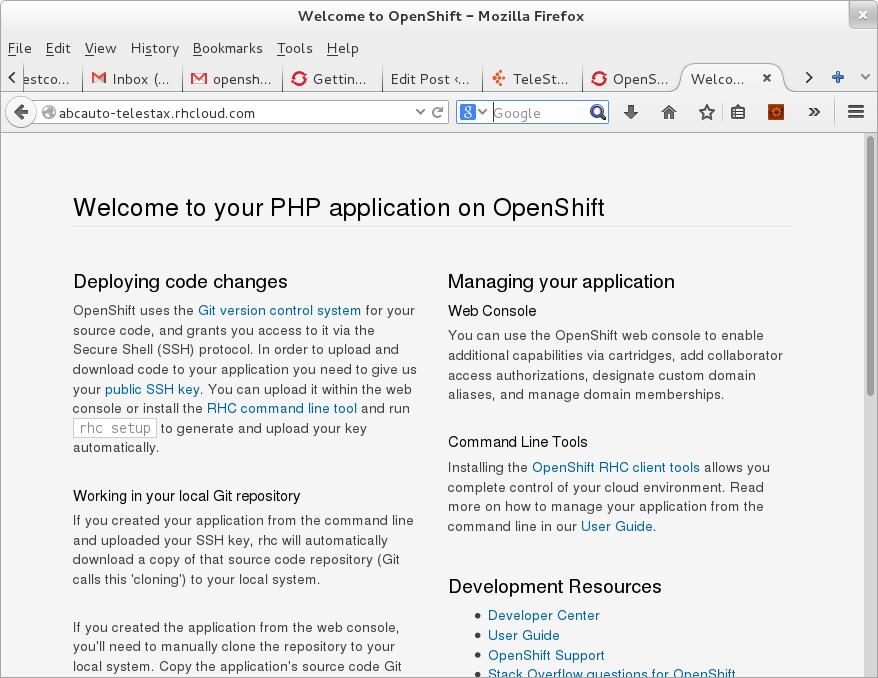

Since the introduction of *Restcomm Visual Designer(RVD)* as part of Restcomm-Connect, a lot of developers have seen rapid development cycle. Telestax also introduced *Restcomm Application Store(RAS)* to further enhance developer'ss user experience. This is a great way to keep the momentum on creating innovative communications applications powered by Restcomm. It will also a way to ensure that developers get the appropriate remunerations for their effort. 

The initiative has spurn a need for more complex application to be made available within RAS. In order to achieve that, the use of the feature rich RVD External Services is required. In this tutorial, we shall see how developers can deploy their apps built with Restcomm and leverage the power of the cloud by hosting their databases and scripts online. 

This tutorial will show you how you can host your database and application script in the cloud. The sample application that will be used to show case this feature is the ABCauto app which can be found link:http://docs.telestax.com/restcomm-building-a-car-repair-ivr-solution/[HERE]. 

he database and script will be hosted on link:https://www.openshift.com/?sc_cid=70160000000UJArAAO&gclid=CKStkquDt8ACFSpo7AodSAQAzQ[Openshift Cloud Solution]. You may use any cloud solution of your choice.   

= Why host in the cloud

* When you build your app with RVD (Restcomm Visual Designer) and you upload your app to the RAS (Restcomm Application Store), you will want those purchasing your app to be able to immediately test it without the hassle of complex setup configuration
* Telestax RAS administrators will be able to approve your application rapidly
* Easier to work and update your app remotely from anywhere
* Better user experience and potential for more commercial success.

= Requirements

* Restcomm AMI or Local Binary Install
* Knowledge of Restcomm Visual Designer
* Openshift Account

= Step 1

It is assumed that you have your application already built using Restcomm and all that is missing is linking the application to your database and script hosted in the cloud.

* Get your https://www.openshift.com/?sc_cid=70160000000UJArAAO&gclid=CKStkquDt8ACFSpo7AodSAQAzQ[free Openshift account]
* Go to the https://www.openshift.com/get-started[Openshift getting started page]
* The guide above will let you start an instance with a programming language like PHP, Python, Java, Ruby, etc.
* In the example of the ABCauto Restcomm app, the root page for the PHP instance on openshift is http://abcauto-telestax.rhcloud.com/
* The page will be similar to the screen below

* Next, you must install a database on your Openshift cloud
* With the ABCauto example, Mysql was installed as shown https://www.openshift.com/developers/mysql[HERE]
* The next step is to create your database and tables
* You must also move all you files, in this case, php files to the cloud using git
* check to make sure your files are accessible on the cloud through the http page (http://abcauto-telestax.rhcloud.com/XYZ.php)

You might get a mysql error when trying to connect to the new database hosted on Openshift. The error output could be similar to the one below 

NOTE: Connect failed: Access denied for user 'root'@'localhost' (using password: YES

In order to resolve this issue:

* log into your mysql DB installation,
* go to the database *mysql*
* check the table *user*

Make sure the *Host* and the *User* are the same as used in your php files. In some cases, you might need to use the IP address instead of localhost. 

= Step 2

This is where you need to point all your files stored in the cloud to the RVD External Services module. Below you we are going to show you an example of how it can be done. This is the old External Services module hosted on a server running Restcomm 

image:./images/validateapp.jpg[restcomm-openshift,width=635,height=490]

When the External Services is hosted in the cloud like in the case of the abcauto, the *Service URL* will look like the one in the screen below: 

image:./images/restcomm-openshift-ES.png[restcomm-openshift-ES,width=567,height=276]
