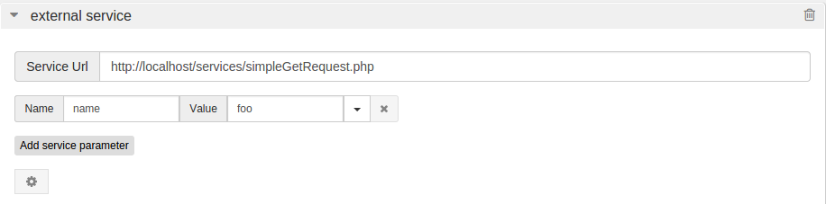
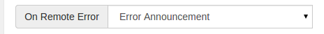

RestComm Visual Designer’s External Service element is a tool for making HTTP requests to external services and processessing their responses. This document focuses on the former. It explains its capabilities and describes how it can be used from RVD’s UI. Currently ES client supports:

* GET or POST request methods
* JSON or web form content types
* HTTP or HTTPS schemes
* basic HTTP authentication

[[a-simple-get-request]]
A Simple GET request
^^^^^^^^^^^^^^^^^^^^

Here is a simple GET request with parameters: 

   

By default, all requests use GET method. Note that name-value parameter is user defined. Such parameters are appended in the query when the request is made. It’s a good practice to keep parameters in their own fields and avoid putting them directly in the Service Url field. Here is what the actual data on the wire: 

*Request* 

GET /services/simpleGetRequest.php?name=foo HTTP/1.1 

Host: localhost 

*Response* 

HTTP/1.1 200 OK

[[a-note-on-variable-expansion]]
*A note on* *_Variable expansion_*
^^^^^^^^^^^^^^^^^^^^^^^^^^^^^^^^^^

Both Service Url and Value fields support __variable expansion__. That means that all $variables and references in them will be replaced by their actual value before the request is being made. 

*For example:* 

image:./images/Selection_071.png[Selection_071,width=918,height=232]   

Here $firstname variable will be expanded to its actual content. 

$firstname → name  

[[posting-web-forms]]
POSTing web forms
^^^^^^^^^^^^^^^^^

Here is a simple POST request: 

image:./images/Selection_073.png[post request,width=908,height=333] 

In order to access the advances features of the ES client you will need to click on the _gear_ icon. Also notice the following:

* You can switch the HTTP method used by using the Method drop down menu. Default is GET.
* Either www form or json content types are supported. For common url-encoded request use www form.
* Manually building the body of the request with ‘&’ and ‘=’ can often be a daunting and error-prone task. Check Automatically populate from service parameters to let RVD build the request body from the Name/Value pairs you have defined.

Let’s see it in action: 

*Request* 

POST /services/simplePostRequest.php HTTP/1.1 

Content-Length: 21 

Content-Type: application/x-www-form-urlencoded 

...

name=foo&lastname=bar 

*Response* 

HTTP/1.1 200 OK

[[provide-post-body-manually]]
*Provide POST body manually*
^^^^^^^^^^^^^^^^^^^^^^^^^^^^

You can also provide the POST body manually if you want. For example: 

image:./images/Selection_074.png[provide POST body manually,width=910,height=287]  

Notice how we have removed the service parameters and provided the url-encoded body instead. In case the service parameters were still there, they would be ignored.

[[posting-json]]
POSTing json
^^^^^^^^^^^^

Using a JSON request body is not much different: 

image:./images/Selection_075.png[Selection_075,width=914,height=268] 

POSTing JSON can only be done by manually providing the JSON expression. You will just need to set the _Content type_ to json and type the JSON expression. 

Here is an example of JSON expression: 

{"name":**"$firstname"**,"lastname":"bar"} 

Note that double quotes are being used in the JSON expression. RVD does not know about the json syntax and its types. It will just go for a search‘n’replace. You will need to make sure that a valid json expression will result at the end.

[[using-basic-http-authentication]]
Using basic HTTP authentication
^^^^^^^^^^^^^^^^^^^^^^^^^^^^^^^

For services that are protected with basic http authentication the user credentials need also to be provided: *image:./images/Selection_076.png[Selection_076,width=915,height=262]*

[[handling-service-http-errors]]
Handling service HTTP errors
^^^^^^^^^^^^^^^^^^^^^^^^^^^^

In case the external service fails with an HTTP error code a handler can be used. In order to set up the handler you will need to:

1.  create a handler RVD module
2.  bind the ES component to this handler using ‘On Remote Error’ drop down menu

**Here is a sample handler module labeled ‘Error announcement’:** 

image:./images/Selection_077.png[Selection_077,width=937,height=371]   

You can find the ‘On Remote Error’ drop down menu at the bottom of the ES component. Here is how it should look like after binding it to the handler module: 

