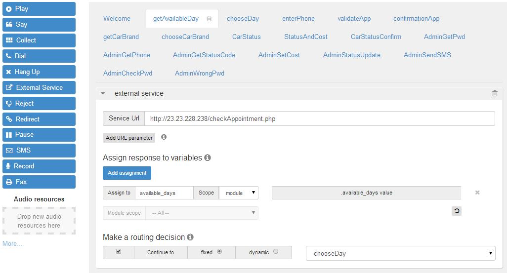
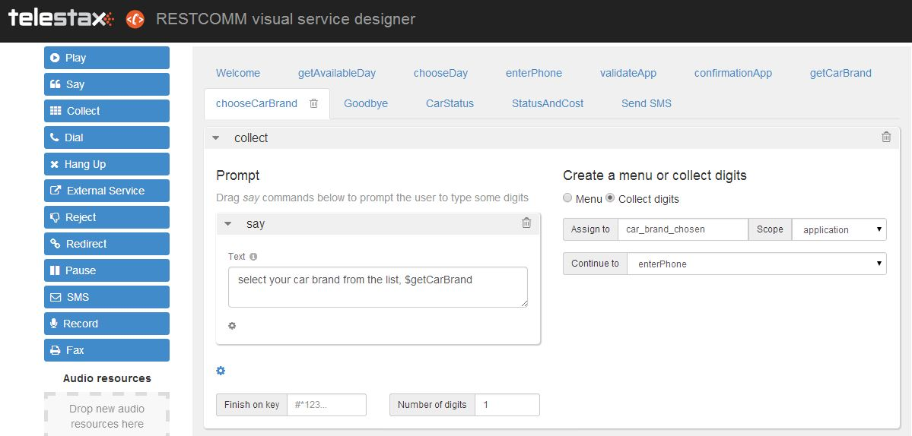
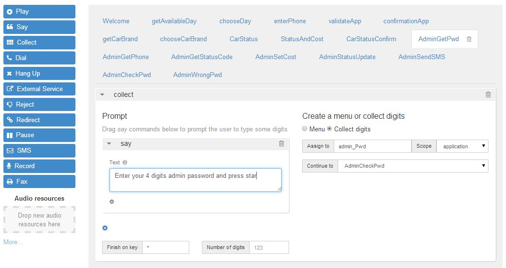
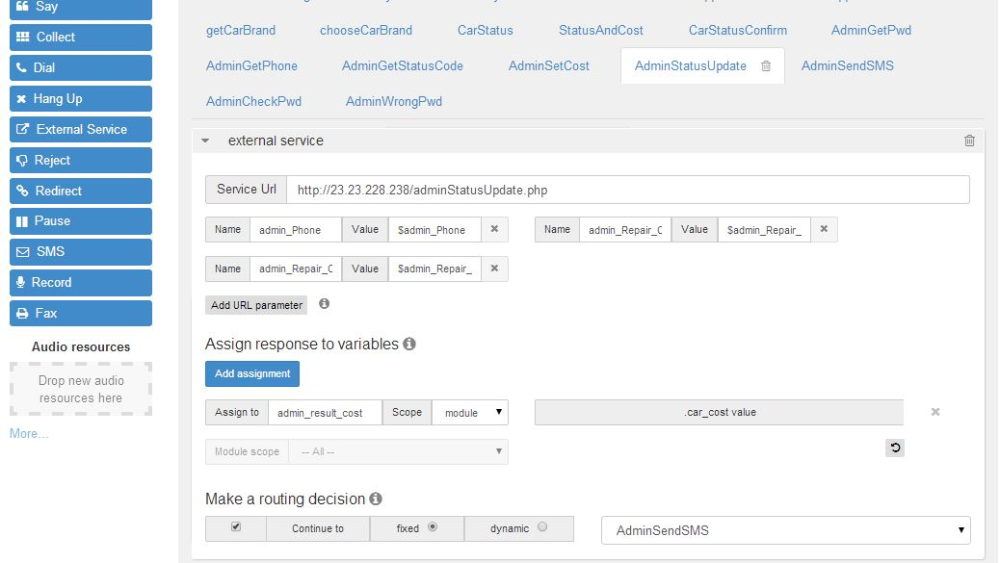
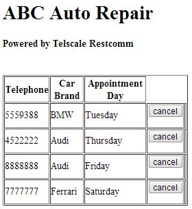

This week we will present a new Restcomm application example targeting the automotive industry. The fully functional application is available for trial and download.

*ABCauto* is a car repair business and the manager wants a solution that will help him manage customer’s appointments. He has this list of requirements

* He would like customers to be able to make appointments 24/7 even after closing hours.
* He would like his customers to receive a confirmation SMS after they make an appointment.
* He would also like customers to be able to check their current appointment any time of the day.
* He would like a web page where he could see current appointments.
* The manager of ABCauto will also like to update car repair status using a telephone system.

Telestax offered ABCauto a solution powered by Restcomm Connect using the Visual Designer as a great way to quickly accelerate building an IVR application. Since, Restcomm can integrate with other Service Providers, the solution will allow SMS through the Voip Innovations network.

image:./images/logo_abc.png[logo_abc,width=300,height=281]

= Application features

* menu 1 - make new appointment
* menu 2 - check car status
* menu 3 - Admin for ABCauto owner to update car status and set cost of repair. At the end of this, an SMS will be sent to the customer, stating car has been repaired and the cost of repair. Menu 3 is password protected with password set to (1234)

= Requirements

* - knowledge of Restcomm
* - knowledge of PHP and MySQL
* - knowledge of JSON

NOTE: In order to set up the application you need to register SMS enabled DID from your service provider like Voip Innovations

You also need to add the Restcomm.xml configuration section that allows you to send SMS (with voip innovations IP)

[source,lang:default,decode:true]
----
        <!-- The SMS aggregator is responsible for the handling of SMS messages
                             inside of RestComm. Refer to the org.mobicents.servlet.sip.restcomm.SmsAggregator
                                             interface for more information. -->
        <sms-aggregator class="SmsService">
                        <outbound-prefix>#</outbound-prefix>
                        <outbound-endpoint>64.136.174.30</outbound-endpoint>
       </sms-aggregator>
----

= Step 1

* Log into your Restcomm Admin UI
* Create new project
* Create modules as follows: 

** Welcome
** getAvailableDay
** chooseDay
** enterPhone
** validateApp
** confirmationApp
** getCarBrand
** chooseCarBrand
** CarStatus
** StatusAndCost
** CarStatusConfirm
** AdminGetPwd
** AdminCheckPwd
** AdminGetPhone
** AdminGetStatusCode
** AdminSetCost
** AdminStatusUpdate
** AdminSendSMS

image:./images/AllModules.jpg[AllModules,width=853,height=155]

= Step 2

* Enter your phpMyAdmin
* Create new database
* Create the following MySQL tables:

*Appointment*

image:./images/mysqlapp.jpg[mysqlapp,width=585,height=150]

////

== Calendar

**calendar; fields: numbers, days; Days** and their numbers should be inserted here. Use Insert button in order to add records in the table. The result after all records being added should be:

 ./images/sqldays.jpg[image:./images/sqldays.jpg[sqldays,width=621,height=122]] ./images/sqldays2.jpg[image:./images/sqldays2.jpg[sqldays2,width=307,height=169]] [/av_tab] [av_tab title='carstatus' icon_select='no' icon=''] *carstatus; fields: telephone, car_brand, carStatus, cost* ./images/sqlcarstatus.jpg[image:./images/sqlcarstatus.jpg[sqlcarstatus,width=635,height=103]] [/av_tab] [av_tab title='car_brand' icon_select='no' icon=''] *car_brand; fields: number, brand_name* Car brands and numbers should be inserted in the table. Use again Insert button to add records in the table. The result should be similar to: ./images/sqlcarbrand.jpg[image:./images/sqlcarbrand.jpg[sqlcarbrand,width=674,height=139]] ./images/sqlcarbrand2.jpg[image:./images/sqlcarbrand2.jpg[sqlcarbrand2,width=323,height=157]] [/av_tab] [av_tab title='status_list' icon_select='no' icon=''] *status_list; fields: number, status_list* In this table add status for number 1 - "Repaired" and for 2 - "Welcome back, ABC auto has not yet updated the status for". ./images/sqlstatuslist.jpg[image:./images/sqlstatuslist.jpg[sqlstatuslist,width=682,height=141]] ./images/sqlstatuslist2.jpg[image:./images/sqlstatuslist2.jpg[sqlstatuslist2,width=462,height=135]] [/av_tab] [/av_tab_container]  

////

You will need the following PHP scripts in order to make the application work.

*checkAppointment.php*

[source,lang:php,decode:true]
----
<?php
    header('Content-Type: application/json');
     
    /*
     * ABC auto
     * A Telestax Restcomm Demo
     * Author: Charles Roufay
     */

//connect to DB
$con=mysqli_connect("localhost","username","password","databasae");

if (mysqli_connect_errno()) {
            echo "Failed to connect to MySQL: " . mysqli_connect_error();
            } 

$result = mysqli_query($con,"SELECT number, days FROM calendar ");

// get available appointment days

while($row = mysqli_fetch_array($result)) {

$app_days = $app_days ." For appointment on " . $row['days'] . ", press  " . $row['number'].".";

    }

//parse app days as array
$response = array ("available_days" => $app_days);

// Output the response as JSON 
$json_response = json_encode($response);

//echo $app_days;
echo $json_response;

?>
----

*getCarBrand.php*

[source,lang:php,decode:true]
----
<?php
    header('Content-Type: application/json');
     
    /*
     * ABC auto
     * A Telestax Restcomm Demo
     * Author: Charles Roufay
     */

//connect to DB
$con=mysqli_connect("localhost","username","password","database");

if (mysqli_connect_errno()) {
            echo "Failed to connect to MySQL: " . mysqli_connect_error();
            } 

$result = mysqli_query($con,"SELECT number, brand_name FROM car_brand");

// get available appointment days

while($row = mysqli_fetch_array($result)) {

//$response = array("days" => $row['phoneNumber'], "status" => $row['carStatus'], "cost" => $row['cost']);

 $car_brand = $car_brand ." " . $row['brand_name'] . ", press  " . $row['number'].".";

    }

//parse app days as array
$response = array ("available_brand" => $car_brand);

// Output the response as JSON 
$json_response = json_encode($response);

//echo $app_days;
echo $json_response;

 ?>
----

*validateAppointment.php*

[source,lang:php,decode:true]
----
<?php
    header('Content-Type: application/json');
     
    /*
     * ABC auto
     * A Telestax Restcomm Demo
     * Author: Charles Roufay
     */

 if( $_GET["app_day"] || $_GET["app_phone"] )
  {

}

$app_day = $_GET["app_day"];
$app_phone = $_GET["app_phone"];
$car_brand_num = $_GET["car_brand"];

//connect to DB
$con=mysqli_connect("localhost","username","password","database");

if (mysqli_connect_errno()) {
            echo "Failed to connect to MySQL: " . mysqli_connect_error();
            } 

//set appointment day and car brand with input from client

mysqli_query($con, "INSERT INTO appointments (day, car_brand, telephone) VALUES ('$app_day', '$car_brand_num', '$app_phone') ");

mysqli_query($con, "INSERT INTO carstatus (telephone,car_brand,carStatus) VALUES ('$app_phone','$car_brand_num','0') ");

//get current phone number appointment day

$result = mysqli_query($con,"SELECT * FROM appointments INNER JOIN car_brand ON appointments.car_brand=car_brand.number INNER JOIN calendar ON appointments.day=calendar.number WHERE appointments.telephone=$app_phone");

// get available appointment days

while($row = mysqli_fetch_array($result)) {
 $app_days_confirm = $row['days'];
 $app_phone_confirm = $row['telephone'];
 $car_brand_confirm = $row['brand_name'];
    }

//parse app days as array
$response = array ("confirm_day" => $app_days_confirm, "confirm_phone" => $app_phone_confirm, confirm_brand => $car_brand_confirm);

// Output the response as JSON 
$json_response = json_encode($response);

//echo $app_days;
echo $json_response;

 ?>
----

*getCarStatus.php*

[source,lang:php,decode:true]
----
<?php
    header('Content-Type: application/json');

    /*
     * ABC auto
     * A Telestax Restcomm Demo
     * Author: Charles Roufay
     */

$app_phone = $_GET["app_phone"];
$car_brand_num = $_GET["car_brand"];

//connect to DB
$con=mysqli_connect("localhost","username","password","database");

if (mysqli_connect_errno()) {
            echo "Failed to connect to MySQL: " . mysqli_connect_error();
            }

//get current phone number appointment day

$result = mysqli_query($con,"SELECT * FROM carstatus INNER JOIN car_brand ON carstatus.car_brand=car_brand.number INNER JOIN status_list ON status_list.number=carstatus.carStatus  WHERE carstatus.telephone=$app_phone");

// get available appointment days

while($row = mysqli_fetch_array($result)) {
 $c_status = $row['status_list'];
 $c_phone = $row['telephone'];
 $c_brand = $row['brand_name'];
 $c_cost  = $row['cost' ];
 $status_code = $row['carStatus'];
        }

if ($status_code == "0")
{

$resp = $c_status . " phone number " . $c_phone . " and car brand " . $c_brand;
$response = array("car_status" => $resp);

}else
{

$resp = "Welcome back, your car status is ". $c_status . " the cost will be " . $c_cost . " dollars";
$response = array ("car_status" => $resp );

}
// Output the response as JSON
$json_response = json_encode($response);

//echo $app_days;
echo $json_response;

?>
----

*adminStatusUpdate.php*

[source,lang:php,decode:true]
----
<?php
    header('Content-Type: application/json');

    /*
     * ABC auto
     * A Telestax Restcomm Demo
     * Author: Charles Roufay
     */

$g_pwd = $_GET["admin_Pwd"];
$g_phone = $_GET["admin_Phone"];
$g_carStatus = $_GET["admin_Repair_Code"];
$g_cost = $_GET["admin_Repair_Cost"];

//connect to DB
$con=mysqli_connect("localhost","username","password","database");

if (mysqli_connect_errno()) {
            echo "Failed to connect to MySQL: " . mysqli_connect_error();
            }

mysqli_query($con, "UPDATE  carstatus SET carStatus='$g_carStatus', cost='$g_cost' WHERE telephone='$g_phone' ");

//get current phone number appointment day

$result = mysqli_query($con,"SELECT * FROM carstatus INNER JOIN car_brand ON carstatus.car_brand=car_brand.number WHERE carstatus.telephone=$g_phone");

// get available appointment days

while($row = mysqli_fetch_array($result)) {
 $car_cost = $row['cost'];
 $app_phone = $row['telephone'];
 $car_brand = $row['brand_name'];
        }

//parse app days as array

$resp = "ABC auto repair, your " . $car_brand . " is ready and the total cost of repair is " . $car_cost . " dollars";
$response = array("car_cost" => $resp);

// Output the response as JSON
$json_response = json_encode($response);

echo $json_response;

?>
----

*adminCheckPwd.php*

[source,lang:php,decode:true]
----
<?php
    header('Content-Type: application/json');

    /*
     * ABC auto
     * A Telestax Restcomm Demo
     * Author: Charles Roufay
     */

$g_pwd = $_GET["admin_Pwd"];

if($g_pwd == 1234){

$response = array ("confirm_pwd" => "AdminGetPhone");
}else
{
$response = array ("confirm_pwd" => "AdminWrongPwd");
}

// Output the response as JSON
$json_response = json_encode($response);

//echo $app_days;
echo $json_response;

?>
----

= Step 3

* Go to Restcomm Visual Designer
* In Welcome module remove the default Say message and drag and drop Collect verb.
* Drag and drop Say into Collect prompt. Type following in the text area: “Welcome to ABC Auto Repair. To schedule an appointment press 1. To check your car status press 2. For admin press 3″.
* From the right side choose menu.
* Select as digit 1 target to be getAvailableDay module.
* Select as digit 2 target to be CarStatus module.
* Select as digit 3 target to be AdminGetPwd.

image:./images/Welcome.jpg[Welcome,width=828,height=427]

= Step 4

* Go to getAvailableDay module.
* Add External Service from the left side.
* Service Url is actually the path to the PHP script checking the appointment - checkAppointment.php
* Click on Add assignment button. Type available_days and set module as a scope. In right side from the first drop down menu choose object, from the second drop down menu select propertyNamed then type the name of the variable – available_days. Click add operation. Select value from the drop down menu and click on Done button.
* Go to Continue to and select fixed. Then select chooseDay module from the drop down menu on the right side.

= Step 5

* Go to chooseDay module.
* Drag and drop Collect.
* In Say command in Collect’s prompt type the following: “Appointment days menu, $available_days”.
* In the right part choose to collect digits.
* Assign to app_day_chosen. Set module as a scope.
* Continue to getCarBrand.
* This module ask user to choose day for his appointment.

image:./images/chooseDay.jpg[chooseDay,width=816,height=400]

= Step 6

* Go getCarBrand module.
* Add External Service.
* Service URL is a PHP script which allows customer to choose a car brand for his appointment - getCarBrand.php.
* Add assignment. Assign to getCarBrand. Select application as a scope. Add gerCarBrand as a value in the same way as in step 4.
* Select chooseCarBrand from the drop down menu in Continue to area.

image:./images/getcarbrand.jpg[getcarbrand,width=888,height=435]

= Step 7

* Go to chooseCarBrand module.
* Add Collect. Type the following in the Say area “select your car brand from the list, $getCarBrand”.
* Choose to Collect digits. Assign to car_brand_chosen. Select application as scope.
* Continue to enterPhone.

= Step 8

* Go to enterPhone module.
* Add Collect. Type following in Say are: “Enter your 7 digit phone number and press star”. Customer has to enter his mobile number in order to finish the appointment.
* Set star as a finish on key.
* Choose to Collect digits. Assign to app_phone_chosen. Set application as scope.
* Continue to validateApp module.

image:./images/enterphone.jpg[enterphone,width=983,height=457]

= Step 9

* Go to validateApp module.
* Add External Service
* Service URL uses PHP script to validate the appointment - validateAppointment.php
* Add three URL parameters: app_day, car_brand, app_phone and their values as follows: $app_day_chosen, $app_phone_chosen and $car_brand_chosen.
* Add three assignments: 
** day_conf , choose application as scope. From the right side add confirm_day value. 
** phone_conf, choose application as scope. Add confirm_phone as value. 
** brand_conf, choose application as scope. Add confirm_brand value.
* Continue to confirmationApp module.

image:./images/validateapp.jpg[validateapp,width=686,height=514]

= Step 10

* Go to confirmationApp module.
* Add Collect and in Say text area type: “You have an appointment at ABC auto on $day_conf for your $brand_conf. Your appointment phone number is $phone_conf. You may hang up or press 1 to go back to the main menu”. This module informs user that appointment has been confirmed.
* Select to create a Menu. Set Welcome module as target of the first digit.

image:./images/confirmationapp.jpg[confirmationapp,width=1010,height=512]

= Step 11

* Go back to CarStatus module
* Add Collect. Type following in Say area: “Please enter your phone number and press star”.
* Set star as finish on key.
* Select to Collect digits. Assign to app_phone. Select module as a scope. Choose to continue to StatusAndCost module.

image:./images/CarStatus1.jpg[CarStatus,width=788,height=417]

= Step 12

* Go to StatusAndCost module.
* Add External Service.
* Service URL uses PHP script - getCarStatus.php which is taking information from carstatus mysql table and inform user about the status of the car registered under the number he entered and the cost of the service.
* Add two URL parameters: - app_phone with $app_phone value;
* Add assignment: - car_status , choose module as scope. Add car_status as value.
* Continue to CarStatusConfirm module.

image:./images/statusandcost.jpg[statusandcost,width=756,height=436]

= Step 13

* Go to CarStatusConfirm module
* Add Say. Type the following in the text area: "$car_status Thank you for calling ABC Auto Repair". Customer will hear car status for his number and the cost for the service.
* Type following in SMS Text area: “$car_status Thank you for calling ABC Auto Repair.”. This message will include the telephone entered by the customer, the status of the car for that number and the cost for the service.
* In order to receive sms to the number you are calling from you need to use $core_From variable. Type it in To are
* Type the number from which you want to send SMS in From area.
* In Continue to you can set next module to which you want the application to proceed. In this application there isn't continue to module.
* Status callback takes a URL as an argument. When the SMS message is actually sent, or if sending fails, RestComm will make an asynchronous POST request to this URL with the parameters ‘SmsStatus’ and ‘SmsSid’. Note, ‘statusCallback’ always uses HTTP POST to request the given url. You can leave the field blank if you don’t need it.

image:./images/carstatusconfirm.jpg[carstatusconfirm,width=744,height=426]

= Step 14

* Go to AdminGetPwd module
* Add Collect. Add Say in Collect prompt and type: "Enter your 4 digits admin password and press star" in the text area.
* Set star as Finish on key.
* From the right side choose to collect digits.
* Assign to admin_Pwd and choose application as a scope.
* Continue to AdminCheckPwd

= Step 15

* Go to AdminCheckPwd module
* Add External Service.
* Service Url will be a PHP script checking password entered by admin - adminCheckPwd.php
* Add admin_Pwd as URL parameter
* Choose routing decision to be dynamic and to continue to confirm_pwd value

image:./images/AdminCheckPwd.jpg[AdminCheckPwd,width=813,height=425]

If the password is correct the application will proceed to AdminGetPhone module. If it is not it will proceed to AdminWrongPwd.

= Step 16

* Go to AdminWrongPwd module
* Add Collect
* Add Say in Collect prompt. Type: "You entered an invalid password, press 1 to try again or you may hang up" in the text area.
* Choose to create a menu.
* Set AdmingGetPwd as digit 1 target.

image:./images/adminwrongpwd.jpg[adminwrongpwd,width=746,height=399]

= Step 17

* Go to AdminGetPhone module
* Add Collect.
* Add Say in Collect prompt. Type: "Enter customer's phone number and press star".
* Set star as Finish on key.
* From the right side choose to collect digits.
* Assing to admin_phone. Choose application as scope.
* Continue to AdminGetStatusCode.

image:./images/adminGetphone.jpg[adminGetphone,width=880,height=470]

= Step 18

* Go to AdminGetStatusCode module
* Add Collect
* Add Say and type the following: "If car has been repaired press 1".
* From right side choose to Collect digits.
* Assign to admin_Repair_Code. Set application as scope.
* Continue to AdminSetCost.

image:./images/adminGetStatusCode.jpg[adminGetStatusCode,width=770,height=415]

= Step 19

* Go to AdminSetCost module
* Add Collect
* Add Say. Type following in the text area: "Enter the cost of the car repaired and press star".
* Set star as Finish on key.
* Choose to collect digits.
* Assign to admin_Repair_Cost. Choose application as scope.
* Continue to AdminStatusUpdate.

image:./images/adminSetCost.jpg[adminSetCost,width=840,height=432]

= Step 20

* Go to adminStatusUpdate module
* Add External Service
* Service Url will PHP script updating status and cost entered by admin in carstatus table - adminStatusUpdate.php
* Add three URL parameters: 
** admin_Phone, $admin_Phone value
** admin_Repair_Code, $admin_Repair_Code value
** admin_Repair_Cost, $admin_Repair_Cost value
* Assign to admin_result_cost. Choose module as a scope. Add car_cost value from the right side.
* Continue to AdminSendSMS

= Step 21

* Go to AdminSendSMS module
* Add say and type "$admin_result_cost". Admin will hear changed status and cost in an existing appointment.
* In order to receive sms to the number you are calling from you need to use $core_From variable. Type it in To area.
* Type the number from which you want to send SMS in From area. From should be a valid DID number from Voip Innovations or another other valid Service Provider.
* Leave Continue to and Status callback empty.

image:./images/adminsendsms1.jpg[adminsendsms,width=778,height=437]

And the application is ready to be tested.

= Step 22

This step is showing how to easily cancel appointments using simple PHP scripts.     

Firstly create **listRemoveAppointment.php**. The script includes simple HTML table showing list of all of the appointments. All of the records from appointments table are being selected. Then calendar and car_brand tables are being joined to appointments so that script can get needed information (telephone, brand_name, days). Cancel button runs *validateCancelAppointment.php.*  

*listRemoveAppointment.php*

[source,lang:php,decode:true]
----
<html>

<body>
<h1>ABC Auto Repair </h1>

<h4>Powered by Restcomm Connect</h4>
 

<table border="1" style="width:300px">

<tr>
    <th>Telephone</th>
    <th>Car Brand</th>
    <th>Appointment Day</th>
  </tr>

<?php 

$con=mysqli_connect("localhost","username","password","database");

if (mysqli_connect_errno()) {
            echo "Failed to connect to MySQL: " . mysqli_connect_error();
            } 

$result = mysqli_query($con,"SELECT * FROM appointments INNER JOIN car_brand ON appointments.car_brand=car_brand.number INNER JOIN calendar ON appointments.day=calendar.number ");

// get available appointment days

while($row = mysqli_fetch_array($result)) {

?>

<tr> 
     <td><?php echo $row ['telephone']; ?> </td>  
    <td> <?php echo $row ['brand_name']; ?>  </td> 
    <td> <?php echo $row ['days']; ?> </td>
    <td> 
    <form action="validateCancelAppointment.php" method="post">
    <input type="hidden" name="phone" value="<?php echo $row ['telephone']; ?>"  >
    <input type="hidden" name="day" value="<?php echo $row ['day']; ?>"  >
    <input type="hidden" name="brand" value="<?php echo $row ['car_brand']; ?>"  >
    <input value="cancel" type="submit" >
    </form>
    <td>  
</tr>

<?php } ?>

</table>

</body>
</html> 
----

*validateCancelAppointment.php*

[source,lang:php,decode:true]
----
<html>

<body>
<h1>ABC Auto Repair </h1>

<h4>Powered by Restcomm Connect</h4>
 

<table border="1" style="width:300px">

<tr>
    <th>Telephone</th>
    <th>Car Brand</th>
    <th>Appointment Day</th>
  </tr>

<?php 

$con=mysqli_connect("localhost","username","password","database");

if (mysqli_connect_errno()) {
            echo "Failed to connect to MySQL: " . mysqli_connect_error();
            } 

$result = mysqli_query($con,"SELECT * FROM appointments INNER JOIN car_brand ON appointments.car_brand=car_brand.number INNER JOIN calendar ON appointments.day=calendar.number ");

// get available appointment days

while($row = mysqli_fetch_array($result)) {

?>

<tr> 
     <td><?php echo $row ['telephone']; ?> </td>  
    <td> <?php echo $row ['brand_name']; ?>  </td> 
    <td> <?php echo $row ['days']; ?> </td>
    <td> 
    <form action="validateCancelAppointment.php" method="post">
    <input type="hidden" name="phone" value="<?php echo $row ['telephone']; ?>"  >
    <input type="hidden" name="day" value="<?php echo $row ['day']; ?>"  >
    <input type="hidden" name="brand" value="<?php echo $row ['car_brand']; ?>"  >
    <input value="cancel" type="submit" >
    </form>
    <td>  
</tr>

<?php } ?>

</table>

</body>
</html> 
----

The output of listRemoveAppointment.php should be similar to:

