The {product} Console is a great way to perform repetitive {product} tasks in a orderly manner. In this guide, you will learn how to use some of the features available to create Applications, Clients, Phone Numbers, Check Call Logs, Messages Logs, Recordings.

= {product} Login Interface

Make sure you use the correct {product} Organization URL that you first defined when you created your {product} Account and that you received in the sign up email. It should look like `https://{mydomain}.restcomm.com/login` 

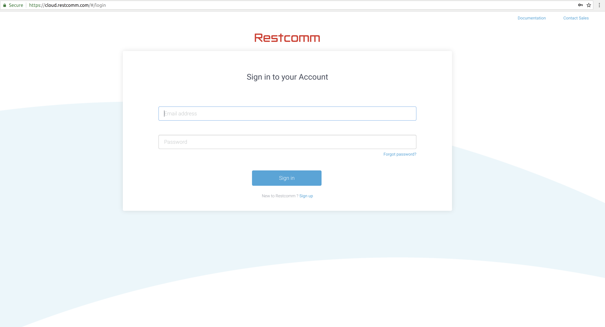

= {product} Console Dashboard

This is the default page after you log in where you can get latest news and features as well as a usage overview of your {product} Account activity.

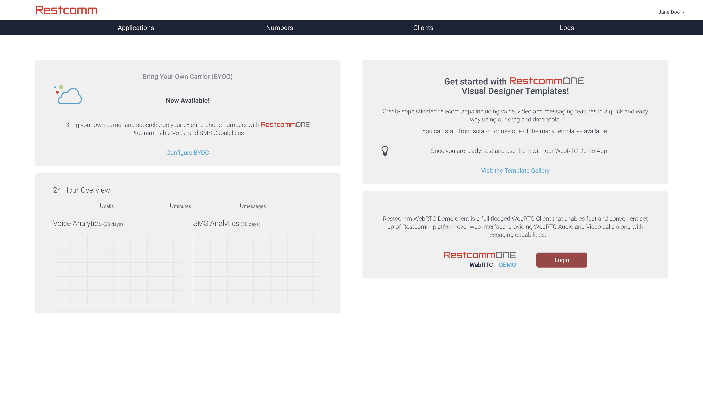

= {product} Account Settings

When you click on the drop down representing the name of your Account then `Account` at the top right corner of the window, as shown in the screenshot below, you will be able to :

* Retrieve your Account SID and Auth Token which are required to use the <<../api/index.adoc#API,{product} API>> to place Outbound Calls or send SMS by example.
* Retrieve your Account Information such as First Name, Last Name, Email, Role.
* Change your Account password 
* Create Sub-Accounts.

[NOTE]
All of the information presented visually under the {product} Account Settings is also accessible through the <<../api/account-api.adoc#account,{product} Accounts API>>

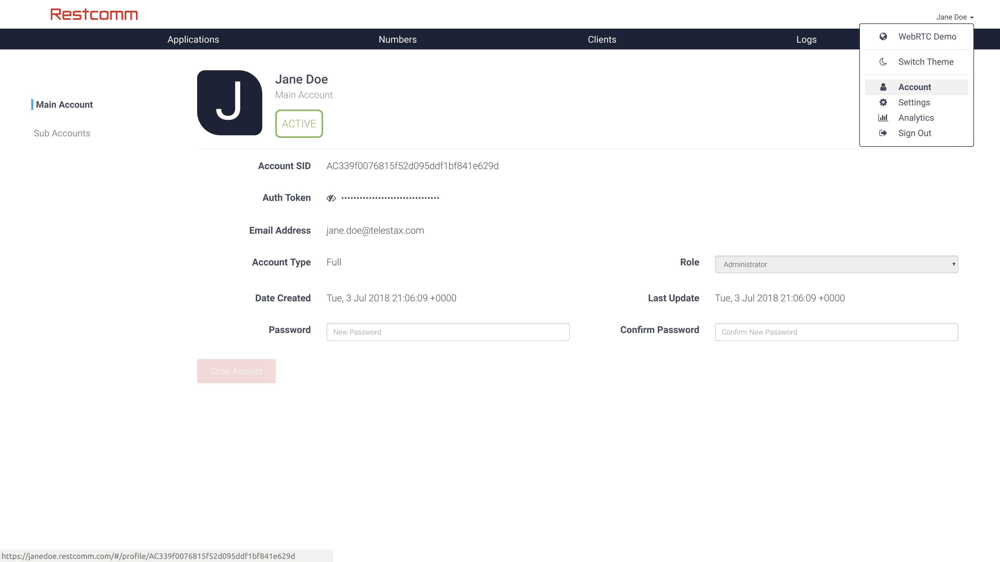

= {product} Applications

This Section allows you to create, delete, update and search for your {product} Applications. When you start the workspace is empty, future updates to the platform will list a number of demo applications to get you started more quickly

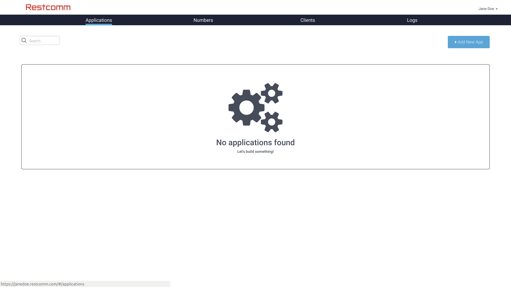

When you click on the `Add New App` button on the right corner, you can create a new application which leads you to the screen below allowing you to choose between three ways of doing so:

image:./images/console-14.png[console-14]

* *Create a URL Application* : This option allows you to create a <<../rcml/index.adoc#RCML,{rcml} Application>> which will be hosted externally outside of {product} and contain the logic of your application to be executed upon receiving a call or a message. The <<../rcml/index.adoc#RCML,{product} Markup language>> needs to be used to design your application. This option will let you define a name, URL of the {rcml} application hosted outside of {product} and the type of application (Voice or SMS). This option is the longest to get you started and will require that you understand {product} better, it's usually recommended to start by creating a Visual Designer Application to get started more quickly.
* *Create a Visual Designer Application* : This option allows you to create a <<../rvd/index.adoc#RVD,{product} Visual Designer Application>> which will be hosted by {product} and contain the logic of your application to be executed upon receiving a call or a message. Visual Designer is a quick and great way to create Voice and Messaging applications with minimal or no programming skills. This option will let you define a name and the type of application (Voice or SMS). This option is the quickest to get you started and you can already choose from a pre-existing set of templates to get started even more quickly.
* *Import a Visual Designer Application* : This option allows you to import a pre-existing <<../rvd/index.adoc#RVD,{product} Visual Designer Application>> which will be hosted by {product} and contain the logic of your application to be executed upon receiving a call or a message. Visual Designer is a quick and great way to create Voice and Messaging applications with minimal or no programming skills. This option will let you define a name and the type of application (Voice or SMS).

= {product} Numbers

This Section allows you to create, delete, update and search for your {product} Numbers. When you start with {Restcomm} this section is empty, future updates to the platform will list a number of demo numbers to get you started more quickly. This section also allows you to link a Number to an Application created in the previous section

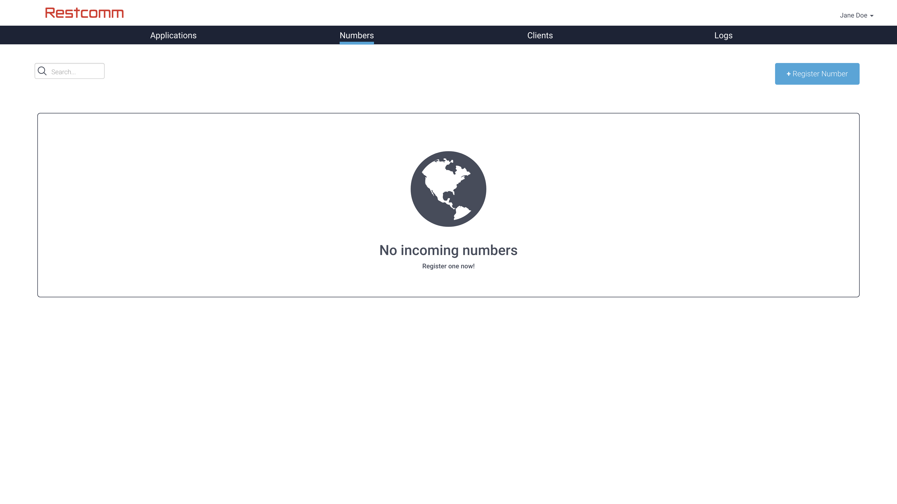

[[register-number]]
== Register Number

When you click on the `Register Number` button, you will see a screen similar to the screenshots below. This will allow you to create a new phone number that can be attached to a {product} application.

You can register two types of Numbers:

* *SIP Number*: Those numbers are virtual numbers which are not tied to any Origination PSTN Provider and can be reached via a registered {product} Client using SIP or WebRTC. Type the name of the SIP Number you want to create in `SIP Address` field and give it a name you can remember easily in the `Friendly Name` field at the top and then click on the `Register` button, which will lead you to the `Edit Number` section below to link your newly purchased number to a {product} application your previously created
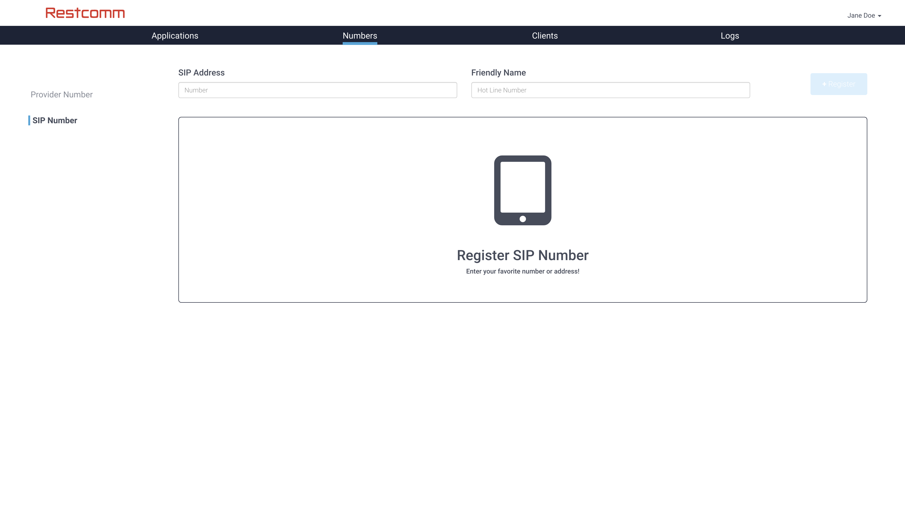
* *Provider Number*: Those numbers are numbers which are tied to an Origination PSTN Provider and can be reached via a landline or mobile phone as well as through a registered {product} Client using SIP or WebRTC. You need to first search for a number from the Provider to purchase it which requires you to select a `Country` in the dropdown, an optional `Number` to filter further if you are looking for a specific number pattern, optional capabilities (SMS or Voice), and optional type (Landline, Mobile, Toll-Free) to further filter the search, then click on the Search icon. Once you found a number in the list, click on `Register Number`, which will lead you to the `Edit Number` section below to link your newly purchased number to a {product} application your previously created
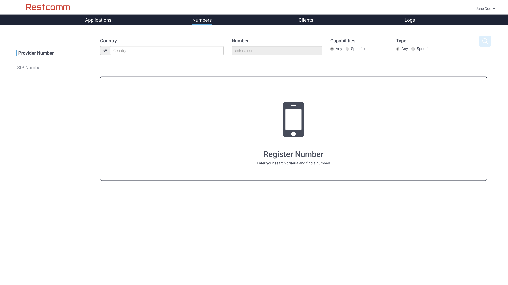

[[edit-update-number]]
== Edit/Update Number

Editing a {product} Number can be done after purchase or creation or by clicking on the number in the `Numbers` list, the screenshot below shows how you can edit a SIP Number but is applicable to a Provider Number as well. You can set or update the Voice or SMS Application to which the number is attached. 

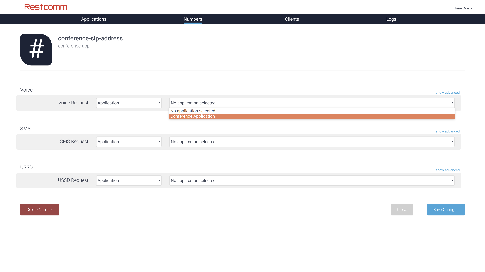

You have two options for attaching the application to a number:

* *Application*: You can use this dropdown list to select one of the applications you previously created using the Visual Designer.
* *{rcml} URL*: You can use this field to copy the URL of where your {rcml} Application is hosted.

In addition to that, you can also set *{rcml} URL* to link another Application for a number of advanced options in clicking on the `Advanced` link for both SMS or Voice Applications.

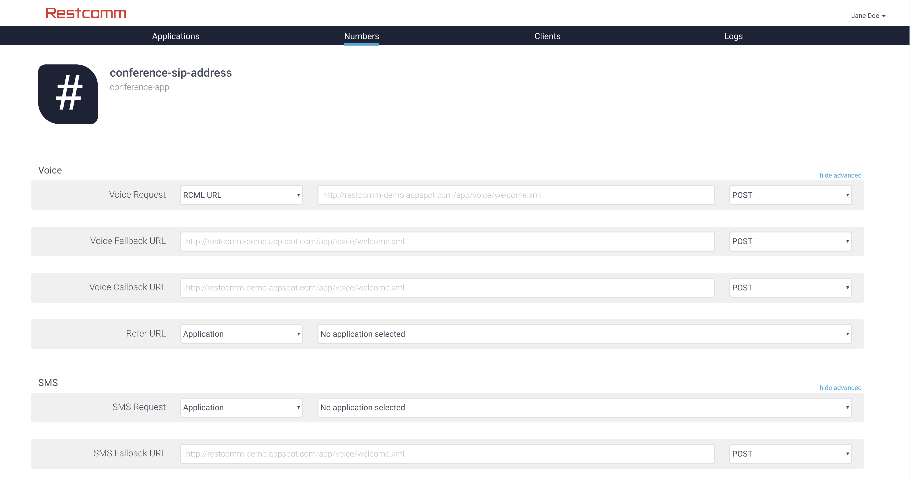

* *Voice or SMS Fallback URL*: The {rcml} URL that {product} will request if an error occurs retrieving or executing the Application set previously.
* *Voice or SMS Callback URL*: The URL that {product} will request to pass status parameters (such as call ended or SMS delivered) to your application.
* *Voice REFER URL*: The {rcml} URL that {product} will request when receiving a SIP REFER request to this number. Read the <<../tutorials/Restcomm_SIP_Refer_Support.adoc#REFER,{product} REFER Tutorial>> to learn more about {product} support for REFER.

= {product} Clients

This Section allows you to create, delete, update and search for your {product} Clients. When you initially start with {product}, this section has a default Client that you can use whose username and password is the same that you used to login to your {product} Account.

A {product} Client is an abstraction for storing credentials related to a typical SIP or WebRTC (using SIP Over Websockets) endpoint that can use through traditional SIP Softphone or hardphone or through our <<../sdks/index.html#SDKs,{product} WebRTC SDKs>> (Currently in **Preview**)

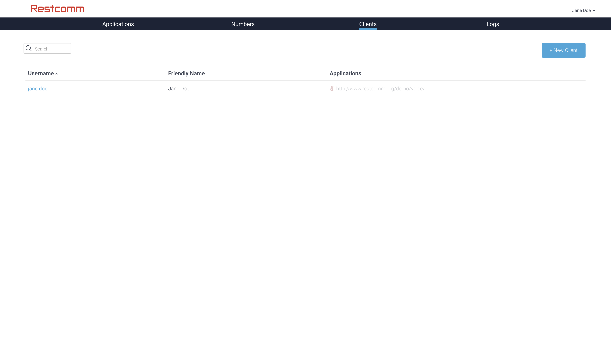

== Edit/Update {product} Client

You can change the {product} client password and also attach an application to the client (in the same manner that is described above to attach an application to a number) which will be executed upon any outbound calls done by the {product} client.

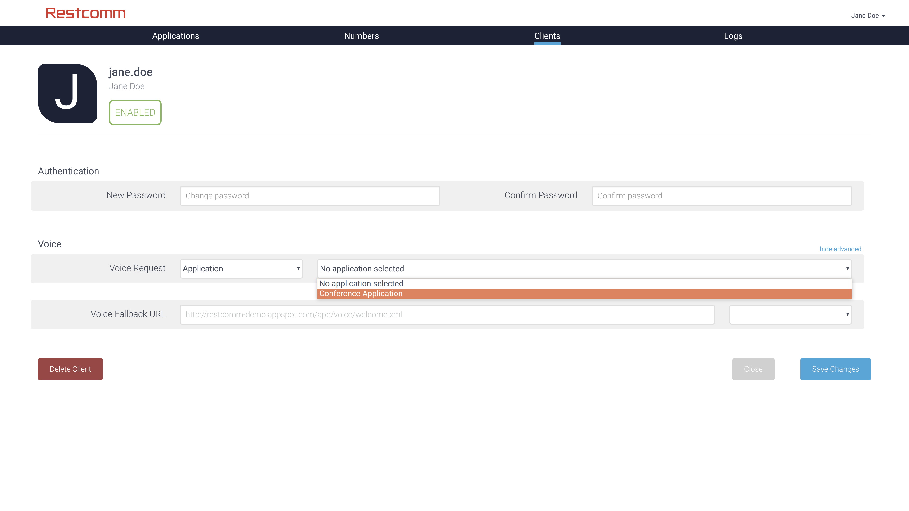

[[logs]]
= Logs

The log section gives you an overview of {product} calls or SMS sent or received.

[[logs---calls]]
== Logs - Calls

A list of all calls that have been received or sent by {product}. This section will be empty until you make or receive any calls to a {product} number.

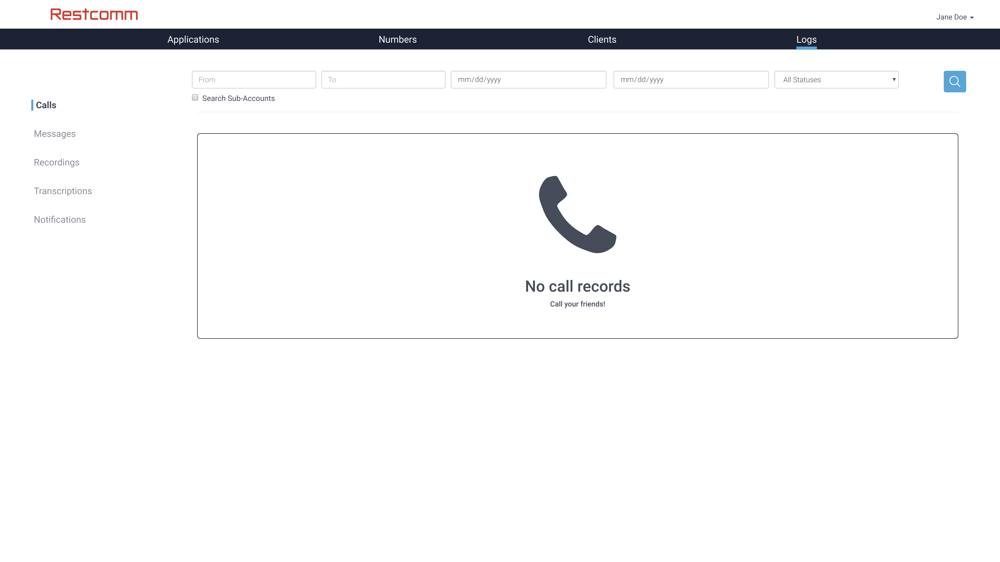

=== Logs - Call Details

If you click on any call details in the list, you will be able to see the full details of the call including its status and if there is a recording link to it be able to download it.

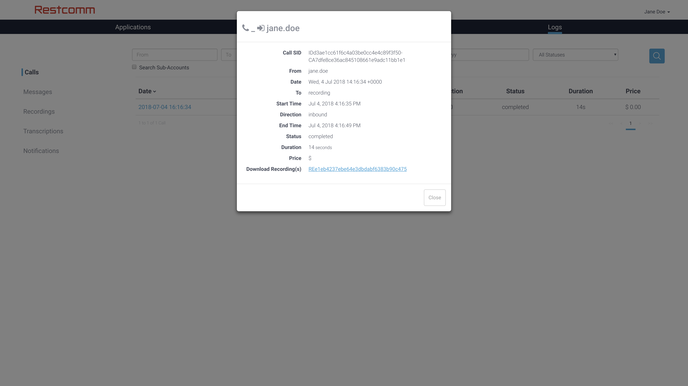

[[logs---messages]]
== Logs - Messages

A list of all SMS and Messages that have been received or sent by {product}. This section will be empty until you make or receive any SMS or Messages to a {product} number.

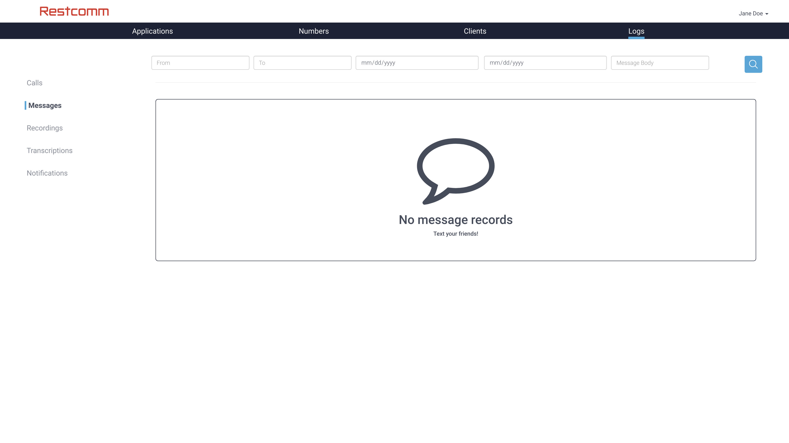

=== Logs - Message Details

If you click on any message in the list, you will be able to see the full details of the message including its delivery status.

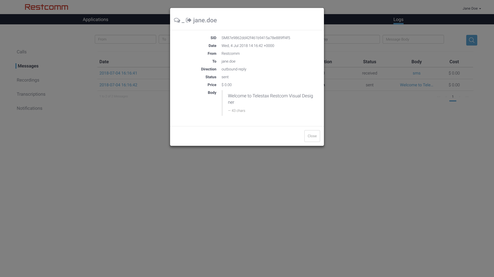

[[logs---recordings]]
== Logs - Recordings

A list of all Recordings (using the Record Verb) that have been received or sent by {product}. This section will be empty until you record any calls with {product}.

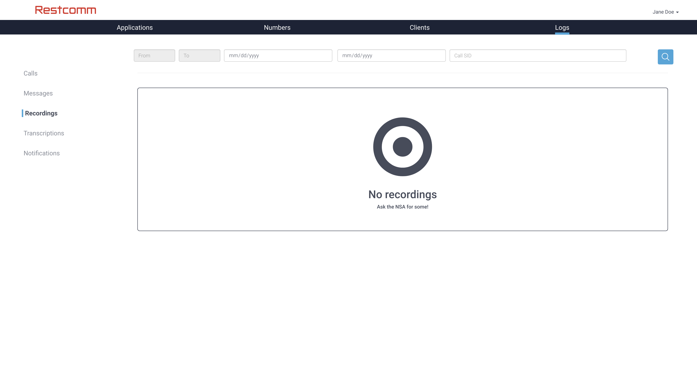

=== Logs - Recordings Details

If you click on any recordings details in the list, you will be able to see the full details of the recording and download or delete it.

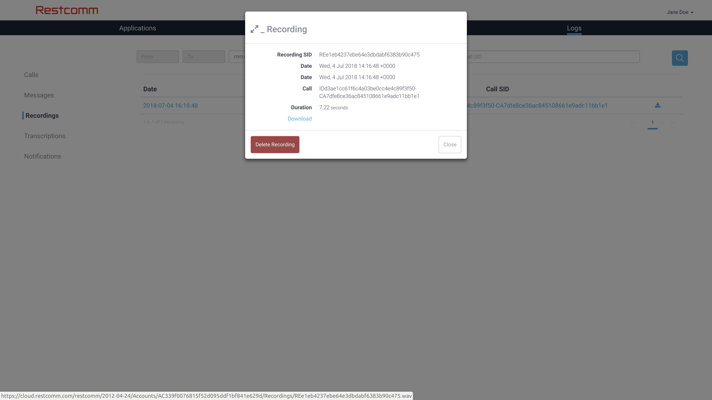

[[logs---notifications]]
== Logs - Notifications

A list of all Notifications received by {product}.

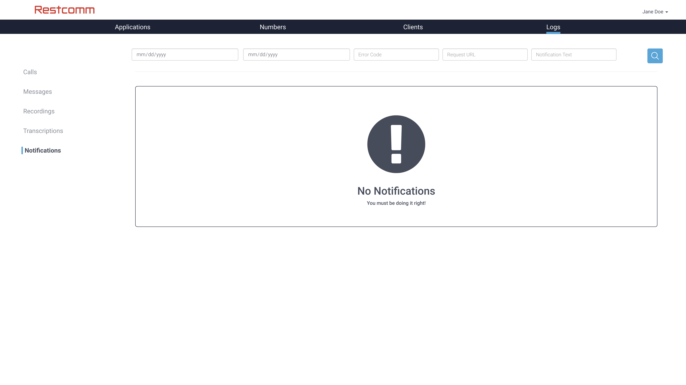
