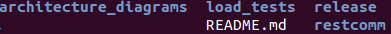
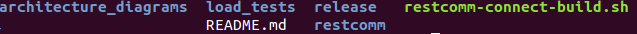
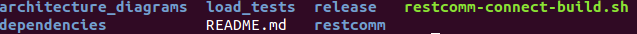
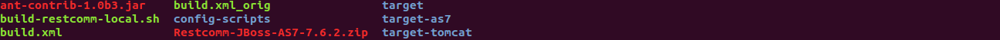

[[build-from-source]]
*How to build Restcomm-Connect from source*

*Requirements*

* You must have *git* installed on your computer
* You must have *ant* installed on your computer
* You must have *JDK - 7* installed on your computer
* You must be running *maven* version 3.x.x on your computer

*Step 1*

* Go to  https://github.com/RestComm/Restcomm-Connect.git
You will see the page like this one below. Copy the URL in the *HTTPS* field.
The URL should look like this: https://github.com/RestComm/Restcomm-Connect.git

image::images/1.png[]

*Step 2*

In the bash window of your local computer create a directory where you should clone Restcomm-Connect:

* run the command : *git clone https://github.com/RestComm/Restcomm-Connect.git*.
This command will create a new directory called RestComm-Connect. Go to this directory entering the command:
 *cd Restcomm-Connect*.
The content of the directory should contain the following:

* You will need to create a script to build Restcomm-Connect.
Copy the script below into a bash script on your local directory at the root of the RestComm-Connect.
In this tutorial, the script below is stored in the file *restcomm-connect-build.sh*.

----
#!/bin/bash
export RESTCOMM_HOME=/home/yuliachornobrivets/Restcomm-Connect
export MAJOR_VERSION_NUMBER=7.6
export BUILD_NUMBER=0

export WORKSPACE=$RESTCOMM_HOME
mkdir $WORKSPACE/dependencies
export DEPENDENCIES_HOME=$WORKSPACE/dependencies

ant release -f ./release/build.xml -Drestcomm.release.version=$MAJOR_VERSION_NUMBER.$BUILD_NUMBER -Drestcomm.branch.name=restcomm-release-$MAJOR_VERSION_NUMBER.$BUILD_NUMBER -Dcheckout.restcomm.dir=$RESTCOMM_HOME -Dworkspace.restcomm.dir=$RESTCOMM_HOME/restcomm -Dcheckout.dir=$DEPENDENCIES_HOME
----

* Change the restcomm-connect-build.sh permission to make it executable as follows:
  *chmod +x ./restcomm-connect-build.sh*.
    The RestComm directory should now display the following content:

* Now, run the build script as follows: *./restcomm-connect-build.sh*

This may take a while to build. If the build is successful, you should see this output at the end of the build:
----
make-final-zip:

    [zip] Building zip: /home/username/Restcomm-Connect/release/Restcomm-JBoss-AS7-7.6.0.zip

release:

BUILD SUCCESSFUL
Total time: 42 minutes 11 seconds
----
* At the root of the RestComm directory you should see:

* Go to the *release* directory. You will see the following files:

Note that the zip file called *Restcomm-JBoss-AS7-7.6.2* is the binary for JBoss container.
You can copy this zip file into a directory on your computer and unzip the content.
