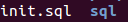
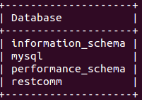

[[restcomm-connect-mysql]]
= How to get started with Restcomm-Connect and Mysql

_When working with the binary version of Restcomm, the default database is hsqlDB.
This is of course not suitable for production but it is provided as a way for you
to conveniently and quickly start up Restcomm.
For those who would like to run Restcomm on a local server or on another cloud based system,
the following tutorial will show how to get started with Restcomm and Mysql._

== Requirements

* Install Restcomm using our <<How to build Restcomm-Connect from source.adoc#requirements,previous guide>>.
* Install link:http://dev.mysql.com/doc/refman/5.7/en/installing.html[MySQL]

== Configuring the mybatis.xml file to use Mysql
* Go to the *$RESTCOMM_HOME/standalone/deployments/restcomm.war/WEB-INF/conf/* directory.
 Open the *mybatis.xml*. $RESTCOMM_HOME is conventional name for unzipped *Restcomm-JBoss-AS7-7.6.0.869* directory.
* Change the

[source,bash]
----
<environments default="production">
----
to
[source,bash]
----
<environments default="mariadb">
----
* Add the MariaDB configuration environment tag as shown below.
Make sure that you have indicated the correct MySQL username, password
and IP of the computer where the database is located (it is 172.21.0.107 in the example).

[source,bash]
----
<environment id="mariadb">
<transactionManager type="JDBC"/>
<dataSource type="POOLED">
<property name="driver" value="com.mysql.jdbc.Driver"/>
<property name="url" value="jdbc:mysql://172.21.0.107:3306/restcomm"/>
<property name="username" value="MySQL_Username"/>
<property name="password" value="MySQL_Password"/>
</dataSource>
</environment>
----
* Save and exit the mybatis.xml file.

== Start Mysql and Create the Restcomm database

* Start Mysql by running the command

[source,bash]
----
sudo /etc/init.d/mysql start
----

Or use link:http://dev.mysql.com/doc/refman/5.7/en/windows-start-command-line.html[MySQL guide].

* Go to the *$RESTCOMM_HOME/standalone/deployments/restcomm.war/WEB-INF/scripts/mariadb* directory. There will be the *init.sql* file and *sql* directory:

* Create the Restcomm database running the following command:

[source,bash]
----
mysql -u root -p < init.sql
----
* Log into Mysql and make sure the Restcomm database was created by running the command:

[source,bash]
----
show databases;
----
If the process was successful you will see the following:

== Edit the restcomm.xml file to point the DAO to MySQL

* Go to the *$RESTCOMM_HOME/standalone/deployments/restcomm.war/WEB-INF/conf/*.
Open the *restcomm.xml* file.
* Find the dao-manager tag and change the sql-files path to mariadb as shown below:

[source,bash]
----
<dao-manager class="org.mobicents.servlet.restcomm.dao.mybatis.MybatisDaoManager">
  <configuration-file>${restcomm:home}/WEB-INF/conf/mybatis.xml</configuration-file>
  <data-files></data-files>
  <sql-files>${restcomm:home}/WEB-INF/scripts/mariadb/sql</sql-files>
</dao-manager>
----
== Download Mysql Java Client Driver

* Download the latest *MySQL Java Connector* from http://mvnrepository.com/artifact/mysql/mysql-connector-java.
* Put the jar file in
*$RESTCOMM_HOME/standalone/deployments/restcomm.war/WEB-INF/lib/*.

* Go to the $RESTCOMM_HOME/bin/restcomm/ directory.

== Verify the setup was successful

* In order to verify the setup was correctly done, first you have to start Restcomm and media server running the following command:

[source,bash]
----
./start-restcomm.sh
----

* Open your web browser and go to the url – http://IP:8080. Instead of "IP" you should put your IP.

* Log in with the administrator@company.com username and the RestComm password. Then you should change the default password.
If you have changed the default password before, you should insert your own password at once.

Here you can read the detailed information on <<Starting Restcomm-Connect.adoc#configure-restcomm-iP-information-and-text-to-speech,Starting Restcomm-Connect>>.
