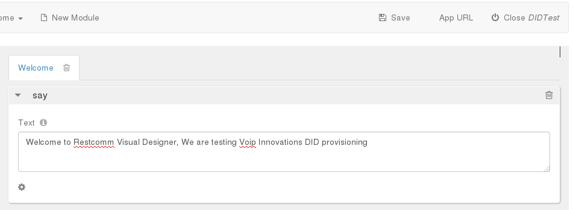
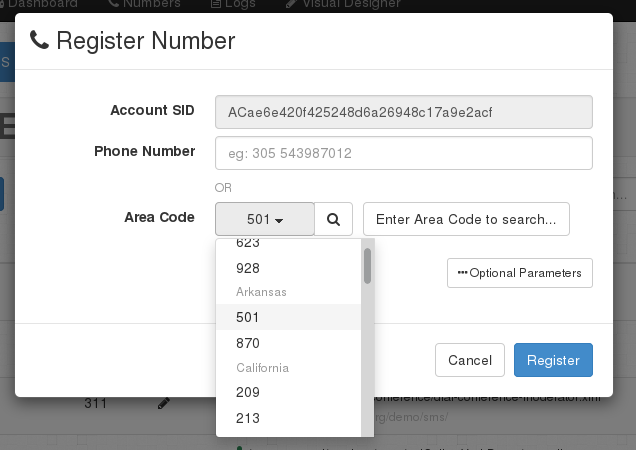
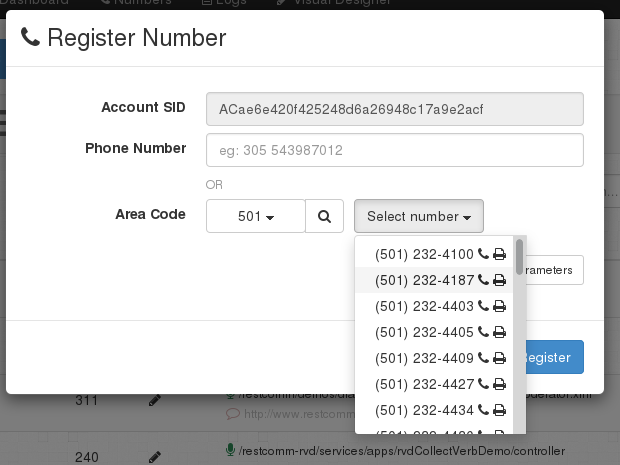
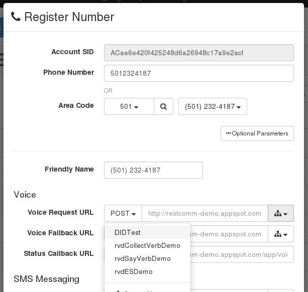

Restcomm Connect allows you to provision DID numbers easily from Voip Innovations through the Restcomm Admin Management Interface. This tutorial will show you how to attach a DID number to an application created using Restcomm Visual Designer.   

= Requirements

* Restcomm AMI or Binary (version 7.1.5 and above)
* Voip Innovations API account and endpoint number
* VoiceRSS for Text to Speech API account

= Step 1

You must configure Restcomm for Text to Speech and for Voip Innovations. 

Open to *$RESTCOMM_HOME//standalone/deployments/restcomm.war/WEB-INF/conf/restcomm.xml* 

Modify the following lines

* *Text to Speech with VoiceRSS* - enter your VoiceRSS API key

[source,lang:default,decode:true]
----
<service-root>http://api.voicerss.org</service-root>
        <apikey>Your_VoiceRSS_API_KEY</apikey>
----

* *Voip Innovations API*

[source,lang:default,decode:true]
----
<voip-innovations>
        <login>YOUR_LOGIN_NAME</login>
        <password>YOUR_LOGIN_PASSWORD</password>
        <endpoint>YOUR_ENDPOINT_NUMBER</endpoint>
        <uri>https://backoffice.voipinnovations.com/api2.pl</uri>
    </voip-innovations>
----

Then Start Restcomm 

= Step 2

We are going to create a test application from the Restcomm Visual Designer (RVD)

* Open you web browser and go to *http://127.0.0.1:8080/restcomm-rvd*
* Click on the Voice button
* Create a new Project called DIDTest
* In the Say verb text area, modify the text to something similar to the screen below.
* Press the *Save* button

= Step 3

You must now attach a Voip Innovation DID number to the DIDTest application you created using the RVD

* Open you web browser and go to http://127.0.0.1:8080/
* Login to the Management Interface, in the Dashboard page, click on the menu Number
* Click on the +Register Number button

In the Register Number window,

* Click on the *Area Code* drop down list to select an area code. In this tutorial the area code selected is *501*

* Press the *search* button to find all available DID numbers from that area code.

You will see a screenshot similar to the list below showing available DIDs from Voip Innovations.

* Select the phone number you will like to attach to your DIDTest application.

* Click on the Optional Parameters button to reveal more configuration options
* Under Voice -> Voice Request URL, click on the options button to reveal a list of available applications
* Choose DIDTest and press the Register button to attach the DID number to your DIDTest application

The DID will now appear in the list of available numbers.

[[warning]]
= Warning

This configuration doesn't take into firewall and NAT issues that you might need to configure in order to make an inward call into your local Restcomm instance running on a private IP address.        
