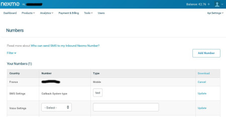

Restcomm comes with SMPP integration that allows sending messages from multiple SMPP endpoints. This tutorial will explain how to connect Restcomm SMPP to Nexmo. You can also connect Restcomm to any SMPP endpoint, for example, by using the Telscale SMSC gateway.

[[requirements]]
Requirements
~~~~~~~~~~~~

* Latest version of Restcomm
* Nexmo Account

[[step-1---get-nexmo-account-details]]
Step 1 - Get Nexmo Account Details
~~~~~~~~~~~~~~~~~~~~~~~~~~~~~~~~~~

Go into your Nexmo account dashboard and get the following data

* In the screenshot below, you need the
* *Callback System-type* = text

You also need the API Settings

* *Key :*
* *Secret :*

image:./images/restcomm-smpp-nexmo2.jpg[restcomm-smpp-nexmo2,width=699,height=172]

You also need to get the Nexmo gateway and the port as explained link:https://help.nexmo.com/hc/en-us/articles/204015743-Which-host-and-port-do-I-use-to-connect-to-Nexmo-SMPP-server-[HERE]  

[[step-2---configure-restcomm-to-use-smpp]]
Step 2 - Configure Restcomm to Use SMPP
~~~~~~~~~~~~~~~~~~~~~~~~~~~~~~~~~~~~~~~

Edit the file  $RESTCOMM_HOME/bin/restcomm/smpp.conf You must set the SMPP_ACTIVATE variable to true for SMPP to be activated

[source,lang:default,decode:true]
----
# Connection details for SMPP Restcomm integration
SMPP_ACTIVATE='true'            #default SMPP activate is always false. Set to true to activate SMPP
SMPP_SYSTEM_ID='xxxxxx'
SMPP_PASSWORD='xxxxxxx'
SMPP_SYSTEM_TYPE='xxxxxxx'  #This is required when working with Nexmo for inbound SMS
SMPP_PEER_IP='xxxxxxxx'  #use IP or DNS name of peer SMPP server
SMPP_PEER_PORT='xxxxx'
----

[[step-3---configure-restcomm-ip-and-required-features]]
Step 3 - Configure Restcomm IP and Required Features
~~~~~~~~~~~~~~~~~~~~~~~~~~~~~~~~~~~~~~~~~~~~~~~~~~~~

The next step is to configure the IP address and other features required to start Restcomm as explained <<Starting Restcomm-Connect.adoc#start-restcomm-connect,Starting Restcomm-Connect>>. 

If SMPP is correctly started, you should see an output similar to the one below in the console.

[source,lang:default,decode:true]
----
08:19:22,697 INFO  [org.restcomm.connect.smpp.SmppClientOpsThread] (Thread-602) SmppClientOpsThread started.
08:19:22,697 INFO  [org.restcomm.connect.smpp.SmppService] (RestComm-akka.actor.default-dispatcher-6) SMPP Service started
08:19:22,796 INFO  [org.jboss.as] (Controller Boot Thread) JBAS015961: Http management interface listening on http://127.0.0.1:9990/management
08:19:22,797 INFO  [org.jboss.as] (Controller Boot Thread) JBAS015951: Admin console listening on http://127.0.0.1:9990
08:19:22,797 INFO  [org.jboss.as] (Controller Boot Thread) JBAS015874: JBoss AS 7.2.0.Final "Janus" started in 10923ms - Started 477 of 557 services (79 services are passive or on-demand)
----

[[step-4---start-restcomm-and-send-inbound-messages]]
Step 4 - Start Restcomm and Send inbound Messages
~~~~~~~~~~~~~~~~~~~~~~~~~~~~~~~~~~~~~~~~~~~~~~~~~

* Start Restcomm and make sure SMPP is correctly bound to Nexmo
* Create a new SMS RVD Application that will receive incoming SMS from Nexmo
* Attach your Nexmo Number to the application (See below)

image:./images/restcomm-smpp-nexmo31.jpg[restcomm-smpp-nexmo3,width=635,height=364]

* See the screenshot below (The number below is the one to attach to your RVD application)

* Send an SMS message to the Number registered in your Nexmo Dashboard.
* The Nexmo *Callback System-type* setting lets Nexmo know that the message should be sent to this particular instance of Restcomm

[[step-5---send-outbound-sms-through-nexmo-smpp]]
Step 5 - Send Outbound SMS through Nexmo SMPP
~~~~~~~~~~~~~~~~~~~~~~~~~~~~~~~~~~~~~~~~~~~~~

To send an outbound message through Restcomm SMPP endpoint, you must specify the DID using as SIP phone or you can also build an app using Restcomm Visual Designer. 

Restcomm will check to see if there is a local application attached to that number. If there is none, the message will be forwarded through the SMPP connection to the provider, in this case, NEXMO. 

Example, if you want to send an SMS to the number 3399999999, you send it to 3399999999@RESTCOMM_IP:5080 

See screenshot below:

image:./images/restcomm-smpp-nexmo5.png[restcomm-smpp-nexmo5,width=466,height=343]]
