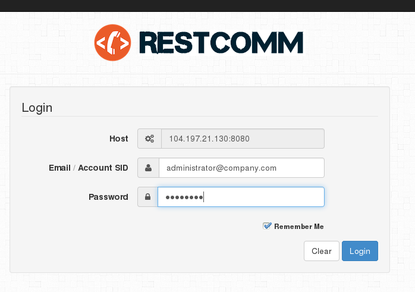

Rescomm is a turn-key telephony SaaS solution ready for public or private cloud deployment. Restcomm is compatible with Twilio API’s and is part of the link:http://restcomm.org[Restcomm] open source Community. Here is the Restcomm Open Source community https://github.com/Restcomm/RestComm-Connect[github page]. 

This tutorial will guide you through the steps required to install and run Restcomm on Google Cloud Compute Engine.

'''''

[[requirements]]
= Requirements

* Basic Knowledge of Telscale Restcomm or Mobicents Restcomm
* Google Cloud Compute Engine as explained https://cloud.google.com/compute/docs/[HERE]
* Java JDK 7 or higher as explained http://tecadmin.net/steps-to-install-java-on-centos-5-6-or-rhel-5-6/[HERE]
* Install screen (**yum install screen**)
* Minimum compute engine "Machine-type" *g1-small (1 vCPU, 1.7 GB memory)* On a production server, increase the machine type to account for higher traffic.

'''''

[[initial-setup-and-installing-restcomm]]
= Initial Setup and Installing Restcomm

* ssh into your google cloud compute instance
* install "screen"
** *yum install screen*
* Download Java
** *download java jdk to the /opt directory of your install as follows*
** *wget --no-cookies --no-check-certificate --header "Cookie: gpw_e24=http%3A%2F%2Fwww.oracle.com%2F; oraclelicense=accept-securebackup-cookie" "http://download.oracle.com/otn-pub/java/jdk/7u79-b15/jdk-7u79-linux-x64.tar.gz"*
** extract the content of the file to the */opt* directory as follows
** t**ar xzf jdk-7u79-linux-x64.tar.gz**
** point the java command to the correct directory with the following command
** *alternatives --config java*
* open firewall ports for Restcomm http traffic and RTP traffic
** from the ssh terminal run the following command
** *gcloud compute firewall-rules update restcomm-rules --allow tcp:444 tcp:8080 tcp:8000 tcp:2080 udp:5060 udp:5061 udp:5080 udp:34534-65535*
** these are some of the essential ports for SIP, RTP traffic.
* download  Mobicents Restcomm
** download Restcomm to any directory of your choice.* (In this tutorial, we created a new directory called telestax)*
** *wget https://mobicents.ci.cloudbees.com/view/RestComm/job/RestComm/lastSuccessfulBuild/artifact/mobicents-Restcomm-JBoss-AS7-7.2.2.611.zip*
** in the directory telestax extract the content of the zip file
** unzip *mobicents-Restcomm-JBoss-AS7-7.2.2.611.zip*
** go into the newly created **mobicents-Restcomm-JBoss-AS7-7.2.2.611** directory
** you should see the following content
+
[source,lang:default,decode:true]
----
appclient      docs               modules            telestax-license.xml
bin            domain             README.txt         telscale-media
bundles        jboss-modules.jar  standalone         tools
copyright.txt  LICENSE.txt        Telestax-EULA.pdf  welcome-content
----

[[config-and-start-restcomm]]
= Configure and Start Restcomm

** go to the directory **mobicents-Restcomm-JBoss-AS7-7.2.2.611**/bin/restcomm
** edit the file *restcomm.conf* file with the info from you google compute instance
** run the command *ifconfig* to get your local network details
** run the command *gcloud compute instances list* to get the Public IP Address
** go to *voicerss.org* to get a free API account
** fill out the *restcomm.conf* file as follows
+ 
[source,lang:default,decode:true]
----
# Network configuration
NET_INTERFACE=eth0
PRIVATE_IP=10.240.203.100
SUBNET_MASK=255.255.255.255
NETWORK=10.240.203.100
BROADCAST_ADDRESS=10.240.203.100

# PUBLIC IP ADDRESS
STATIC_ADDRESS=104.197.21.130

# VoiceRSS variable declarations
VOICERSS_KEY='290adfae344sdfgssfgs56d4c72b7'
----

[[start-and-use-restcomm]]
= Start and Use Restcomm

** run the start script in the directory mobicents-Restcomm-JBoss-AS7-7.2.2.611/bin/restcomm
** *./start-restcomm.sh*
** on your web browser go to the url
** *http://104.197.21.130:8080/*
** log into the Restcomm instance with username=**administrator@company.com**
** password=**RestComm**
** You will be prompted to change the default password.

[[restcomm-login-page]]

'''''

[[section]]

[[making-sip-calls-to-restcomm]]
= Making SIP Calls to Restcomm

* Start a SIP phone and make a call to *sip:1234@104.197.21.130:5080*
* Make another call to *sip:1235@104.197.21.130:5080*
