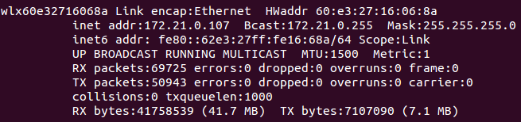
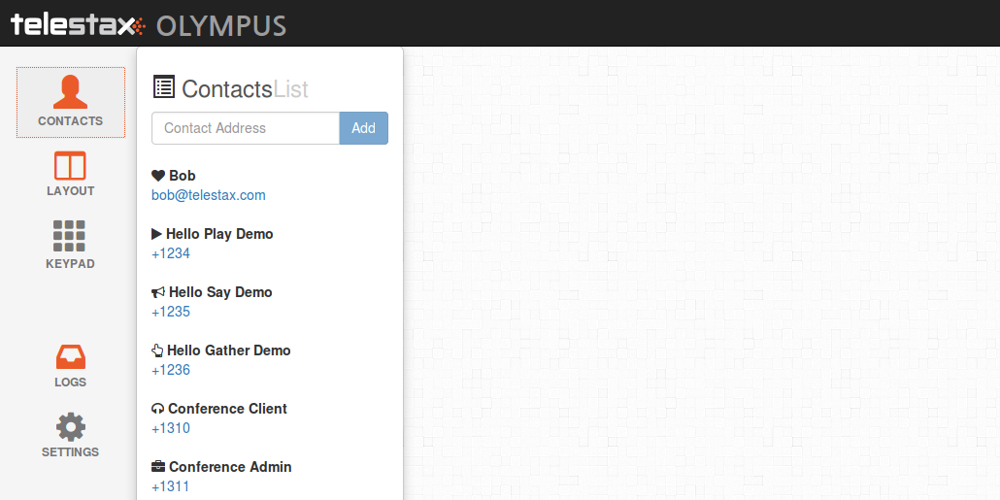

[[start-restcomm-connect]]
= Starting Restcomm-Connect

== Requirements

*  Install the link:https://www.linode.com/docs/networking/ssh/using-gnu-screen-to-manage-persistent-terminal-sessions[GNU screen] (it is optional but recommended)
* Install link:http://linuxaria.com/howto/linux-subnet-calculator-cidr[IPCalc]
* Install link:http://dev.mysql.com/doc/refman/5.7/en/installing.html[MySQL]
* You must have link:http://www.oracle.com/technetwork/java/javase/downloads/jdk7-downloads-1880260.html[JDK - 7] installed on your computer

== Download and unzip Restcomm binary

_If you you have already installed Restcomm you can <<Configure Restcomm IP information and Text-to-speech>> at once_

* Go to a local directory on your computer and run the following command ( <xxx> is the release version number):

[source,bash]
----
wget https://mobicents.ci.cloudbees.com/job/RestComm/lastSuccessfulBuild/artifact/Mobicents-Restcomm-JBoss-AS7-<xxx>.zip
----

* Unzip the binary to a local directory. It should be similar to this one:
*Restcomm-JBoss-AS7-7.6.0.869.zip*.
  Further we shall refer to this above Restcomm directory as the *$RESTCOMM_HOME*.

== Configure Restcomm IP information and Text-to-speech
=== Add your IP address
_A single host may have multiple IP addresses.
To get Restcomm working properly it is important to indicate the right IP address.
For local testing you can use localhost address (e.g. 127.0.0.1), in real working environment you will
need to use your public IP address._

* Go to the directory *$RESTCOMM_HOME/bin/restcomm*.
* Open the file *restcomm.conf*.
* Go to the section *# Network configuration*. You have to indicate the following information:

[source,bash]
----
# Network configuration
NET_INTERFACE=''
PRIVATE_IP=''
SUBNET_MASK=''
NETWORK=''
BROADCAST_ADDRESS=''
----
==== Obtaining the network interface
* First you have to get the information on your network interface. Run the command:

[source,bash]
----
 netstat -r
----
* Picture below shows sample output for the command.
Your *network interface* you can find in the Iface column in the same row where Gateway is indicated ( for example wlx60e32716068a ).

* You will have multiple rows for the same network interface.
One of the rows in the Destination column contains the *network address*. ( for example 172.21.0.0 )

image::images/10.png[]

=== Obtaining the public IP
* In order to get your public ip address you should run the following command:

[source,bash]
----
ifconfig
----
* You will have to find the same network interface name.
The information you will need can be found in the output:

* Your *IP address* ( for example 172.21.0.107 ) you will see in
[source,bash]
----
inet addr
----

* Your *subnet mask* ( for example 255.255.255.0 ) you will see in
[source,bash]
----
Mask
----
* Your *broadcast address* ( for example 172.21.0.255 ) you will see in
[source,bash]
----
Bcast
----
=== Network configuration
* Insert the network configuration details of your server in the following variables:

[source,bash]
----
# Network configuration
NET_INTERFACE='wlx60e32716068a'
PRIVATE_IP='172.21.0.107'
SUBNET_MASK='255.255.255.0'
NETWORK='172.21.0.0'
BROADCAST_ADDRESS='172.21.0.255'
----

=== Add your Text-to-Speech Key

_Text-to-Speech (TTS) is the technology which enables mobile, desktop and web applications
to read text aloud. Voice RSS provides free Text-to-Speech API as web service.
This TTS API key allows to convert the text to speech without installation of special software._

* Register at link:http://www.voicerss.org[voicerss.org] and get your personal *VoiceRSS API key*. It is for free.

* Go to *$RESTCOMM_HOME/bin/restcomm* and open *restcomm.conf* file.

* Go to the  *# VoiceRSS variable declarations* section. Add your VoiceRSS API key to the *VOICERSS_KEY* variable:

[source,bash]
----
# VoiceRSS variable declarations
#VOICERSS_KEY='797e69a254fc431b818bb37f35fb62df'
----

* Save and exit the restcomm.conf file.

== Start Restcomm and Open the Admin GUI

* Go to the *$RESTCOMM_HOME/bin/restcomm/* directory.

* To start Restcomm and media server run the following command:
[source,bash]
----
./start-restcomm.sh
----

* To see the Restcomm startup process run the following command (only works if you have screen installed):
[source,bash]
----
screen -r restcomm
----

* To see the Restcomm Media Server startup process run the command:
[source,bash]
----
screen -r mms
----

* Open your web browser and go to the url – *http://IP:8080*.
Instead of "IP" you should put your IP.

* Log in with the *administrator@company.com* username and the *RestComm* password.
Then you should change the default password.

* If you need to stop the Restcomm you need to go to *$RESTCOMM_HOME/bin/restcomm*
directory and run
[source,bash]
----
./stop-restcomm.sh
----
== Making Test SIP Calls using the Demo Apps

* Open any SIP phone of your choice.
You may use *Olympus*. Here you can find link:http://docs.telestax.com/how-to-use-olympus-with-restcomm[how to use Olympus with Restcomm].

* Go to the *Contacts* and make a test call at +1234 number. You will hear the standard voice message that is 2-3 seconds long.

