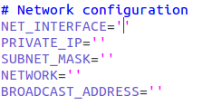
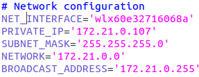
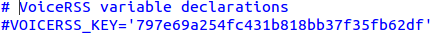

[big red]*Starting Restcomm-Connect*

[black]*Requirements*

*  Install the GNU screen (it is optional but recommended)

* Install IPCalc
* You must have *JDK - 7* installed on your computer

[big black]*Step 1 – Download and unzip Restcomm binary*

_If you you have already installed Restcomm you can skip the Step 1 and move to Step 2._

* Go to a local directory on your computer and run the following command:
*wget https://mobicents.ci.cloudbees.com/job/RestComm/lastSuccessfulBuild/artifact/Mobicents-Restcomm-JBoss-AS7-<xxx>.zip*,
where <xxx> is the release version number.

* Unzip the binary to a local directory. It should be similar to this one:
*Restcomm-JBoss-AS7-7.6.0.869.zip*.
  Further we shall refer to this above Restcomm directory as the *$RESTCOMM_HOME*.

[big black]*Step 2 – Configure Restcomm IP information and Text-to-speech*

* Go to the directory *$RESTCOMM_HOME/bin/restcomm*.
* Open the file *restcomm.conf*.
* Go to the section *# Network configuration*.

* In order to get the details of your server you should run the *ifconfig* command in the terminal.
You will see something like this:

image::images/8.png[]

* Run the command *netstat -r* to get the Network address of your computer:

image::images/10.png[]

* Configure the following variables with the network configuration details of your server:

[black]*Add your Text-to-Speech Key*

* Register at *www.voicerss.org* and get your personal VoiceRSS API key. It is for free.

* Go to *$RESTCOMM_HOME/bin/restcomm* and open *restcomm.conf* file.

* Go to the  *# VoiceRSS variable declarations* section. Add your VoiceRSS API key to the *VOICERSS_KEY* variable:

* Save and exit the restcomm.conf file.

[big black]*Step 3 – Start Restcomm and Open the Admin GUI*

* Go to the *$RESTCOMM_HOME/bin/restcomm/* directory.

* To start Restcomm and media server run the following command: *./start-restcomm.sh*

* To see the Restcomm startup process run *screen -r restcomm* (only works if you have screen installed).
To see the MMS startup process run the *screen -r mms* command.

* Open your web browser and go to the url – *http://IP:8080*.
Instead of "IP" you should put your IP.

* Log in with the *administrator@company.com* username and the *RestComm* password.
Then you should change the default password.

* If you need to stop the Restcomm you need to run *$RESTCOMM_HOME/bin/restcomm/stop-restcomm.sh* command.

[big black]*Step 4 – Making Test SIP Calls using the Demo Apps*

* Open any SIP phone of your choice.
You may use link:http://www.linphone.org/downloads-for-desktop.html[Linphone] which doesn’t require registration.

* Make sip calls at the following numbers. Take into account that first you should put you IP instead of "Restcomm_IP":

- 1234@Restcomm_IP:5080 – you will hear a welcome message
- 1235@Restcomm_IP:5080 – you will hear an hello world message in 3 languages
- 1236@Restcomm_IP:5080 – this will test the collect verb
