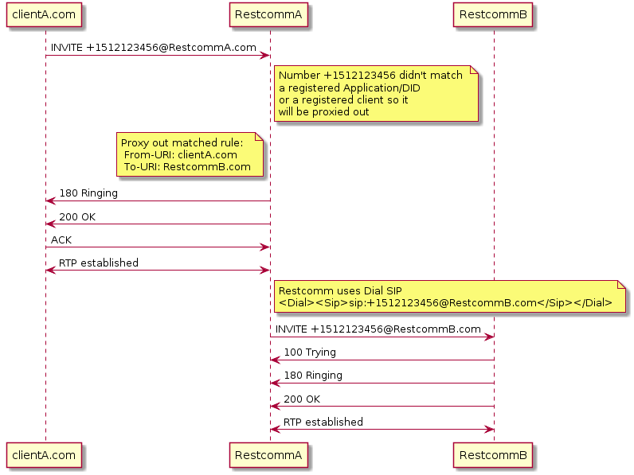

[[intro]]
= Restcomm as a generic Proxy

Restcomm can be configured to act as B2BUA and proxy out incoming calls (that didn't matched a registered application or a registered client) based on certain rules.

On incoming call, the feature will be executed after Restcomm-Connect finish checking:

1. Call to a registered Application/DID
2. Call to a registered Client

Restcomm-Connect will use Dial SIP RCML to proxy the call to the destination which means that media server will be in the call path.

== Configuration

To enable this feature you will need to modify the **restcomm.xml** configuation file, and edit the **ims-authentication** section:

[source,xml]
----
		<acting-as-proxy>
			<enabled>false</enabled>
			<use-from-header>true</use-from-header>
			<proxy-rules>
				<rule>
					<from-uri></from-uri>
					<to-uri></to-uri>
					<!-- Optionally provide username -->
					<proxy-to-username></proxy-to-username>
					<proxy-to-password></proxy-to-password>
				</rule>
				<rule>
					<from-uri></from-uri>
					<to-uri></to-uri>
					<!-- Optionally provide username -->
					<proxy-to-username></proxy-to-username>
					<proxy-to-password></proxy-to-password>
				</rule>
			</proxy-rules>
		</acting-as-proxy>
----

=== Options

* `enabled` set to **true** to enable the feature
* `use-from-header` if set to **true**, From header will be used to determine the From URI. If set to **false** the Contact header will be used to determine the From URI. Default **true** (use From header)
* `proxy-rules` Define the rules to match incoming traffic. You can define as many rules as you need
** `from-uri` Define the **From URI** that will be used to match the incoming traffic
** `to-uri` Define the **To URI** which will be used to proxy out incoming traffic that matched the rule
** `proxy-to-username` (Optional) Username for proxy
** `proxy-to-password` (Optional) Password for proxy

When enabled, the feature will try to match incoming traffic from **from-uri** and if matched will proxy it to **to-uri**

=== Example configuration

Given

* ClientA: **192.168.100.10:5060**
* Restcomm InstanceA: **192.168.100.11:5080**
* Restcomm InstanceB: **192.168.200.11:5080**

The configuration should be:

[source,xml]
----
		<acting-as-proxy>
			<enabled>true</enabled>
			<use-from-header>true</use-from-header>
			<proxy-rules>
				<rule>
					<from-uri>192.168.100.10:5060</from-uri>
					<to-uri>192.168.200.11:5080</to-uri>
					<!-- Optionally provide username -->
					<proxy-to-username></proxy-to-username>
					<proxy-to-password></proxy-to-password>
				</rule>
				<rule>
					<from-uri>192.168.200.11:5080</from-uri>
					<to-uri>192.168.100.10:5060</to-uri>
					<!-- Optionally provide username -->
					<proxy-to-username></proxy-to-username>
					<proxy-to-password></proxy-to-password>
				</rule>
			</proxy-rules>
		</acting-as-proxy>
----

The first rule:
[source,xml]
----
				<rule>
					<from-uri>192.168.100.10:5060</from-uri>
					<to-uri>192.168.200.11:5080</to-uri>
					<!-- Optionally provide username -->
					<proxy-to-username></proxy-to-username>
					<proxy-to-password></proxy-to-password>
				</rule>
----

Will match traffic from **192.168.100.10:5060** (**ClientA**) and will proxy out to **192.168.200.11:5080** (**Restcomm InstanceB**)

The second rule:
[source,xml]
----
				<rule>
					<from-uri>192.168.200.11:5080</from-uri>
					<to-uri>192.168.100.10:5060</to-uri>
					<!-- Optionally provide username -->
					<proxy-to-username></proxy-to-username>
					<proxy-to-password></proxy-to-password>
				</rule>
----
Will match traffic from **192.168.200.11:5080** (**Restcomm InstanceB**) and will proxy out to **192.168.100.10:5060** (**ClientA**)

== Call flows

Following a call flow for how the feature is used

