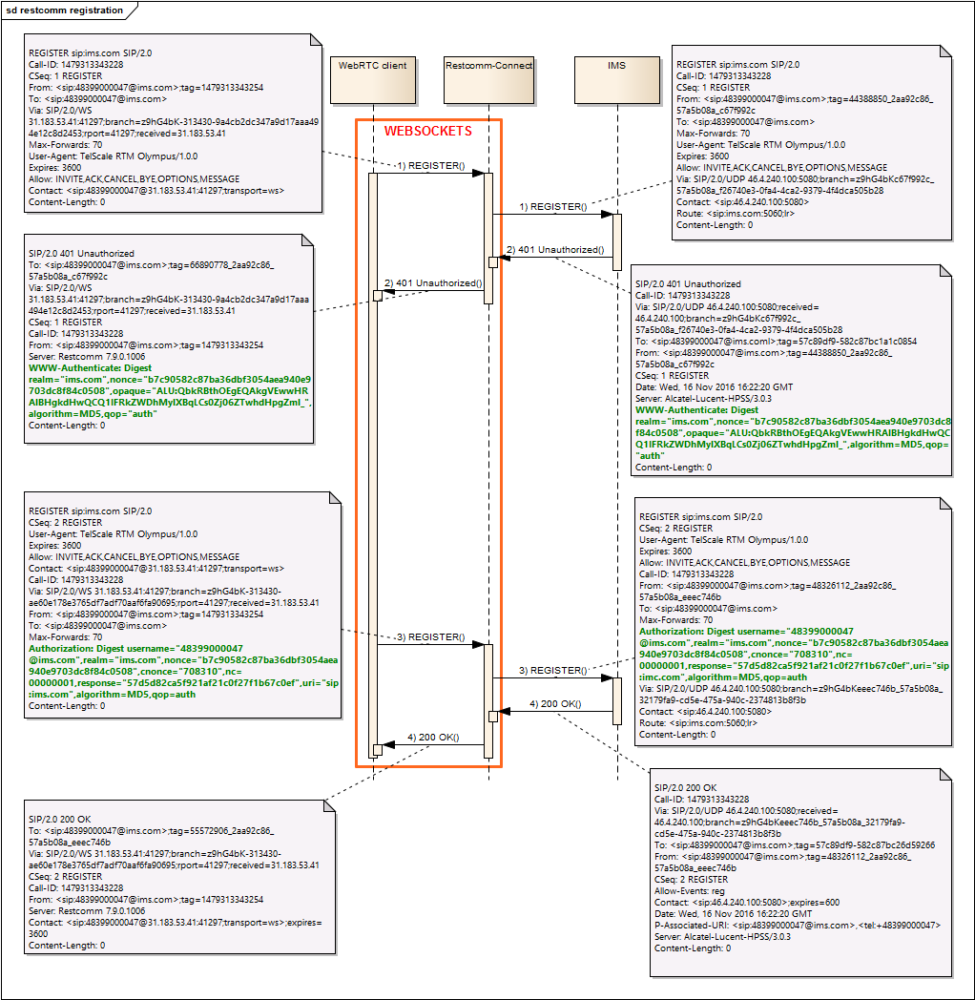
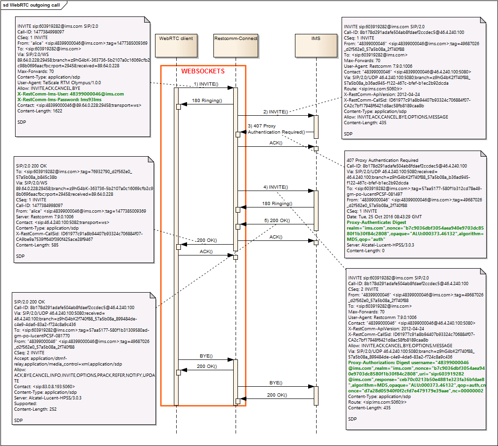
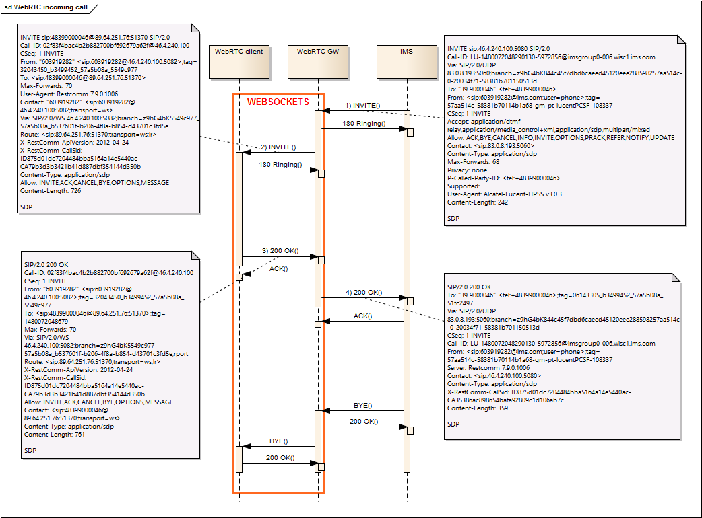
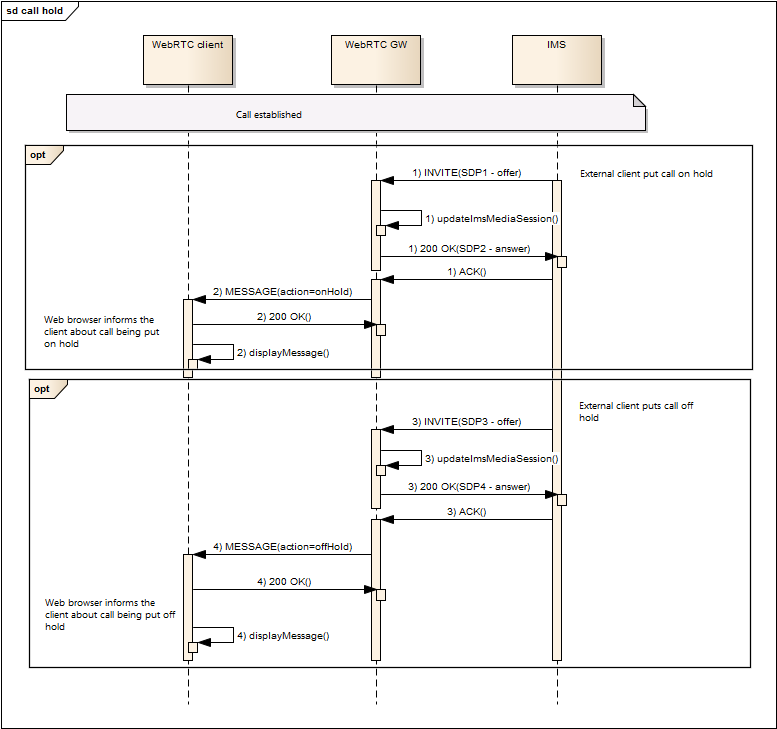

[[intro]]
= Restcomm as a WebRTC gateway to IMS

The main aspect of this feature is to associate WebRTC clients with IMS core network, in other words to make WebRTC clients act as IMS core network clients.

All signaling from WebRTC client should be sent toward IMS, and signaling from IMS should be passed to WebRTC clients.

Restcomm will act as a WebRTC gateway to IMS core network.

== Configuration

To enable this feature you will need to modify the **restcomm.xml** configuation file, and edit the **ims-authentication** section:

[source,xml]
----
<ims-authentication>
	<act-as-ims-ua>true</act-as-ims-ua>
	<domain>ims.com</domain>
	<proxy-address>ims.com</proxy-address>
	<proxy-port>5060</proxy-port>
	<call-id-prefix>WebRTCGW__1@</call-id-prefix>
	<user-agent>WebRTCGW/1.0</user-agent>
	<account>ims</account>
</ims-authentication>
----

== Call flows and examples

=== 1. WebRTC client registration

The registration of WebRTC clients is routed to IMS, and only when accepted by IMS it is stored in Restcomm-Connect database. The sequence diagram below illustrates IMS registration process.

=== 2. WebRTC client outgoing call

The outgoing call from WebRTC client registered in IMS is routed to IMS. The sequence diagram below illustrates outgoing call flow.

=== 3. WebRTC client incoming call

The incoming call from IMS is passed to WebRTC client. The sequence diagram below illustrates incoming call flow.

=== 4. WebRTC call hold flow

The Restcomm-Connect handles call hold action and makes sure to pass hold indication to client and IMS. The sequence diagram below illustrates the call hold scenario.

