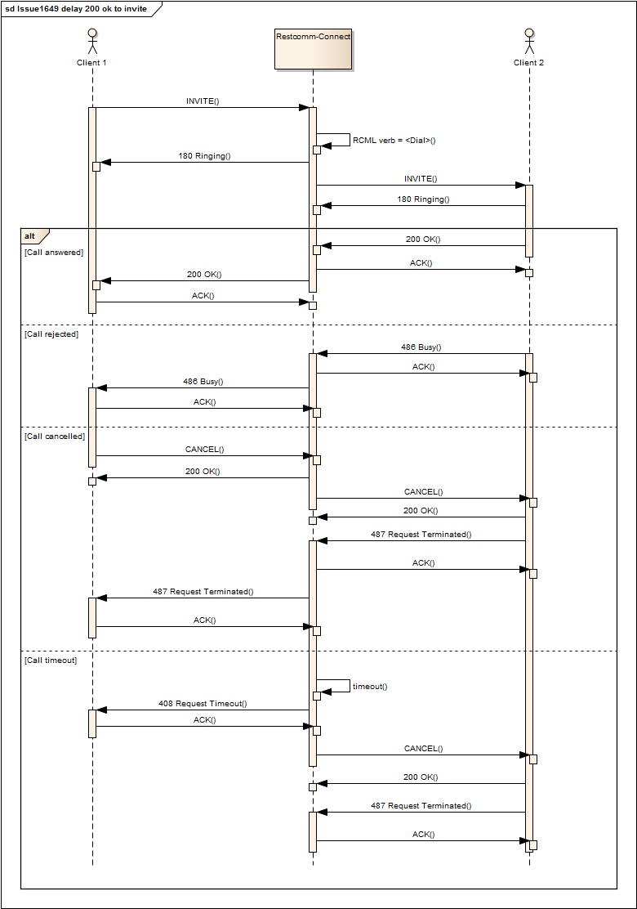
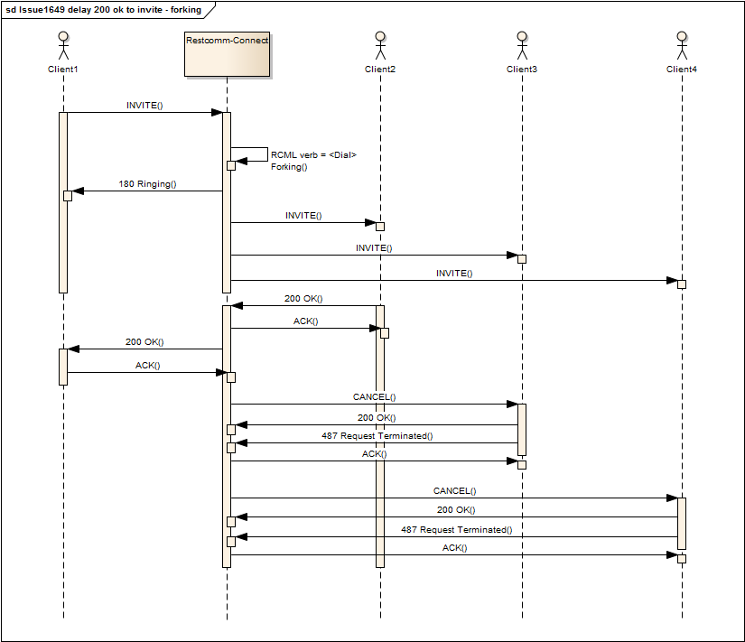

= Restcomm RCML – Dial

[[dial]]
== Dial
The *<Dial>* verb connects the current caller to another phone. If the called party picks up, the two parties are connected and can communicate until one hangs up. If the called party does not pick up, if a busy signal is received, or if the number doesn't exist, the dial verb will finish.

=== Dial Attributes

[cols=",,",options="header",]
|======================================================================================================
|Name |Allowed Values |Default Value
|action |relative or absolute URL |no default for <Dial>
|method |GET, POST |POST
|timeout |positive integer in seconds |30 seconds
|timeLimit |positive integer (seconds) |14400 seconds (4 hours)
|callerId |a valid phone number, or client identifier if you are dialing a <Client>. |Caller's callerId
|record |true, false |false
|======================================================================================================

* *action.* The 'action' attribute takes a URL as an argument. When the dialed call ends, RestComm will make a GET or POST request to this URL including the parameters below. If you provide an 'action' URL, RestComm will continue the current call after the dialed party has hung up, using the RCML received in your response to the 'action' URL request. Any RCML verbs occuring after a <Dial> which specifies an 'action' attribute are unreachable. If no 'action' is provided, <Dial> will finish and RestComm will move on to the next RCML verb in the document. If there is no next verb, RestComm will end the phone call.

=== Request Parameters

[cols=",",options="header",]
|==============================================================================================================================================================================================================
|Parameter |Description
|DialCallStatus |The outcome of the <Dial> attempt. See the DialCallStatus section below for details.
|DialCallSid |The call sid of the new call leg. This parameter is not sent after dialing a conference.
|DialCallDuration |The duration in seconds of the dialed call. This parameter is not sent after dialing a conference.
|RecordingUrl |The URL of the recorded audio. This parameter is only sent if record="true" is set on the `Dial` verb, and does not include recordings from the `Record` verb or Record=True on REST API calls..
|==============================================================================================================================================================================================================

*DialCallStatus Values*

[cols=",",options="header",]
|=======================================================================================================================================================
|Parameter |Description
|completed |The called party answered the call and was connected to the caller.
|busy |RestComm received a busy signal when trying to connect to the called party.
|no-answer |The called party did not pick up before the timeout period passed.
|failed |RestComm was unable to route to the given phone number. This is frequently caused by dialing a properly formated but non-existent phone number.
|canceled |The call was canceled via the REST API before it was answered.
|=======================================================================================================================================================

* *method.* The 'method' attribute takes the value 'GET' or 'POST'. This tells RestComm whether to request the 'action' URL via HTTP GET or POST. This attribute is modeled after the HTML form 'method' attribute.
* *timeout.* The 'timeout' attribute sets the limit in seconds that <Dial> waits for the called party to answer the call.
* *timelimit.* The 'timeLimit' attribute sets the maximum duration of the <Dial> in seconds.
* *callerId.* The 'callerId' attribute lets you specify the caller ID that will appear to the called party when RestComm calls. By default, when you put a <Dial> in your RCML response to RestComm's inbound call request, the caller ID that the dialed party sees is the inbound caller's caller ID. If you are dialing to a <Client>, you can set a client identifier as the callerId attribute. For instance, if you've set up a client for incoming calls and you are dialing to it, you could set the callerId attribute to client:thomas.
* *record.* The 'record' attribute lets you specify whether the call will be recorded or not. By default, the call is not recorded. If you set the attribute to 'true' Restcomm will start recording when the two calls are bridged

NOTE: The current release of Restcomm doesn't support recording for Dial Conference. This feature will be available in the next release

* *Nesting.* You can nest the following nouns within <Dial>: <Number>, <Client>, <Conference>

== Examples

For examples of how to use the <Dial> verb see below.

----
<Response>
    <Dial>1-444-555-666</Dial>
</Response>
----

----
<Response>
    <Dial record="true">1-444-555-666</Dial>
</Response>
----

----
<Response>
    <Dial callerId="1555666777" record="true">1-444-555-666</Dial>
</Response>
----

== Answer Delay with Dial verb

For certain scenarios the 200 OK on the initial call should be delayed when the first verb is Dial, until Restcomm receives the final response from the Dial branch (or branches).

Before this feature, when processing an incoming call for a hosted application, the application immediately created media session and sent SIP 200 OK response to the client no matter if there was a Dial verb in the hosted application or not. The incoming call was established with the application and the 'ringing' sound was transmitted through media channel. At the same time, if the RCML hosted application had Dial verb, the application sent SIP INVITE request to the destination. Depending on the destination response, the incoming call was either updated with the new media session (when the response was 200 OK), or it was disconnected (in case of failure response).

With this new feature, in the above scenario, the application sends SIP 180 Ringing response instead of SIP 200 OK. The SIP 200 OK response is sent to the client only when the outgoing call is established with the destination. When outgoing call is failed, then the failure response is passed to the client.

The feature was implemented as a feature flag. In order to configure this functionality, the following definition must be present in restcomm.xml file:

[source,xml]
----
<enable-200-ok-delay>true</enable-200-ok-delay>
----

=== Call flows

The following sequence flow diagrams illustrate the new way of Restcomm-Connect functionality for RCML <Dial> verb.

1. The following sequence flow diagram illustrate the use of the feature when dialing to a single destination. Here you can see how all the possible states (answered, failed, busy etc) are handled.

1. The next sequence flow diagram illustrate the feature when in Dial Forking.

