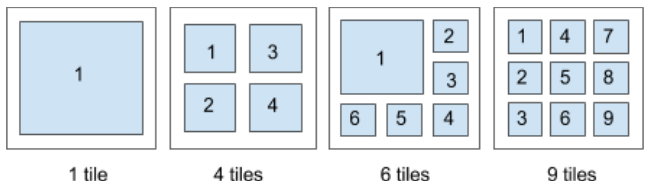

= Restcomm RCML – Video

[[video]]
== Video

The `<Video>` noun allows to configure and enable video* for calls and conferences, therefore, it can be nested under `<Client>`, `<Sip>` and `<Conference>` nouns.

IMPORTANT: * Video is supported only when Restcomm is configured to use Dialogic's PowerMedia XMS media server.

IMPORTANT: When `<Video>` noun is nested with other nouns, the client name, sip URI and the conference room should be informed as `name` attribute on each of their nouns.
Example: `<Client>alice</Client>` should be `<Client name="alice"></Client>`.

[[attributes]]
=== Noun Attributes

Some of the attributes of `<Video>` noun can be used exclusively by `<Conference>` noun. The `<Video>` noun supports the following attributes:

[cols=",,,",options="header",]
|==========================================================================
|Attribute Name |Allowed Values |Default Value | Allowed when nested under
|enable |`true`, `false` |`false` |`<Client>`, `<Sip>`, `<Conference>`
|mode |`mcu`, `sfu` |`mcu` |`<Conference>`
|resolution |`CIF`, `4CIF`, `16CIF`, `QCIF`, `VGA`, `720p` |`720p` |`<Conference>`
|layout |`tile`, `linear` |`tile` | `<Conference>`
|overlay |String |Empty | `<Client>`, `<Sip>`, `<Conference>`
|==========================================================================

==== enable

The enable attribute specifies if the video is enabled or not. Accepts two values: `true` and `false`. Default value is `false`. If the value is set to `false`, it wont be video for the given call, the same way for when there is no `<Video>` noun informed.

==== mode

The mode attribute specifies the video conference mode. It allows you to choose between `mcu` and `sfu` mode. For `mcu`, all video received from participants of the conference is mixed on server side and streamed back to all participants equally. For `sfu`, the video from each participants is delivered to all participant separately (without mixing) and the video disposition relies on client side.

==== resolution

The resolution attribute lets you specify the resolution of the video. Accepted values are: `QCIF`, `CIF`, `4CIF`, `16CIF`, `VGA`, and `720p`. Default value is `720p`.

==== layout

The layout attribute defines the video conference layout. It allows to choose between `linear`, and `tile`. The layout attribute can be applied only in MCU mode. The tiled layout depends on the number of participants. Both use an automatic setting where the tiles grow or shrink based on the number of conference participants.

The `linear` layout organizes its objects into scrolling rows or columns.

image::images/linearLayout.png[Conference linear layout]

The `tile` layout organizes its objects into four pre-defined tiled layouts.

==== overlay

Text overlays on video can be used to embed a caption, a name or a watermark for copyright reasons. The text can also be used in advertisement banners with variable content.

[[examples]]
== Examples

[[examples-1]]
=== Example 1: Video call to Client

The following RCML dials to alice enabling video with `text` as overlay.

----
<?xml version="1.0" encoding="UTF-8"?>
<Response>
    <Dial>
	    <Client name="alice">
	        <Video enable=”true” overlay=”text”>
    	    </Video>
	    </Client>
    </Dial>
</Response>
----

[[examples-2]]
=== Example 2: Video call to Sip address

The following RCML dials to alice's SIP URI enabling video with `text` as overlay.

----
<?xml version="1.0" encoding="UTF-8"?>
<Response>
    <Dial>
	    <Sip name="sip:alice@127.0.0.1:5080">
	        <Video enable=”true” overlay=”text”>
    	    </Video>
	    </Sip>
    </Dial>
</Response>
----

[[examples-3]]
=== Example 3: Videoconference

The following RCML starts conference `1112` enabling video in MCU mode with resolution of 720p, tile layout and `text` as overlay.

----
<?xml version="1.0" encoding="UTF-8"?>
<Response>
	<Dial>
		<Conference startConferenceOnEnter="true" name="1112">
			<Video enable="true" mode="mcu" resolution="720p" layout="tile" overlay="text">
			</Video>
		</Conference>
	</Dial>
</Response>
----
