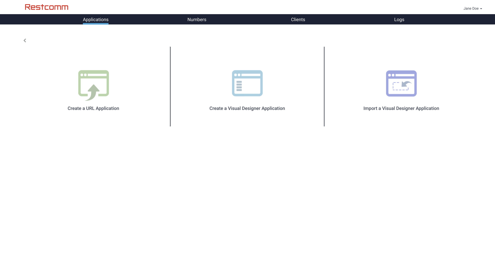
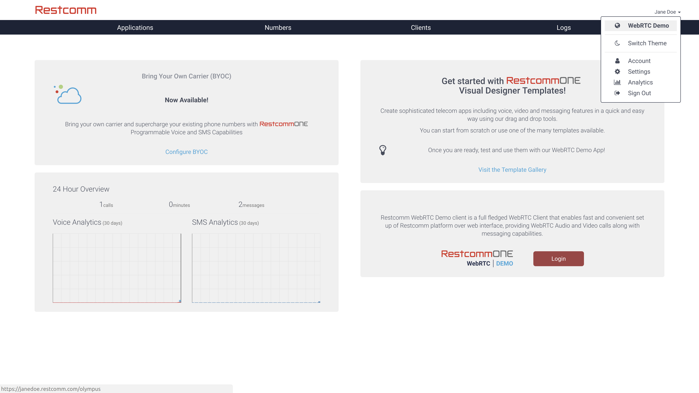
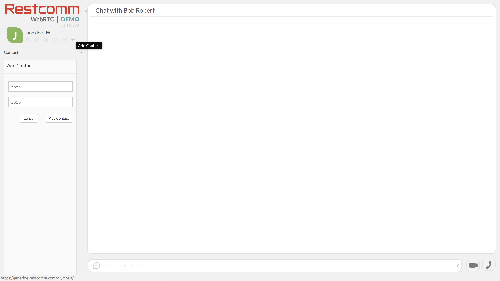

= {product} Visual Designer Quick Start guide

This guide will help you learn the basics of Visual Designer.

== The _Greeting_ Voice Application

=== Create the Application

New applications are easily created from within the <<../admin/console-overview.html#restcomm-applications,{product} Console>>. 

In order to create an <<../admin/console-overview.html#restcomm-applications,{product} Application>>:

* Click on the `Add New App` button from the `Applications` Tab. This will start the application creation wizard.
* Choose `Create a Visual Designer Application` in the next view.
* In the Template Gallery pick the `Blank` template. That's the most basic Visual Designer application.
Template Gallery offers a range of options to kick start your application and can save you a great deal of time
and effort. More templates are added on a continunous basis.
* Next, you need to name your application and choose a _type_ for it. The _name_ is not an
identifier but more like a user friendly way to refer to your app. We'll use `greeting-app` for the purpose of this example.
* The _type_ determines whether this application will be used to handle incoming voice calls or SMS messages.
Choose `voice`.
* When done, click `Create`. This will create your application and navigate you to the Application details page.
* Click `Design` to open the Visual Designer editor in a new tab.

image::https://www.restcomm.com/wp-content/uploads/2018/07/Screenshot-from-2018-07-02-16-39-23.png[{product} Visual Designer Greeting application]

You're almost there. Your application has been created and is ready to greet you with the default message when called.
You do need a way to reach it though. To do that, you'll have to attach it to a <<../admin/console-overview.html#restcomm-numbers,{product} Number>> and finally make a call to it.

=== Attach your Application to a {product} number

You've just created a _voice_ application. Such applications are executed when an incoming voice call is made to a <<../admin/console-overview.html#restcomm-numbers,{product} Number>>.
We will register a SIP Number which is a number that can be called via a SIP or WebRTC Client

In <<../admin/console-overview.html#,{product} Console>>, click on the `Numbers` Tab and follow the steps below:

* At the top of the screen, provide a value for `SIP Address` and `Friendly Name` such as 5555 by example. 
Remember, what you define as SIP Address is the number you will call to test your application. 
Click `Register` to register this number and start the wizard for linking a <<../admin/console-overview.html#restcomm-numbers,{product} Number>> to your newly created application.
The operation will fail if the number has already been registered.
* You should now see the number details form similar to the screenshot below. Your number is registered but does not point
 to your application yet.
* In the `Voice` section expand the dropdown with the list of applications. You should
see an entry named `greeting-app`. Select it.
* Click `Save changes` at the bottom.

image::https://www.restcomm.com/wp-content/uploads/2018/07/Screenshot-from-2018-07-02-16-42-35.png[Bind greeting application to a phone number]

Your number is now linked to the application.

=== Call the Application

It's now time to test the application. Voice applications are executed when an incoming voice call is made to the <<../admin/console-overview.html#restcomm-numbers,{product} Number>> you just registered.
We will use the WebRTC Demo client that is available in your {product} account for testing purposes.

* Start WebRTC Demo client. Please use the same password that you used to create your {product} Account, unless you changed it in the <<../admin/console-overview.html#restcomm-client,{product} Clients>> Tab

From WebRTC Demo client

* Create a new Contact named after the number you created. In our case this is 5555.

* Place your call and make sure your sound output device is active.
image::https://www.restcomm.com/wp-content/uploads/2018/07/Screenshot-from-2018-07-02-16-55-39.png[Greeting app demo call]
* You should hear the greeting message of the `greeting-app` application.
* Keep the tab open for later use.

== Visual Designer Concepts

Now that the base application has been created, linked to a <<../admin/console-overview.html#restcomm-numbers,{product} Number>> and tested through the WebRTC Demo Client, you can go ahead and tweak your application with more useful and interesting features.  Let's switch back to Visual Designer tab and introduce some basic concepts.

=== Elements

On the left, you will notice a list of buttons you can drag and drop into the modules to the right of this list. They are called `Elements`. 
Elements are the building blocks of each Visual Designer application.

You will notice that your application already contains a `Say` element. It contains the greeting that
you heard when calling the application. `Say` elements are able to convert written phrases to their
audio representations. We call this Text-To-Speech (TTS).

=== Modules

`Elements` are grouped together in sequences called `modules`. The whole area next to the
element toolbox is where modules appear. They are organized in a series of tabs and will accept
elements when dragged and dropped over them. Modules are the main execution unit in a Visual Designer application.

By default new applications already contain a _Welcome_ module with the `Say` element previously mentioned. 
Since this gets executed first, this is called the `Startup` module.

=== Making changes

Let's now change the greeting to something more interesting.

* Edit the default text in the `Say` element and use something more personalized like _'Hello Alice. I am glad to hear back from you.'_.
* Click the `Save` button.

image::https://www.restcomm.com/wp-content/uploads/2018/07/Screenshot-from-2018-07-02-16-49-11.png[Greeting app announcement modified]

* Get back to the WebRTC Demo tab and call your application once again.
* You should hear the updated greeting.

image::https://www.restcomm.com/wp-content/uploads/2018/07/Screenshot-from-2018-07-02-16-55-39.png[Greeting demo app call]

==== Validation errors

You will need to _Save_ your changes so that they are effective. In case you get a validation
error, your changes won't be applied to the actual running application. They will be persisted though so
that you don't loose your work.

=== Workflow

Once you're done, it's good practice to close the editor tab. Think of Visual Designer
as an editor like the one you edit images in. You get a new window for each new image you edit
and you're allowed to switch between them. When done, you just close what you don't need any more.
This is not required but will result in a cleaner and faster workflow.

<<index.adoc#,Back to Visual Designer documentation home>>

