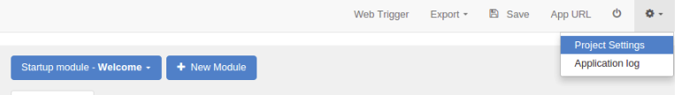
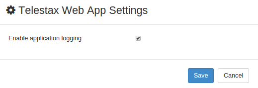
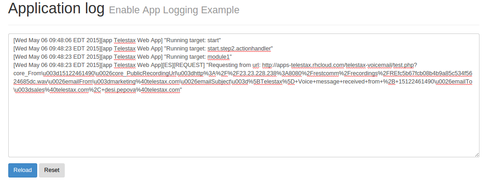

Application Logging is designed to help users troubleshoot their applications.

[[accessing-application-log]]
Accessing Application Log
^^^^^^^^^^^^^^^^^^^^^^^^^

* Go to RestComm Visual Designer
* Open the application you wish to enable logging for
* On the top of the application screen click on the _Settings_ icon
* Select _Project Settings_

* Enable Application Logging

* Make a test call to your application
* After the test call click on the _Settings_ button again and and open _Application log_

image:./images/Selection_095.png[enable application logging,width=767,height=114]

* If your application is working properly you should see a screen similar to the one below.
+

+
* If there are some issues with the external service you are using or any other part of your application you should see similar log screen: 
+
image:./images/Selection_101.png[application log screen with an exception,width=1059,height=409]
+
* In this case an EXCEPTION has been thrown. The error relates to the external service used in the application.

Enabling Application log can help you easily find and troubleshoot issues related with your application while you are still developing it. If you want to clear the application log just click on the Reset button. Reload your application log screen each time you are testing your application in order to view new logs.
