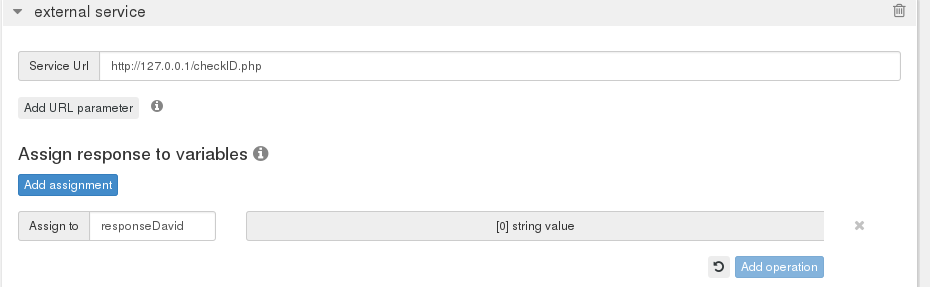
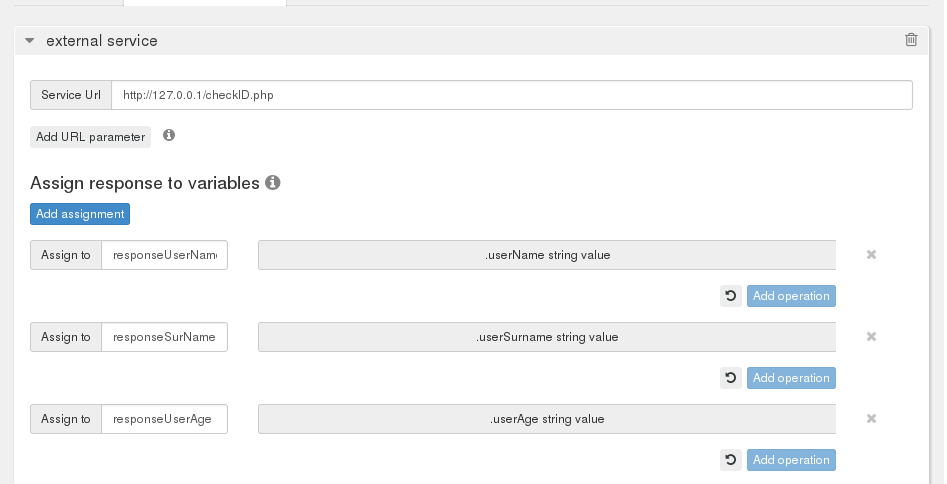
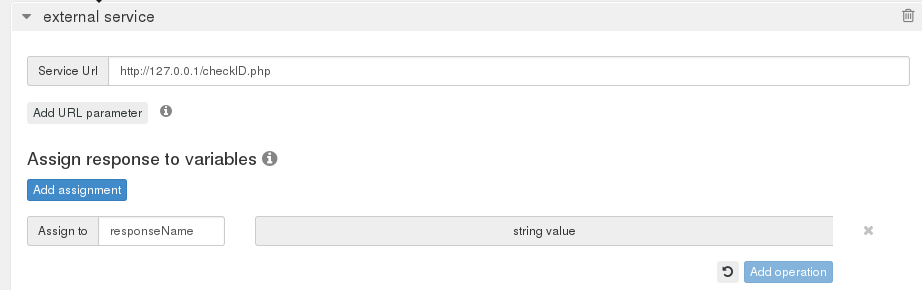

In this tutorial, you will learn the  specifics of getting data out of your external services applications using Objects, String and Arrays. We are going to use the PHP snippet below to illustrate the example.   

NOTE: Note that the associative array is later Json encoded.

[source,lang:php,decode:true]
----
<?php
//Using Arrays
$userArrays = array("David", "Jones", "30");

//Using Associative Arrays
$assoArrays = array("userName"=>"John", "userSurname" => "Mayor", "userAge"=>"29");

//Using variable String
$userName = "Clive James";
?>

<html>
<dl>
  <dt>Array</dt>
    <dd><?php echo json_encode($assoArrays); ?></dd>
  <dt>Associative Array</dt>
    <dd><?php echo var_dump($userArrays); ?></dd>
  <dt>Json Encoded Variable String Value</dt>
    <dd><?php echo json_encode($userName); ?> </dd>
</dl> 
</html>
----

The code above will produce the following result.

[source,lang:default,decode:true]
----
Array
    Array ( [0] => David [1] => Jones [2] => 30 ) 1
Associative Array
    {"userName":"John","userSurname":"Mayor","userAge":"29"}
Json Encoded Variable String Value
    "Clive James"
----

= Arrays with external services

When using RestComm Visual Designer external services, you will likely want to reference any of the objects in the array and retrieve the value. In the first line, the *Array ( [0] => David [1] => Jones [2] => 30* ). This is how you will get the results in the RVD external services

[[under-the-rvd-assign-response-to-variables-perform-the-following-steps]]
== Under the RVD Assign response to variables, perform the following steps

* click on *Add Assignment*
* *Assign to* - give an RVD variable name, in this example, *responseDavid*
* choose *array->itemAtPosition->0*
* click on *Add Operation*
* choose *String*
* click on *Done*

The result will be similar to the screen below. The *itemAtPosition 0* points to David and position one will point to Jones, etc. You can click on Add Assignment and do the same for all the data you want to retrieve from the Array specifying the position and creating an RVD variable to store the retrieved data. 

= Associative Arrays

Here is the result of the associative array to retrieve using external services: *\{"userName":"John","userSurname":"Mayor","userAge":"29"}.*

[[under-the-rvd-assign-response-to-variables-perform-the-following-steps-1]]
== Under the RVD Assign response to variables, perform the following steps:

* click on *Add Assignment*
* *Assign to* - give an RVD variable name, in this example, *responseUserName*
* choose *Object->propertyNamed->userName*
* click on *Add Operation*
* choose *String*
* click on *Done*

You can repeat the above steps for all three properties of the associative array objects. The result will be similar to the screenshot below: 

= Getting data from a Variable

In the PHP snippet, the variable **$userName = "Clive James"**. You must convert this into a Json object as shown in the code like this *json_encode($userName).* 

The result will be the value of the variable without a object property name. This is how to retrieve the value from the $userName variable.

[[under-the-rvd-assign-response-to-variables-perform-the-following-steps-2]]
== Under the RVD Assign response to variables, perform the following steps:

* click on *Add Assignment*
* *Assign to* - give an RVD variable name, in this example, *responseName*
* choose *String*
* click on *Done*

RVD knows what data to retrieve and the value of the $userName variable will be returned and placed in the RVD *responseName* variable you created. Here is a screenshot below: 

