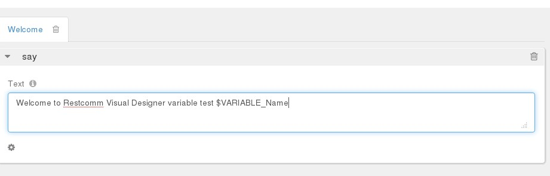
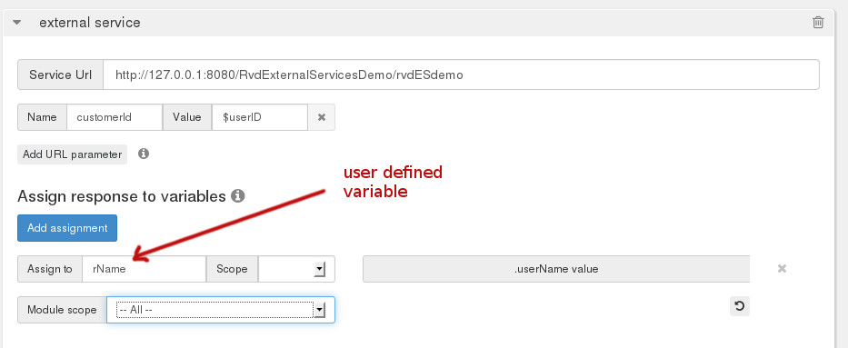

Telscale Restcomm Visual Designer helps you speed up creating communications application. However, for more complex applications, you might need to access advanced features of Restcomm. That is why understanding how you can use user-defined and built-in variables is essential. Please see below for more information. 

= Variable syntax

Variable names should comply with the following regular expression:

*/^[A-Za-z]+[A-Za-z0-9_]*$/*

For example, MyVariableName, MyVariableName123

= Accessing variables

In order to access a variable its name should be prepended with "$" sign. Currently RVD variables are processed when placed in:

1.  Say verb text
2.  Sms text
3.  Fax content
4.  UssdMessage text
5.  ExternalService URL parameter values

NOTE: For cases 1-4 interpretation occurs when steps are rendered. In case 5 interpretation is done internally.

= Kinds of variables

*Default request variables*

These variables are created for every Restcomm request:

* core_CallSid
* core_AccountSid
* core_From
* core_To
* core_CallStatus
* core_ApiVersion
* core_Direction
* core_CallerName

1.  *core_CallSid* = This can be useful when you want to get and pass the SID of a current call and transfer the call to another user core_From
2.  *core_From* and *core_To* = can be used to block certain users from making a call. A type of call blocking application.
3.  *core_CallerName* = This can be useful for sending callerID

= Verb action variables

These variables are created from Restcomm requests to specific verb actions. They are copied from the default Restcomm URL parameters and are prefixed with core_*.

The following verbs create such variables:

* *Collect* (both menu and collectdigits types) 
** core_Digits
* *Dial* 
** core_DialCallStatus 
** core_DialCallSid 
** core_DialCallDuration__if "record" = true__ 
** core_RecordingUrl
* *Record* 
** core_RecordingUrl
** core_RecordingDuration
** core_Digits
* *Sms* 
** core_SmsSid
** core_SmsStatus
* *Fax* 
** core_FaxSid
** core_FaxStatus
* *UssdCollect*
** core_Digits (not yet implemented. The user-defined variable works)

= User defined variables

These are user defined general purpose variables. They have an additional "Scope" property that controls whether they last for the whole "application" or for the next "module" execution.

Such variables can be created from the following steps:

* *Collect/collectdigits Creates a variable named as defined in "Assign to" control property and populates it with the Digits provided by the Restcomm request.*

NOTE: Effectively there are _two_ variables created when the Gather action is processed by RVD. The user-defined one and the _core_Digits_ as described in the previous section.

image:./images/RVD_variables2.jpg[RVD_variables2,width=933,height=307]

* *External Service*

NOTE: Each assignment creates a new variable named as defined in the "Assign to" assignment property.

Technically, when the "application" scope is selected, a variable is automatically propagated over verb actions using an implicit sticky_ prefix (transparent to the designer). Whenever the RVD controller handles a Restcomm requests that contains a sticky_* named variable it implicitly places it in all action urls rendered in the resulting RCML response.      
