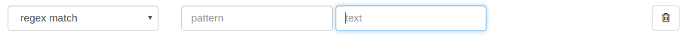
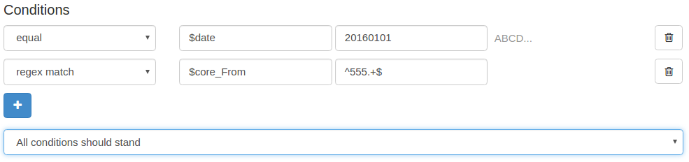
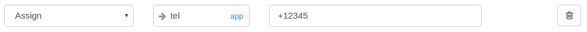
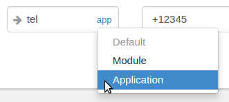
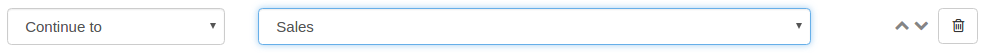
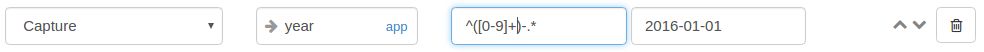
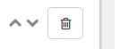

_Control_ element performs basic tasks based on a set of conditions.
It is the equivalent of a _if-then_ control structure in developer terms.
In consists of _conditions_ and _actions_. If the conditions are met
the actions are exetuted.

Conditions
~~~~~~~~~~

A set of _conditions_ defines all the prerequisites in order for the actions to be executed. Each condition can be valid or not (true/false).
It supports common comparison operations **equals, not equal, greater, greater or equal,
less, less or equal** for both numeric and string operands. In addition, **regex match**, a handy regular expression matching operation is supported too.

==== Operations

 equals, not equal, greater, greater or equal, less, less or equal

image:./images/ControlElement_equal_operation.png[equal_operation]

Compares the two operands. The comparison can be _numeric_ "123" or _text_ based "ABCD". For
numeric comparisons, the operands should be convertible to numbers (floats supported).
For text based comparisons any operand will do.

====== Comparison type - Text & numbers

When comparing, treating operands as numbers or text will not always render the same result.
For example, **4** is less than **05** but at the same time **'4'** is greater than **'05'**. Make sure
you are always using the right comparison type. You can switch between comparison types using
the `ABCE/123` link right after the operands:

image:./images/ControlElement_comparison_type_switch.png[switch_comparison_type]

==== regex match

Tries the to match the _text_ parameter against the regular expression in the _pattern_ parameter.
If a match is found it evaluates to true. Note that no _RVD expression expansion_ takes
place for the pattern parameter.

==== Handling many conditions

For a single control element more than one conditions can be evaluated. If many conditions are given, each one of them
will be evaluated individually and all results will be combined to determine the
status of the whole complex condition. This can be done in two ways. Either _All conditions should stand_ (AND operation) or _Any condition should stand_ (OR operation).

In the screenshot above, both _$date_ should equal '20160101' **and** $core_From should start with '555'
in order to have the whole control element evaluate to _true_.

==== No conditions present

In case there are no conditions present, the whole Control element will evaluate to true and proceed to the
execution of the actions.

Actions
~~~~~~~

A number of tasks to be executed sequentially if the condition(s) evaluate to _true_.

==== Assign action

Introduces a new variable and assignes it the value of the expression on the right.

The text box on the left with the -> icon holds the name of the variable (note that
no '$' character should be included here). A typical RVD expression can be typed
in the right side.

====== Variable scope

The _scope_ of the variable (i.e. for how long it will last) can be selected by clicking on the blue link
inside the text box.

In the screenshot above, `tel` variable is set to _Application_ scope (i.e. last throughout the
whole lifecycle of the application).

==== Continue-to action

Diverts the flow of the application to the specified module. All consequent actions
are ignored.

In the screenshot above, the flow of the application is dieverted to the `Sales` module when the action
is executed.

==== Capture action

image:./images/ControlElement_capture_action_blank.png[capture_action]

Captures part of the RVD expression in _text_ according to _pattern_ and assigns the captured
value to a _variable_. Use a pair of parenthesis to designate the captured segment.

In the screenshot above, the 'year' part is isolated out of a date literal and assigned
to a `year` (application-scoped) variable.

The use of a **single** pair of parenthesis is obligatory inside the _pattern_ parameter.
Also, only literal regex patterns are supported in this parameter. No RVD variable expansion will take place.

==== Ordering actions

The order of actions is significant. They will be executed one-by-one until the last action is complete,
a _Continue-to_ action is executed or an error occurs. The order of actions can be altered using the re-order
buttons on the far right of the row:

Make sure to include only a single _Continue-to_ action in a control element and
always make it last.

