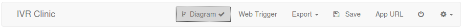

[[diagrams]]
Restcomm Visual Designer Diagrams
^^^^^^^^^^^^^^^^^^^^^^^^^^^^^^^^^

_Diagram_ is a feature of RVD introduced in Restcomm release version 7.5.0. It's a graphical tree-like view of a project's call flow where modules are depicted as tree nodes and connections between modules are drawn as arrows. With a single look one can get a pretty good idea of what an application does. 

To enable the diagram view, just hit the __Diagram__ button at the project menu bar: 

A new section will appear under the menu. Here is the diagram for the sample _IVR Clinic_ application:   

image:http://docs.telestax.com/wp-content/uploads/2016/02/irv_clinic.png[irv_clinic,width=599,height=644]

Points worth mentioning:

* Nodes are displayed by their labels.
* Links between modules are displayed using arrows. Typical RVD elements that produce links are __Collect__, and _External Service_

[[arrows-continue-to]]
Arrows - Continue To 
^^^^^^^^^^^^^^^^^^^^

In general, wherever RVD contains a _ContinueTo_ field that links to another module an arrow is displayed. Depending on the type of the element, a different piece of information is displayed on the arrow.

* For _Collect_ menu elements descriptions like *"Press 1", "Press 2"* etc. are displayed.
* For _Collect_ elements that capture digits in variables the name of the variable is displayed. For example: **'app_phone' = <collect>**. _app_phone_ is the name of the variable.
* For _External Service_ elements with _mapped routing_ enabled the service response value that leads to a destination module is displayed. For example, for a service returning values __ok__|_error_ to indicate success or failure, typical arrow descriptions would be *"ES Result = ok"* or **"ES Result = error"**.

Diagrams are not updated for any single operation a user makes. Instead a per-save update policy is followed requiring a user to _Save_ in order to see the updated graphical representation of a project.

[[no-support-for-deprecated-dynamic-routing]]
No support for deprecated dynamic routing
^^^^^^^^^^^^^^^^^^^^^^^^^^^^^^^^^^^^^^^^^

No support is provided for External Services with dynamic routing feature used. Dynamic routing is a deprecated feature that made it impossible for the application to know the possible service outcomes at design time. You can learn more on how to fix projects with dynamic routing so their diagram is properly displayed  http://docs.telestax.com/fix-dynamic-routing-external-services/[here].

[[known-issues-in-chrome]]
Known issues in Chrome
^^^^^^^^^^^^^^^^^^^^^^

An issue was discovered in Chrome that will prevent proper display of Diagrams. The issue passed under our radars and is already included in the 7.5.0 Restcomm release. We apologize for any inconvenience and working on fixing this ASAP. The fix will be probably included in the regularly updated Docker release of Restcomm first. 

Here is the related https://github.com/RestComm/RestComm-Core/issues/872[github issue].

[[future-plans]]
Future plans
^^^^^^^^^^^^

Future plans on tightening the integration between the new graphical and the old view of a project are already under way. We're considering the following:

* https://github.com/RestComm/RestComm-Core/issues/877[Real-time diagram update]
* https://github.com/RestComm/RestComm-Core/issues/878[Diagram based navigation] (show module by clicking on the diagram)
* https://github.com/RestComm/RestComm-Core/issues/879[Linking between modules using drag & drop operation on the diagrams]

Stay tuned!
