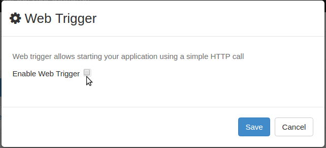
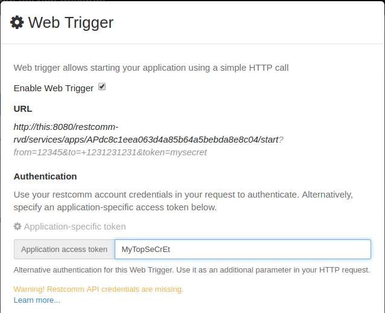
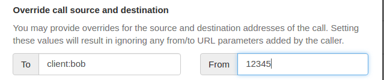

Web Trigger is an alternative way to start a voice application. It allows establishing a call between an RVD application and a destination address using a simple HTTP request.
Any RVD Voice application can be configured to be started using Web Trigger. The process of doing that is roughly the following:

* Create a Voice application in RVD.
* Enable and configure Web Trigger feature for this application.
* Start your application by making a request to the WebTrigger URL.

Other features of Web Trigger include:

* Custom authentication using an application-specific token.
* Initialization of RVD variables by using HTTP parameters.
* Control caller identifier that will be presented to the callee.

Web Trigger relies on the Restcomm Calls REST API to do the actual work. You can find more information on how a call between an RCML application and a destination address is established at <<../api/calls-api.adoc#calls,Restcomm API – Calls>>. 

In the following example we will create a sample application that, when
 trigerred, will establish a call between a Restcomm Client and the application and execute it.

[[step-1---create-the-voice-application]]
Step 1 - Create the Voice application
+++++++++++++++++++++++++++++++++++++

* Log into RVD and create a new project named TestWebTrigger.

No need to change anything yet. If you don't know what RVD is and how to create an application please have a look at link:#[RVD Basic Tasks] first.

[[step-2---enable-web-trigger]]
Step 2 - Enable Web Trigger
+++++++++++++++++++++++++++

In the project menu, click on __Web Trigger__:

image:./images/show_web_trigger_form.png[show_web_trigger_form,width=624,height=75]

Then, check __Enable Web Trigger__:

[[step-3---register-your-sip-client]]
Step 3 - Register your SIP client
+++++++++++++++++++++++++++++++++

You will need a registered destination address to receive the triggered call.
Fire up your favourite SIP client and register to your Restcomm instance as **alice**. Default password is _1234._

Step 4 - Trigger a call
+++++++++++++++++++++++

Using your favorite REST client make a call to the WebTrigger URL. You can copy it from the configuration form:

image:./images/WebTrigger_copy_URL.png[copy_web_trigger_url]

Before making the request you need to specify a destination for the call in the `to` parameter. You may use the _client_
you just registered. The destination goes in the `to` parameter of the request:

 http://this:8080/restcomm-rvd/services/apps/APdc8c1eea063d4a85b64a5bebda8e8c04/start?to=client:alice

Notice _client:_ prefix in the `to` parameter.

Also, WebTrigger supports Basic HTTP authentication. Use your restcomm account credentials in order
to authenticate. In this example we will use *administrator@company.com* / *RestComm*.

Here is the cURL command to make the request:

 $ curl -X GET --user 'administrator@company.com:RestComm' 'http://this:8080/restcomm-rvd/services/apps/APdc8c1eea063d4a85b64a5bebda8e8c04/start?to=client:alice'

In addition to specifying the destination of the call, the caller ID may also be specified (optional) using
the `from` parameter. Here is the how the trigger URL  will look like when the caller ID  is set to *bob*:

 .../start?to=client:alice&from=bob

At this point you should be able to trigger a call to your registered client and listen to
 your application.

Authenticate with application-specific tokens
+++++++++++++++++++++++++++++++++++++++++++++

In case you don't want to reveal your account credentials to the user of the trigger you can
use an alternative form of authentication that relies on custom application-specific tokens. To enable it
you will need to define an arbitrary security token in the configuration form and then use it in the request that
will trigger the call. If the tokens match the request will be accepted.

Here is the configuration form with the _application access token_ set to *MyTopSeCrEt*.

Since there are no Basic HTTP authentication headers involved you may easily trigger the call by typing the WebTrigger URL
directly in the browser:

 http://this:8080/restcomm-rvd/services/apps/APdc8c1eea063d4a85b64a5bebda8e8c04/start?to=client:alice&token=MyTopSeCrEt

IMPORTANT: Before giving it a try make sure that you have configured
 <<configure-restcomm-api-credentials,Restcomm API credentials>> in RVD settings.

Call source and destination overrides
+++++++++++++++++++++++++++++++++++++

There can be cases when the destination or the source of a WebTrigger call should be locked
down to a fixed value and not be controlled from the request. In order to do that _overrides_ can
be provided in the configuration form as follows:

Now, the `to` and `form` parameters in the HTTP request will be ignored and values in the form
will be used instead.

[[configure-restcomm-api-credentials]]
Configure Restcomm API access credentials
+++++++++++++++++++++++++++++++++++++++++

In order to use application-specific tokens Restcomm API credentials should be configured in RVD
 settings. RVD relies on Restcomm Calls REST API to create the actual call between the
 application and the destination address. For that, it needs to know the credentials of
 the Restcomm Account that will make the call.

To supply these credentials:

* Click on the top right gear icon as illustrated bellow:

image:./images/show_ide_settings_profile_form.png[show_ide_settings_profile_form,width=300,height=56]

This will bring up the IDE Settings form for the logged user: 

image:./images/ide_settings_profile_form_complete.png[ide_settings_profile_form_complete,width=300,height=179]

Supply the credentials of the Restcomm account that will be used to create the call.

* Set *Username* to the restcomm username on whose behalf the calls will be made. In this tutorial we used _administrator@company.com_
* Set *Password* to the _AuthToken_ of your account displayed in Dashboard.

[[adding-variables-to-the-mix]]
Adding variables
++++++++++++++++

Application behaviour can be further enhanced by adding parameters to your trigger URL.
All additional parameters will be converted to RVD variables and can be used in your application.

Bellow is a personalized greeting of the application using `firstname` and `lastname` variables.

image:./images/add_variables_to_the_mix.png[add_variables_to_the_mix,width=763,height=341]

This application will use the _firstname_ and _lastname_ parameters from a trigger URL like the
following:

 http://this:8080/restcomm-rvd/services/apps/APdc8c1eea063d4a85b64a5bebda8e8c04/start?to=client:alice&firstname=nick&lastname=the+greek

[[note-on-destinations]]
Destination address syntax
++++++++++++++++++++++++++

Throughout this tutorial we have only used _client_ destinations for the call. Restcomm
Calls REST API and consequently RVD WebTrigger support four different types of destination
address. Any of these types can be used as a destination address. Here are some example
values you can use as destinations either directly in the URL `to` parameter or as overrides
 in the configuration form.

[[client]]
* *client*
** client:alice
** client:bob

[[sip]]
* *sip*
** sip:bob@192.168.1.39:5060

[[conference]]
* *conference*
** conference:2233

[[number]]
* *number*
** +1234598323

IMPORTANT: Make sure you url-encode these values if you specify the *to* destination in the trigger URL!

