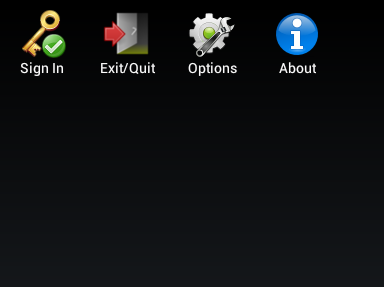
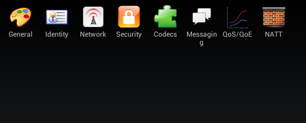
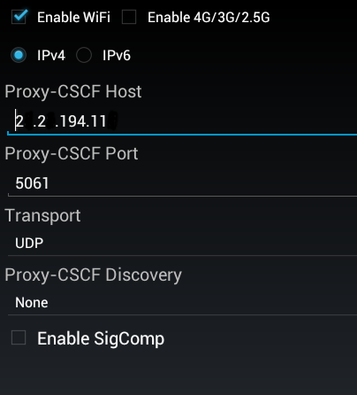
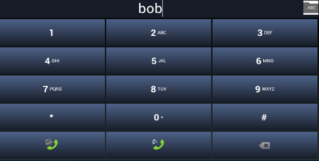

Integrating any Android client that is SIP standard compliant with Telscale Restcomm for voice and messaging is intuitive. Respectively you can use in your own app any SIP standard SDK for Android, including the one link:http://developer.android.com/guide/topics/connectivity/sip.html[provided by default] by Google. In this tutorial, you will learn how to configure an android SIP phone and make calls using Restcomm. 

= Requirements for Android Client

* You must link:http://code.google.com/p/imsdroid/downloads/list[download and install Imsdroid] (you may opt to use any other SIP Android client) on your android mobile phone
* Make sure Telscale Restcomm is running on an Amazon AMI. Please see http://docs.telestax.com/restcomm-quick-start-guide/[HERE] to lean more about how to work with Restcomm AMI.
* Two Android phones

= Scenario

* Create 2 Restcomm clients Alice and Bob using Restcomm admin UI.
* You will configure the first android phone to register as Alice and the Second to register as Bob
* You will make a call from Alice to Bob
* You may also choose to dial any SIP clients that is reachable through a public IP address.

Start Imsdroid on your phone and you will see the dashboard similar to the screen shot below. *Click on Options*  

 

*Click Identity*   

 

Fill out the identity as follows, where *2.2.194.11:5080 would be the actual Public IP address of your own Restcomm instance:*

* Display Name: *alice*
* Public Identity *sip:alice2.2.194.11:5080*
* Private Identify: *alice*
* Password: *<provide the password that was used to create client>*
* Realm: *sip:2.2.194.11:5080*

image:./images/export_021.png[export_02,width=472,height=435]

Go back to the options window and click on **Network**. You will see a screen similar to the one below. Configure as shown in the screen shot below. 

Go back to the main dashboard and click on *Sign In* 

You will see a screenshot similar to the one below. 

image:./images/export_05.png[export_05,width=695,height=248]

[[you-must-now-configure-the-second-android-phone-as-user-bob-using-similar-information-as-user-alice.]]
*You must now configure the second android phone as user Bob using similar information as user Alice*

Click on the *Dialer* to call Bob! Ring! Ring! Talk. 

And that is *all there is* to configuring an android client to work with Telscale Restcomm. If you have experience using another SIP Android Client or SDK with Restcomm, please share it in the comments section of this article.

