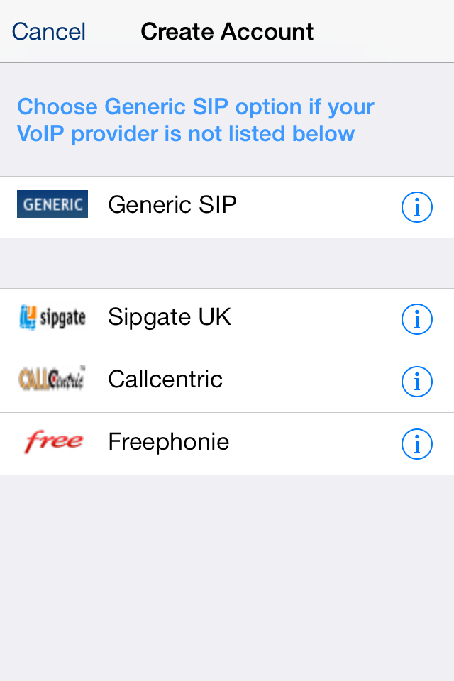
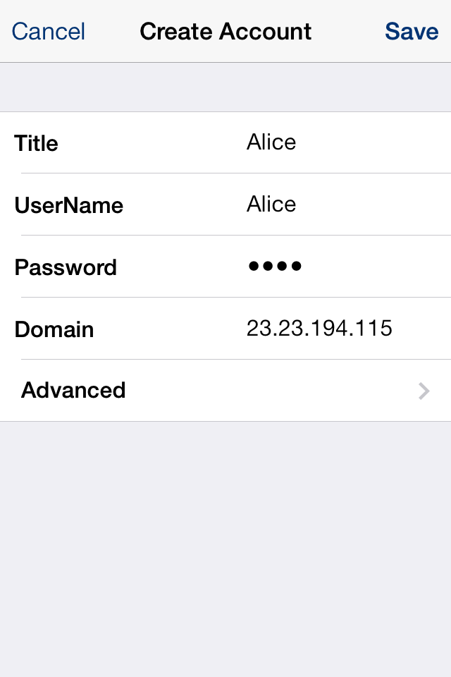
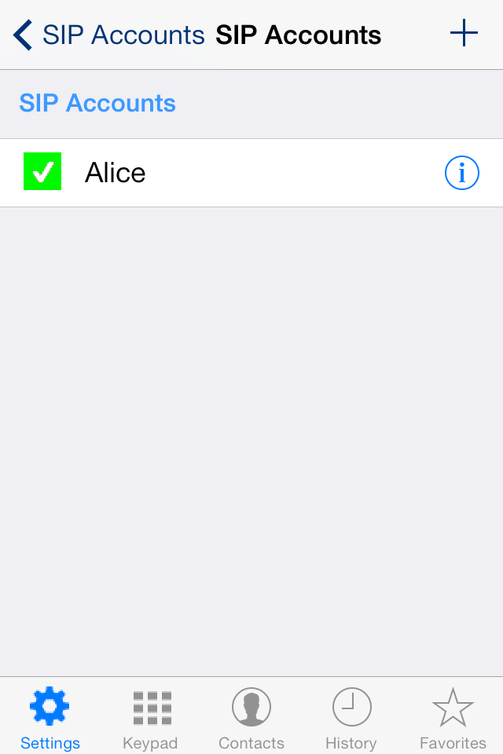
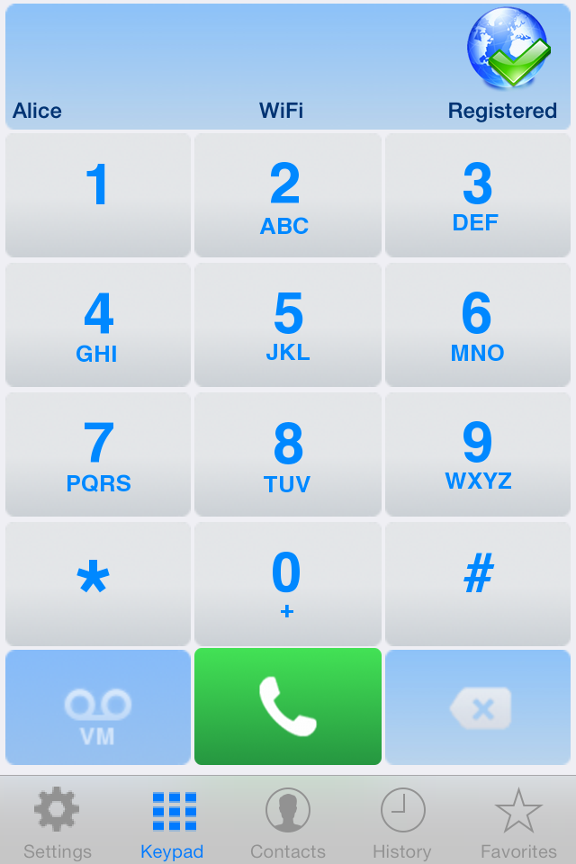
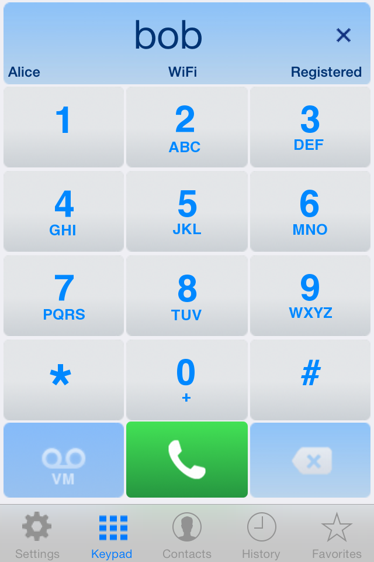
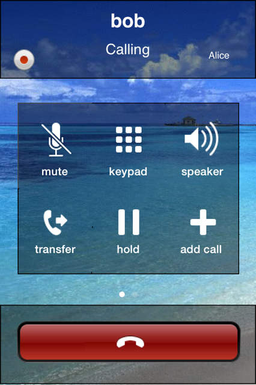

Integrating any iOS SIP client or SIP SDK with Telscale Restcomm for voice and messaging is intuitive. In this tutorial, you will learn how to configure an iPhone/iPod/iPad and make calls using Restcomm. 

= Requirements for iOS SIP Client

* You must install any SIP capable client from the Apple store of your iPhone. In the example below we shall be using link:https://itunes.apple.com/us/app/sessiontalk-sip-voip-softphone/id357429372[SessionTalk]
* Make sure Telscale Restcomm is running on an Amazon AMI or another server that can be accessed from the phone. Please see <<Starting Restcomm-Connect.adoc#start-restcomm-connect,Starting Restcomm-Connect>> to lean more about how to work with Restcomm.
* You will need at least one iOS based phone or tablet. In this document we will test with two iPhones. If you do not have two iOS based devices, the second one can be any SIP client running on your computer or another mobile device.

= Scenario

* Create 2 Restcomm clients Alice and Bob using Restcomm admin UI.
* You will configure the first android phone to register as Alice and the Second to register as Bob.
* You will make a call from Alice to Bob.
* You may also choose to dial any SIP clients that is reachable through a public IP address.

Once you have downloaded and installed link:https://itunes.apple.com/us/app/sessiontalk-sip-voip-softphone/id357429372[SessionTalk] 

Click to start the SIP application on your iPhone. You will see a screenshot like the one below. You must choose the *"Generic SIP"* 

]   

In the *Create Account* Window, register the user Alice as shown below

* *Title: Alice*
* *Username: alice*
* *Password: <provide the password that was used to create client>*
* *Domain: Public Ip address of the Restcomm AMI*

Then click on *Advanced* 

In the **Advanced** window, scroll down to the option *Proxy Address* Add the Restcomm proxy using the format below Proxy Address: *<Public IP:5080>* 

The format must always include the IP and the Restcomm proxy default port *5080. An example will be 22.33.44.55:5080* 

The click on the *Back* button to go back to the previous page.   

image:./images/photo-3.png[photo 3,width=200,height=300]

In the *Create Account* page, click on *Save* to create the Alice account. You will now see the created account similar to the screenshot below.

At the bottom of the page, press the *Keypad* button. 

If your account is correctly registered with Restcomm, you will see the green check mark similar to the screen below. 

The next step is to configure Bob using similar configuration as you did for Alice. This can be either on another iPhone or on a SIP client running on your computer. Then you can make a call from Alice to Bob as shown below 

You can tap the top of the screen to display the keyboard so that you can type the name of the person you want to call. In this case, you type Bob and press the call button, 

Once bob answers the call, you can begin to talk. 

