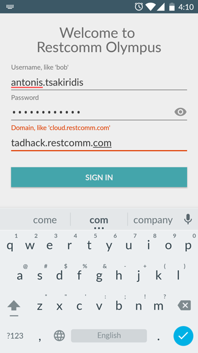
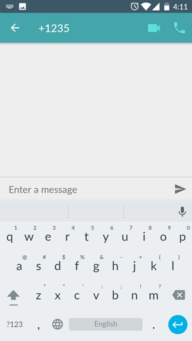
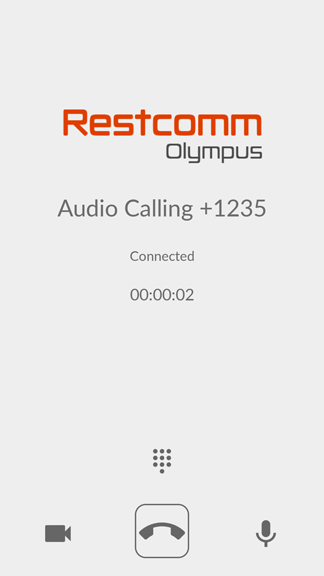
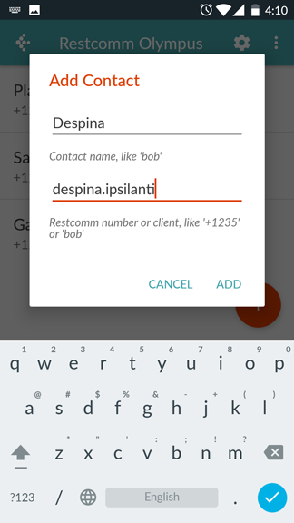
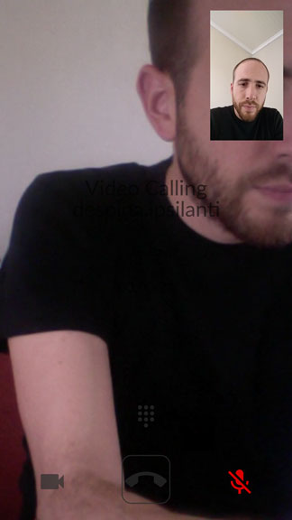
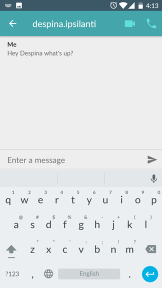

The Restcomm Android SDK comes with Olympus Client Android App that taps into  the SDK and presents to the user a full fledged application capable of video/audio WebRTC calls and text messages. If we add Restcomm Platform to the mix, we get full telecom programmability and access to PSTN/SMS. Let's see how this works.

You can get the latest version of Android Olympus .apk from the link found  https://github.com/RestComm/restcomm-android-sdk#latest-olympus-apk[here]. For the TADHack event you will also need to register for a new account https://accounts.restcomm.com/tadhackRegistration.jsp[here] and follow along the registration process until you get your password via email. 

Then you need to launch the Olympus Android App and use the user part of your email and the password you received in the first, wizard screen. Also, you will need to change domain to tadhack.restcomm.com and tap Done:

Once you login, you can call any of the default contacts, be it a Restcomm Application, like +1235 or another client like Bob who needs to be registered from another Olympus or generic SIP client. Here's the contacts screen:

image:./images/android-olympus-contacts.png[android-olympus-contacts]

[[calling-a-restcomm-application]]
Calling a Restcomm Application
^^^^^^^^^^^^^^^^^^^^^^^^^^^^^^

Let's first try an audio call towards Restcomm Application +1235 that uses Text-to-Speech to greet you with and audio message. 

* Tap on the 'Say App' and on the new screen that opens tap on the Audio Call icon on the upper right corner:

* You should then see the call screen and hear the message:

[[calling-another-restcomm-client]]
Calling another Restcomm Client
^^^^^^^^^^^^^^^^^^^^^^^^^^^^^^^

Now let's try a Client to Client video call. 

* Back in the Contacts screen tap on the plus sign on the lower right corner to create a new contact, add the client's details and tap Add:

* Tap on the new contact and when the message screen comes up tap on the Video Call icon on the upper right corner so that a video call is made to that contact: 

* Remember that the called client (in my case Despina) needs to be registered from another device. Once you answer from the called client you should see something like this:

[[sending-a-text-message-to-another-restcomm-client]]
Sending a text message to another Restcomm Client
^^^^^^^^^^^^^^^^^^^^^^^^^^^^^^^^^^^^^^^^^^^^^^^^^

Let's send a text message from Olympus to another client. Back to Contacts screen tap on the little (i) icon on the right of the peer you want to message (in my case Despina). On the new screen that opens tap on the Message and then write a message and tap Send:

That's about it. By taking further advantage of Restcomm's Apps capabilities you can now add a wealth of features in your flow, be it IVR, Conferencing, etc.
