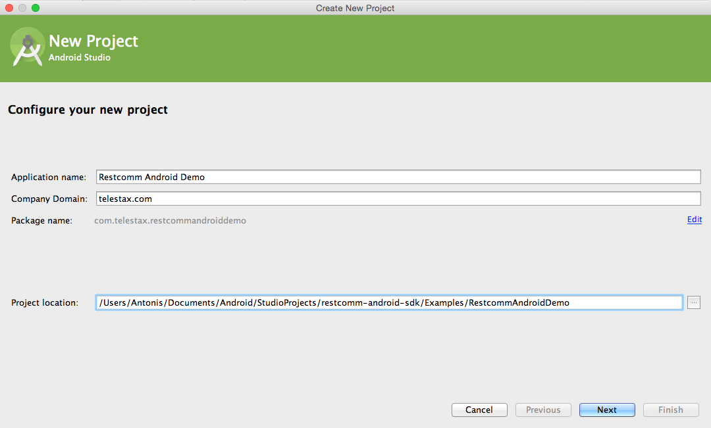
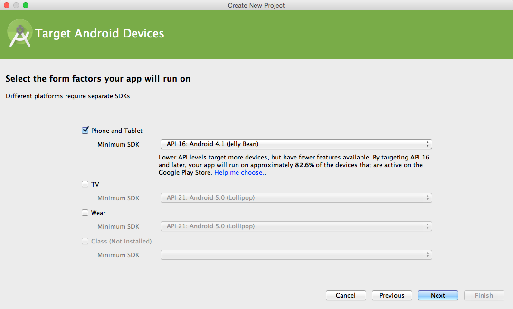
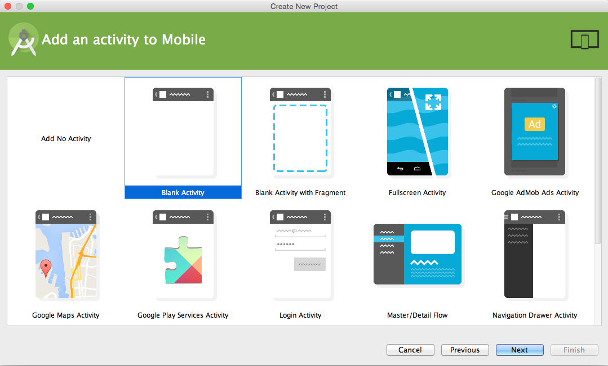
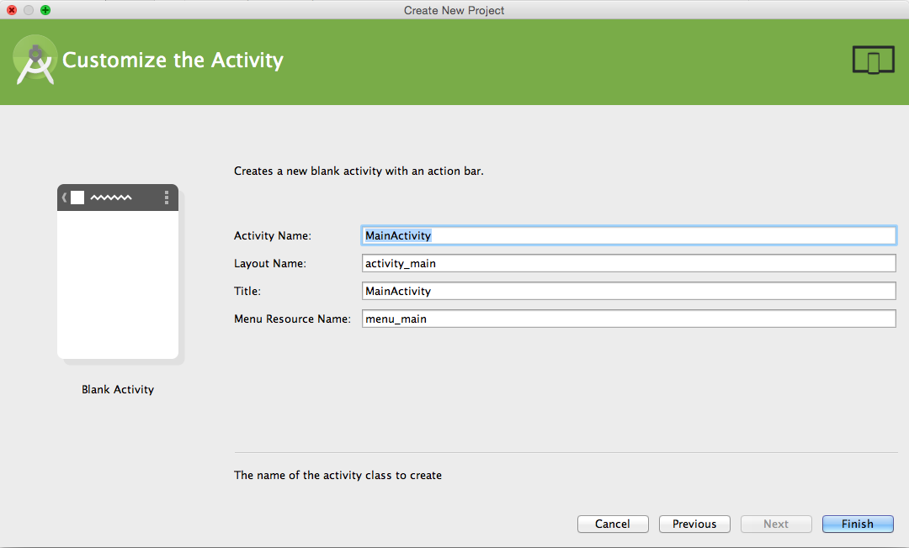
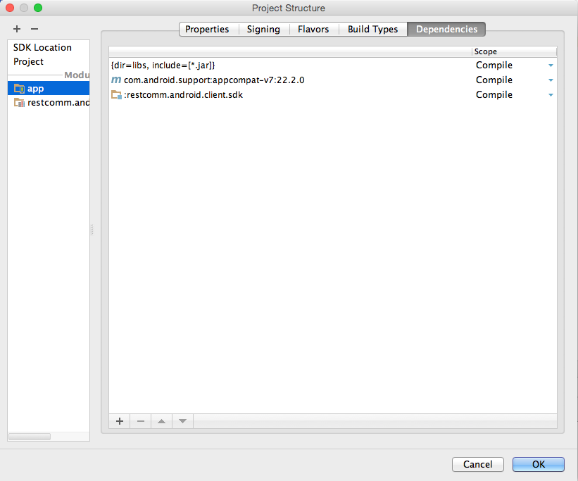
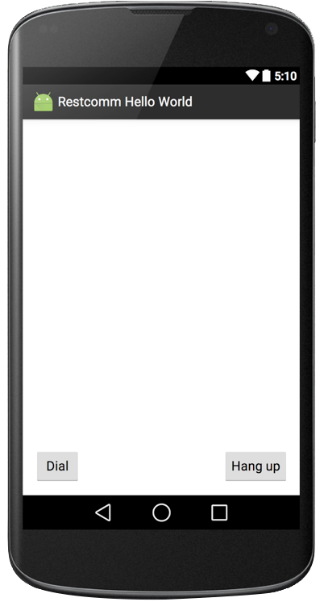

This tutorial will show you how to integrate Restcomm WebRTC Android SDK into your Apps to tap into the Restcomm telecom capabilities.

[[prerequisites]]
Prerequisites
^^^^^^^^^^^^^

* Restcomm Communications Platform
* Android Studio

[[restcomm]]
1. Restcomm
^^^^^^^^^^^

Here you have three alternativess:

* Don't perform a local installation and use RaaS (RestComm as a Service).
* Install the latest link:https://hub.docker.com/r/restcomm/restcomm/[Restcomm Docker image] locally (i.e. $ docker pull restcomm/restcomm to get it from docker hub). For more information please check link:http://www.telestax.com/rapid-webrtc-application-development-with-restcomm-and-docker/ and link:https://github.com/RestComm/Restcomm-Docker#restcomm-docker-image. If you aren't familiar with docker you can have a quick intro here https://www.docker.com/

[[restcomm-client-androidsdk]]
2. Restcomm WebRTC Android SDK
^^^^^^^^^^^^^^^^^^^^^^^^^^^^^^

Once you have installed the  Restcomm platform (or you are using RaaS) you are ready to start taking advantage of Restcomm's features from your Android Applications. Here's what you need to do:

* Grab the latest Restcomm WebRTC Android SDK release from GitHub: https://github.com/RestComm/restcomm-android-sdk/releases/tag/v1.0.0-BETA6. At the time of this writing it is v1.0.0-beta6 and the bundle you need to download is restcomm-android-sdk-1.0.0-beta6.tar.bz2
* Extract it:
+
[source,theme:github,toolbar:2,lang:default,decode:true]
----
$ tar -jxvf restcomm-android-sdk-1.0.0-beta6.tar.bz2
----

[[use-the-existing-sample-androidapp-helloworld]]
Use the existing sample Android App, 'HelloWorld'
+++++++++++++++++++++++++++++++++++++++++++++++++

To illustrate the SDK, first we'll be using one of the sample Apps provided in the bundle, called HelloWorld:

* Open Hello World sample Android Studio project from $ANDROID_SDK/Examples/restcomm-helloworld
* Open MainActivity.java source file within Hello World, search for string 'CHANGEME' and perform required changes in the Restcomm instance IP address/domain name. This will depend on which alternative you picked above for Restcomm: a. if you used RaaS then you don't need to update the IP address (i.e. the RaaS domain name is used by default). b. if you used the Docker image then you should use the local IP address that Restcomm uses when coming up:
+
[source,theme:github,toolbar:1,lang:java,mark:6,23,decode:true]
----
public void onClick(View view) {
    if (view.getId() == R.id.button_dial) {
        if (connection != null) {
            Log.e(TAG, "Error: already connected");
            return;
        }
        connectParams = new HashMap<String, Object>();
        // CHANGEME: You can update the IP address to your Restcomm instance. Also, you can update the number
        // from '1235' to any Restcomm application you wish to reach
        connectParams.put(RCConnection.ParameterKeys.CONNECTION_PEER, "sip:+1235@cloud.restcomm.com");
        connectParams.put(RCConnection.ParameterKeys.CONNECTION_VIDEO_ENABLED, true);
        connectParams.put(RCConnection.ParameterKeys.CONNECTION_LOCAL_VIDEO, findViewById(R.id.local_video_layout));
        connectParams.put(RCConnection.ParameterKeys.CONNECTION_REMOTE_VIDEO, findViewById(R.id.remote_video_layout));
        
        handlePermissions(true);
    }
    ....
}
----
* Build and run Hello World (prefer a real device as the simulator tends to be slow on the media processing and hasn't been tested)
* Once the sample App starts up you can press Dial and behind the scenes number '1235' will be called on the Restcomm instance and you will hear the associated announcement.
* From then on, you can try more fun experiments, such as calling a different Restcomm number by changing the whole URI in the code from sip:1235@<ip address>:5060 to for example sip:1311@<ip address>:5060 which is the default Restcomm Application for conferencing:
+
[source,theme:github,toolbar:1,lang:objc,mark:11,decode:true]
----
public void onClick(View view) {
    if (view.getId() == R.id.button_dial) {
        if (connection != null) {
            Log.e(TAG, "Error: already connected");
            return;
        }
        connectParams = new HashMap<String, Object>();
        // CHANGEME: You can update the IP address to your Restcomm instance. Also, you can update the number
        // from '1235' to any Restcomm application you wish to reach
        connectParams.put(RCConnection.ParameterKeys.CONNECTION_PEER, "sip:+1311@cloud.restcomm.com:5060");
        connectParams.put(RCConnection.ParameterKeys.CONNECTION_VIDEO_ENABLED, true);
        connectParams.put(RCConnection.ParameterKeys.CONNECTION_LOCAL_VIDEO, findViewById(R.id.local_video_layout));
        connectParams.put(RCConnection.ParameterKeys.CONNECTION_REMOTE_VIDEO, findViewById(R.id.remote_video_layout));
        
        handlePermissions(true);
    }
    ....
}
----
+
Now the real fun begins: you can call the same number using the Android SDK from yet another Android device and start a conference between the two!

[[create-a-new-android-studio-app-from-scratch]]
Create a new Android Studio App from scratch
++++++++++++++++++++++++++++++++++++++++++++

Next, we 'll be going in more detail over the steps it takes to come up with an App similar to HelloWorld but starting from scratch to get a good idea what you need to do to incorporate it in an existing Android project:

* Create a new project in Android Studio. File > New > New Project: 
+
[New Android Studio Project]

+
* Pick a project name and a location and press Next.
* Leave the defaults (i.e. Target Android Devices) and hit Next: 
+
[Target Android Devices]

+
* Select 'Blank Activity' and hit Next: 
+
[Add an activity]

+
* You can customize your activity if you want in this screen but defaults work fine. When ready hit Finish: 
+
[Customize the Activity]

+
* Now project should be created and you should be automatically navigated to the Android Studio Designer. So remove the existing 'Hello world!' TextView and add two buttons, one for Dial and one for Hangup. Apart from the 'text' property of the buttons, don't forget to also update the 'id' attributes accordingly so that you know how differentiate between them later in the code: 
+
[Android Studio Designer]
image:./images/Screen-Shot-2015-06-26-at-1.20.07-PM.png[Android Studio Designer,width=1030,height=654]
+
* Edit **settings.gradle** so that the Android SDK Java modules are included in the project but without copying the module projects anew (which is what Android Studio does by default when importing modules). This is how it should look after you update it (remember that here we assume that we are introducing this demo project inside the Examples in the SDK directory tree, if you don't want to do that then you need to update the 'project' setting for 'restcomm.android.sdk' module and set the full path to it):
+
[source,theme:github,lang:default,decode:true]
----
include ':app'
include ':restcomm.android.sdk'
project(':restcomm.android.sdk').projectDir=new File('../../restcomm.android.sdk')
----
* Edit the 'app' module settings and add restcom.android.sdk as a dependency from View > Open Module Settings:
+
[Update 'app' module settings]

+
* Ok, now that we have all the settings ready the App should be able to build and run but with no actual functionality yet. For that we need to take advantage of the SDK facilities. So first you need to import required Android SDK packages and make your Activity the listener of Android SDK events (such as incoming calls and messages) as well as OnClick events for the buttons:
+
[source,java,theme:github,toolbar:1,lang:default,decode:true]
----
import org.restcomm.android.sdk.RCClient;
import org.restcomm.android.sdk.RCConnection;
import org.restcomm.android.sdk.RCConnectionListener;
import org.restcomm.android.sdk.RCDevice;
import org.restcomm.android.sdk.RCDeviceListener;
import org.restcomm.android.sdk.RCPresenceEvent;

public class MainActivity extends Activity implements RCDeviceListener, RCConnectionListener, OnClickListener, ServiceConnection {
...
----
* Once you do that you 'll have to implement the Android SDK listener interface methods with empty stubs so that Java doesn't complain. Notice that for this example we are keeping things simple and not handling incoming events, but you could add that later. An exception are the webrtc video events (i.e. onReceiveLocal/RemoteVideo), which need to be there so that the video tracks can be added to our video view.
+
[source,java,theme:github,toolbar:1,lang:default,decode:true]
----
// RCDevice Listeners
public void onStartListening(RCDevice device, RCDeviceListener.RCConnectivityStatus connectivityStatus)
{

}

public void onStopListening(RCDevice device, int errorCode, String errorText)
{
   Log.i(TAG, errorText);
}

public void onConnectivityUpdate(RCDevice device, RCConnectivityStatus connectivityStatus)
{

}

// RCConnection Listeners
public void onConnecting(RCConnection connection)
{
}

public void onConnected(RCConnection connection, HashMap<String, String> customHeaders) {
}

public void onDisconnected(RCConnection connection)
{
   Log.i(TAG, "RCConnection disconnected");
   this.connection = null;
   pendingConnection = null;
}

public void onDisconnected(RCConnection connection, int errorCode, String errorText)
{

   Log.i(TAG, errorText);
   this.connection = null;
   pendingConnection = null;
}

public void onCancelled(RCConnection connection)
{
   Log.i(TAG, "RCConnection cancelled");
   this.connection = null;
   pendingConnection = null;
}

public void onDeclined(RCConnection connection)
{
   Log.i(TAG, "RCConnection declined");
   this.connection = null;
   pendingConnection = null;
}

public void onLocalVideo(RCConnection connection)
{
}

public void onRemoteVideo(RCConnection connection)
{
}

public void onError(RCConnection connection, int errorCode, String errorText)
{
}

public void onDigitSent(RCConnection connection, int statusCode, String statusText)
{
}

public void onMessageSent(RCDevice device, int statusCode, String statusText)
{
}

public void onReleased(RCDevice device, int statusCode, String statusText)
{
}

public void onInitialized(RCDevice device, RCDeviceListener.RCConnectivityStatus connectivityStatus, int statusCode, String statusText)
{
}

public void onInitializationError(int errorCode, String errorText)
{
}
----
* Add the needed Android SDK objects (i.e. RCDevice and RCConnection) in the Activity class as well as some convenience variables:
+
[source,java,theme:github,toolbar:1,lang:default,decode:true]
----
public class MainActivity extends Activity implements RCDeviceListener, RCConnectionListener, View.OnClickListener {
    private RCDevice device;
    private RCConnection connection, pendingConnection;
    private HashMap<String, String> params;
    private static final String TAG = "MainActivity";
    boolean serviceBound = false;
    ....
----
* In order to make the buttons we created available to the App and also initialise the Android SDK you need to update the onCreate() method of your activity as follows:
+
[source,java,theme:github,toolbar:1,lang:java,decode:true,linenums]
----
protected void onCreate(Bundle savedInstanceState) {
    super.onCreate(savedInstanceState);
    // Set window styles for fullscreen-window size (makes video show up better)
    requestWindowFeature(Window.FEATURE_NO_TITLE);
    getWindow().addFlags(
            WindowManager.LayoutParams.FLAG_FULLSCREEN
                    | WindowManager.LayoutParams.FLAG_KEEP_SCREEN_ON
                    | WindowManager.LayoutParams.FLAG_DISMISS_KEYGUARD
                    | WindowManager.LayoutParams.FLAG_SHOW_WHEN_LOCKED
                    | WindowManager.LayoutParams.FLAG_TURN_SCREEN_ON);
    getWindow().getDecorView().setSystemUiVisibility(
            View.SYSTEM_UI_FLAG_HIDE_NAVIGATION
                    | View.SYSTEM_UI_FLAG_FULLSCREEN
                    | View.SYSTEM_UI_FLAG_IMMERSIVE_STICKY);

    setContentView(R.layout.activity_main);

    // initialize UI
    btnDial = (Button)findViewById(R.id.button_dial);
    btnDial.setOnClickListener(this);
    btnHangup = (Button)findViewById(R.id.button_hangup);
    btnHangup.setOnClickListener(this);

}
----
* Handle Android Service callbacks to initialized the SDK facilities. Remember that the SDK is wrapped inside an Android Service to be able to linger on even after Activities have been sent in the background or have been destroyed.
+
[source,java,theme:github,toolbar:1,lang:java,decode:true]
----
// Callbacks for service binding, passed to bindService()
@Override
public void onServiceConnected(ComponentName className, IBinder service)
{
   Log.i(TAG, "%% onServiceConnected");
   // We've bound to LocalService, cast the IBinder and get LocalService instance
   RCDevice.RCDeviceBinder binder = (RCDevice.RCDeviceBinder) service;
   device = binder.getService();

   Intent intent = new Intent(getApplicationContext(), MainActivity.class);

   HashMap<String, Object> params = new HashMap<String, Object>();
   // we don't have a separate activity for the calls and messages, so let's use the same intent both for calls and messages
   params.put(RCDevice.ParameterKeys.INTENT_INCOMING_CALL, intent);
   params.put(RCDevice.ParameterKeys.INTENT_INCOMING_MESSAGE, intent);
   params.put(RCDevice.ParameterKeys.SIGNALING_DOMAIN, "");
   params.put(RCDevice.ParameterKeys.SIGNALING_USERNAME, "android-sdk");
   params.put(RCDevice.ParameterKeys.SIGNALING_PASSWORD, "1234");
   params.put(RCDevice.ParameterKeys.MEDIA_ICE_URL, "https://service.xirsys.com/ice");
   params.put(RCDevice.ParameterKeys.MEDIA_ICE_USERNAME, "atsakiridis");
   params.put(RCDevice.ParameterKeys.MEDIA_ICE_PASSWORD, "4e89a09e-bf6f-11e5-a15c-69ffdcc2b8a7");
   params.put(RCDevice.ParameterKeys.MEDIA_TURN_ENABLED, true);
   //params.put(RCDevice.ParameterKeys.SIGNALING_SECURE_ENABLED, prefs.getBoolean(RCDevice.ParameterKeys.SIGNALING_SECURE_ENABLED, false));

   if (!device.isInitialized()) {
      device.initialize(getApplicationContext(), params, this);
      device.setLogLevel(Log.VERBOSE);
   }

   serviceBound = true;
}

@Override
public void onServiceDisconnected(ComponentName arg0)
{
   Log.i(TAG, "%% onServiceDisconnected");
   serviceBound = false;
}
----
+
* Update the onClick Activity method to respond to button events -this is where the ids come into play that we updated back when we added the buttons in the Designer:
+
[source,java,theme:github,toolbar:1,lang:java,decode:true]
----
public void onClick(View view)
{
   if (view.getId() == R.id.button_dial) {
      if (connection != null) {
         Log.e(TAG, "Error: already connected");
         return;
      }

      connectParams = new HashMap<String, Object>();
      // CHANGEME: You can update the IP address to your Restcomm instance. Also, you can update the number
      // from '1235' to any Restcomm application you wish to reach
      connectParams.put(RCConnection.ParameterKeys.CONNECTION_PEER, "sip:+1235@cloud.restcomm.com");
      connectParams.put(RCConnection.ParameterKeys.CONNECTION_VIDEO_ENABLED, true);
      connectParams.put(RCConnection.ParameterKeys.CONNECTION_LOCAL_VIDEO, findViewById(R.id.local_video_layout));
      connectParams.put(RCConnection.ParameterKeys.CONNECTION_REMOTE_VIDEO, findViewById(R.id.remote_video_layout));

      handlePermissions(true);
   }
   else if (view.getId() == R.id.button_hangup) {
      if (connection == null) {
         Log.e(TAG, "Error: not connected");
      }
      else {
         connection.disconnect();
         connection = null;
         pendingConnection = null;
      }
   }
}
----
* Provide handling for runtime Android permissions (i.e. API level 23). We need permission for audio, calling and video (if the call is a video call):
+
[source,java,theme:github,toolbar:1,lang:java,decode:true]
----
// Handle android permissions needed for Marshmallow (API 23) devices or later
private boolean handlePermissions(boolean isVideo)
{
   ArrayList<String> permissions = new ArrayList<>(Arrays.asList(new String[]{Manifest.permission.RECORD_AUDIO, Manifest.permission.USE_SIP}));
   if (isVideo) {
      // Only add CAMERA permission if this is a video call
      permissions.add(Manifest.permission.CAMERA);
   }

   if (!havePermissions(permissions)) {
      // Dynamic permissions where introduced in M
      // PERMISSION_REQUEST_DANGEROUS is an app-defined int constant. The callback method (i.e. onRequestPermissionsResult) gets the result of the request.
      ActivityCompat.requestPermissions(this, permissions.toArray(new String[permissions.size()]), PERMISSION_REQUEST_DANGEROUS);

      return false;
   }

   resumeCall();

   return true;
}

// Checks if user has given 'permissions'. If it has them all, it returns true. If not it returns false and modifies 'permissions' to keep only
// the permission that got rejected, so that they can be passed later into requestPermissions()
private boolean havePermissions(ArrayList<String> permissions)
{
   boolean allgranted = true;
   ListIterator<String> it = permissions.listIterator();
   while (it.hasNext()) {
      if (ActivityCompat.checkSelfPermission(this, it.next()) != PackageManager.PERMISSION_GRANTED) {
         allgranted = false;
      }
      else {
         // permission granted, remove it from permissions
         it.remove();
      }
   }
   return allgranted;
}

@Override
public void onRequestPermissionsResult(int requestCode, String permissions[], int[] grantResults) {
   super.onRequestPermissionsResult(requestCode, permissions, grantResults);
   switch (requestCode) {
      case PERMISSION_REQUEST_DANGEROUS: {
         // If request is cancelled, the result arrays are empty.
         if (grantResults.length > 0 && grantResults[0] == PackageManager.PERMISSION_GRANTED) {
            // permission was granted, yay! Do the contacts-related task you need to do.
            resumeCall();

         } else {
            // permission denied, boo! Disable the functionality that depends on this permission.
            Log.e(TAG, "Error: Permission(s) denied; aborting call");
         }
         return;
      }

      // other 'case' lines to check for other permissions this app might request
   }
}

// Resume call after permissions are checked
private void resumeCall()
{
   if (connectParams != null) {
      connection = device.connect(connectParams, this);
      if (connection == null) {
         Log.e(TAG, "Error: error connecting");
         return;
      }
   }
}
----
* You are now ready to build and run your project! Press the Play button in Android Studio and wait for the App to load. It should look like this: 
+
[Restcomm Android Demo]

+
* Now press dial and your Appliation will instruct the Android SDK to call the configured Restcomm instance and voila, you will hear the announcement!
* Finally, you can press Hang up to terminate the call whenever you like.

That's it! Give it a try it and share your experience with the rest of the Restcomm community, or even better, jump in and get your hands dirty with the code! Here are some additional resources:

* Reference Documentation: http://restcomm.github.io/restcomm-android-sdk/doc/
* Restcomm forum: https://groups.google.com/forum/#!forum/restcomm
* Stack Overflow: http://stackoverflow.com/questions/tagged/restcomm
* You can also try out a full fledged RestComm client for Android, Olympus, by directly installing the .apk from Test Fairy: https://github.com/RestComm/restcomm-android-sdk#latest-olympus-apk
