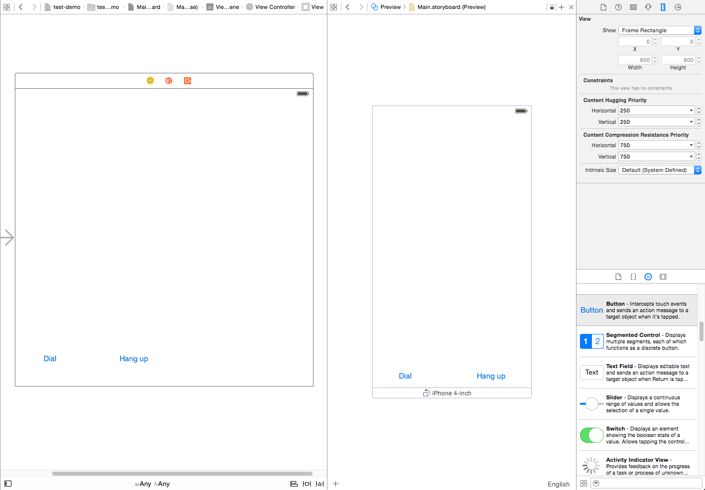
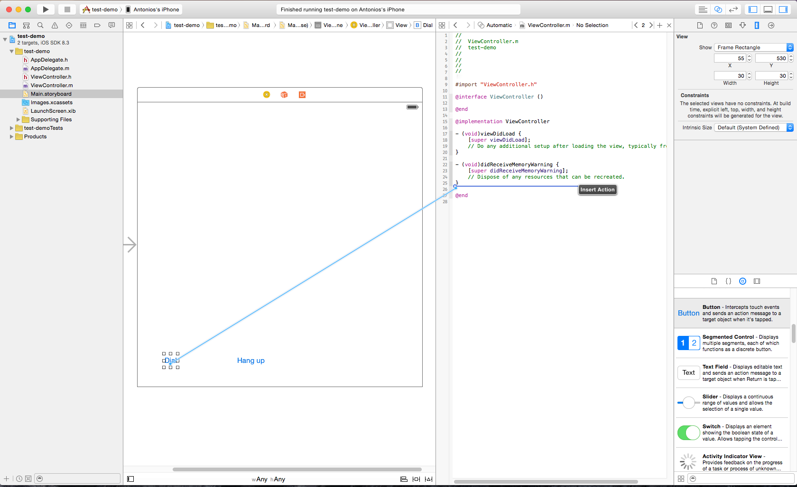
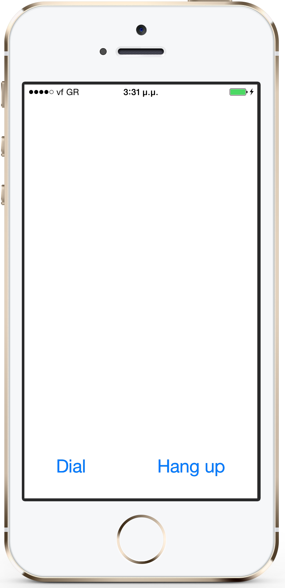

In this tutorial we 'll go over the steps to integrate the WebRTC enabled Restcomm iOS SDK into your Apps to tap into the Restcomm telecom capabilities.

[[prerequisites]]
Prerequisites
^^^^^^^^^^^^^

* Restcomm Communications Platform
* Xcode 6 with at least iOS SDK 8.0 or higher

[[restcomm]]
1. Restcomm
^^^^^^^^^^^

You first need to install the latest link:https://hub.docker.com/r/restcomm/restcomm/[Restcomm Docker image] locally (i.e. $ docker pull restcomm/stable to get it from docker hub). For more information please check link:http://docs.telestax.com/restcomm-docker-quick-start-guide/[here]. If you aren't familiar with docker you can have a quick intro link:https://www.docker.com/[here]

[[restcomm-ios-sdk]]
2. Restcomm iOS SDK
^^^^^^^^^^^^^^^^^^^

Once you have installed the Restcomm platform you are ready to start taking advantage of Restcomm's features from your iOS Applications. Notice that the SDK is distributed via CocoaPod 'restcomm-ios-sdk', so you can integrate it with your App in a snap -we 'll discuss about that in a bit at <<Create a new Xcode iOS App from scratch>>

[[use-the-existing-sample-ios-app-helloworld]]
Use the existing sample iOS App, 'HelloWorld'
+++++++++++++++++++++++++++++++++++++++++++++

For now let's try the Hello World Sample App to get acquainted:

* Grab the latest Restcomm iOS SDK release from link:https://github.com/RestComm/restcomm-ios-sdk/releases[GitHub]. At the time of this writing it is 1.0.0-beta.4.2.4 and the bundle you need to download is link:https://github.com/RestComm/restcomm-ios-sdk/releases/download/1.0.0-beta.4.2.4/restcomm-ios-sdk-1.0.0-beta.4.2.4.tar.bz2[restcomm-ios-sdk-1.0.0-beta.4.2.4.tar.bz2]
* Extract it:
+
[source,theme:github,toolbar:2,lang:default,decode:true]
----
$ tar -jxvf restcomm-ios-sdk-1.0.0-beta.4.2.4.tar.bz2
----

To illustrate the SDK, first we'll be using one of the sample Apps provided in the bundle, called 'Hello World':

* Hello World installs the SDK dependency via CocoaPods itself, so you need to setup the restcomm-ios-sdk dependency like so (after changing directory to Examples/restcomm-helloworld):
[source,theme:github,toolbar:2,lang:default,decode:true]
----
$ pod install
Analyzing dependencies
Fetching podspec for `restcomm-ios-sdk` from `../../`
Downloading dependencies
Installing restcomm-ios-sdk (1.0.0-beta.4.2.4)
Installing sofia-sip-library (1.12.11.2)
Installing webrtc-framework (14493.2)
Generating Pods project
Integrating client project
Sending stats
Pod installation complete! There is 1 dependency from the Podfile and 3 total pods installed.
----

* Now that dependencies are setup open Hello World sample Xcode workspace from $IOS_SDK/Examples/restcomm-helloworld/restcomm-helloworld.xcworkspace
* After the Xcode workspace opens, edit file ViewController.mm source file within restcomm-helloworld dir, search for string 'CHANGEME' and perform required changes in the Restcomm instance IP address to reflect your docker instance IP:
+
[source,theme:github,toolbar:1,lang:objc,mark:10,22,decode:true]
----
- (void)viewDidLoad
{
    ....
    self.parameters = [[NSMutableDictionary alloc] initWithObjectsAndKeys:
                       @"bob", @"aor",
                       @"1234", @"password",
                       nil];

    // CHANGEME: set the IP address of your RestComm instance in the URI below (or leave empty for registrar-less access)
    [self.parameters setObject:@"<docker ip address>:5080" forKey:@"registrar"];

    // initialize RestComm SDK by setting up an RCDevice
    self.device = [[RCDevice alloc] initWithParams:self.parameters delegate:self];
    ....
}

- (IBAction)dialPressed:(id)sender
{
    ...
    // CHANGEME: set the number of the RestComm Application you wish to contact (currently we are using '1235',
    // which is the Hello World RestComm Application). Also set the ip address for your RestComm instance
    [self.parameters setObject:@"+1235" forKey:@"username"];

    // call the other party
    self.connection = [self.device connect:self.parameters delegate:self];
}
----
* Build and run Hello World either on the Xcode simulator or your device.
* Once the sample App starts up you can press Dial and behind the scenes number '+1235' will be called on the Restcomm instance and you will hear the associated announcement.
* From then on, you can try even more fun experiments, such as calling a different Restcomm number by changing the whole URI in the code from +1235 to for example +1311 which is the default Restcomm Application for conferencing:
+
[source,theme:github,toolbar:1,lang:objc,mark:6,decode:true]
----
- (IBAction)dialPressed:(id)sender
{
    ...
    // CHANGEME: set the number of the RestComm Application you wish to contact (currently we are using '1235',
    // which is the Hello World RestComm Application). Also set the ip address for your RestComm instance
    [self.parameters setObject:@"+1311" forKey:@"username"];

    // call the other party
    self.connection = [self.device connect:self.parameters delegate:self];
    ...
}
----
+
Now the real fun begins: you can call the same number using the iOS SDK from yet another iOS device or simulator and start a conference between the two!

[[create-a-new-xcode-ios-app-from-scratch]]
Create a new Xcode iOS App from scratch
+++++++++++++++++++++++++++++++++++++++

Next, we 'll be going in more detail over the steps it takes to come up with an App similar to HelloWorld starting from a 'Single View' Xcode iOS Application. That way you 'll get a good idea what you need to do to incorporate it in an existing iOS App, or as described below come up with a new App from scratch:

* Create a single view Application. Xcode > File > New > Project and pick a 'Single View Application':
+
image:./images/Screen-Shot-2015-05-26-at-4.54.53-PM.png[Single View Application,width=733,height=430]
+
* Pick a project name and a location and press Create.
* Once the new Xcode project opens, you need to close it and add the dependencies to your project via CocoaPods (CocoaPods updates your project files, hence the need to close it). To do that you need to install CocoaPods if you don't have them already, check link:https://guides.cocoapods.org/using/getting-started.html#Installation[here] for more information.
* Once CocoaPods are installed, you need to go to your Xcode project dir and initialize your Podfile like so:
[source,theme:github,toolbar:2,lang:default,decode:true]
----
$ pod init
----
* Then you need to edit the newly created Podfile and add the line *pod restcomm-ios-sdk* like so:
[source,theme:github,toolbar:1,lang:default,decode:true]
----
# Uncomment the next line to define a global platform for your project
# platform :ios, '9.0'

target 'your-target' do
  # Pods for your-project
  pod 'restcomm-ios-sdk', '>= 1.0.0-beta.4.2.4'

  ...
end
----
* Do the actual installation of the dependencies:
[source,theme:github,toolbar:1,lang:default,decode:true]
----
$ pod install
----
* Once the installation is done you can open the newly created workspace by CocoaPods that combines your project along with the newly installed dependencies using Xcode.
* In your App main View Controller header, include the SDK, create required objects and also adopt specific SDK protocols so that you can receive events:
+
[source,theme:github,toolbar:1,lang:default,mark:2,4,5,6,decode:true]
----
#import <UIKit/UIKit.h>
#import "RestCommClient.h"

@interface ViewController : UIViewController<RCDeviceDelegate,RCConnectionDelegate>
@property (nonatomic,retain) RCDevice* device;
@property (nonatomic,retain) RCConnection* connection;
// this is not mandatory but let's keep all our parameters in our ViewController in case we need them
@property NSMutableDictionary * parameters;
@end
----
+
* Add some bootstrap code in viewDidLoad of your main View Controller. Remember to use the correct IP for your Restcomm docker instance:
+
[source,theme:github,toolbar:1,lang:default,decode:true]
----
- (void)viewDidLoad {
    [super viewDidLoad];
    // Do any additional setup after loading the view, typically from a nib.
    
    self.parameters = [[NSMutableDictionary alloc] initWithObjectsAndKeys:
                       @"bob", @"aor",
                       @"1234", @"password",
                       nil];

    // CHANGEME: set the IP address of your RestComm instance in the URI below (or leave empty for registrar-less access)
    [self.parameters setObject:@"<docker instance ip>:5080" forKey:@"registrar"];

    // initialize RestComm SDK by setting up an RCDevice
    self.device = [[RCDevice alloc] initWithParams:self.parameters delegate:self];
}
----
* Open Main.storyboard from the Project Navigator and add the UI controls: let's use one button for dialing and one for hang up (don't worry if the view looks too big -in latest Xcode installations a bigger view is used to accommodate more than one device -but you can see how this will look in your device in the Preview window on the right):
+

+
* Then connect the UI controls to actions in the ViewController code:
+

+
* Add Restcomm iOS SDK calls to the actions you just created to integrate with Restcomm. [RCDevice connect] will make the call and return the established connection (when we press Dial), while [RCConnection disconnect] will disconnect the connection (when we press Hang up). Again, remember to use the correct IP address for the Restcomm instance you are using:
+
[source,theme:github,toolbar:1,lang:default,mark:7,12,decode:true]
----
- (IBAction)dialPressed:(id)sender {
    // CHANGEME: set the number of the RestComm Application you wish to contact (currently we are using '1235',
    // which is the Hello World RestComm Application). Also set the ip address for your RestComm instance
    [self.parameters setObject:@"+1235" forKey:@"username"];
    
    // do the call
    self.connection = [self.device connect:self.parameters delegate:self];
}

- (IBAction)hangupPressed:(id)sender {
    // disconnect the established RCConnection
    [self.connection disconnect];
    
    self.connection = nil;
}
----
+
At this point you will get some warnings again because we haven't configured Xcode yet, but we'll do it pretty soon.
* Rename ViewController.m to ViewController.mm to be able to use C++ code (which some includes of some libs use)
* Go to Build Settings for your main target, search for 'bitcode' and set 'Enable Bitcode' to No.
* Implement the needed RCDevice and RCConnection callbacks defined in RCDeviceDelegate and RCConnectionDelegate protocols so that you get back events from the RestCommClient library:
+
[source,theme:github,toolbar:1,lang:default,decode:true]
----
// ---------- Delegate methods for RC Device
- (void)device:(RCDevice*)device didStopListeningForIncomingConnections:(NSError*)error
{
    
}

- (void)deviceDidStartListeningForIncomingConnections:(RCDevice*)device
{
    
}

// received incoming message
- (void)device:(RCDevice *)device didReceiveIncomingMessage:(NSString *)message
{
}

// 'ringing' for incoming connections
- (void)device:(RCDevice*)device didReceiveIncomingConnection:(RCConnection*)connection
{
}

- (void)device:(RCDevice *)device didReceivePresenceUpdate:(RCPresenceEvent *)presenceEvent
{
    
}

- (void)deviceDidInitializeSignaling:(RCDevice *)device
{
}

// ---------- Delegate methods for RC Connection
- (void)connection:(RCConnection*)connection didFailWithError:(NSError*)error
{
    
}

- (void)connectionDidStartConnecting:(RCConnection*)connection
{

}

- (void)connectionDidConnect:(RCConnection*)connection
{

}

- (void)connectionDidDisconnect:(RCConnection*)connection
{
}

- (void)device:(RCDevice *)device didReceiveConnectivityUpdate:(RCConnectivityStatus)deviceState
{
    
}
----
* You are now ready to build and run your project! Press the Play button in Xcode and wait for the App to load. It should look like this: 
+

+
* Now press dial and the SDK will call the configured Restcomm instance and voila, you will hear the announcement! You can press Hang up to terminate the call whenever you like.

That's it! Give it a try it and share your experience with the rest of the Restcomm community! Here are some additional resources:

* Roadmap: https://github.com/RestComm/restcomm-ios-sdk/milestones
* Reference Documentation: http://restcomm.github.io/restcomm-ios-sdk/doc/html/
* Restcomm forum: https://groups.google.com/forum/#!forum/restcomm
* Stack Overflow: http://stackoverflow.com/questions/tagged/restcomm
* You can also install RestComm Olympus application directly on your iOS device using the .ipa we provide. Please follow the instructions at the TestFairy download link: https://github.com/RestComm/restcomm-ios-sdk#latest-olympus-ipa
