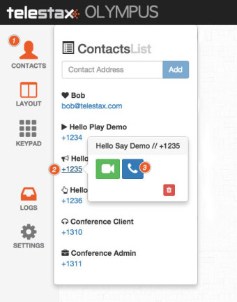
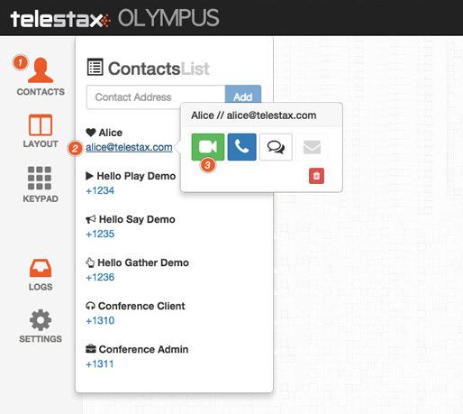
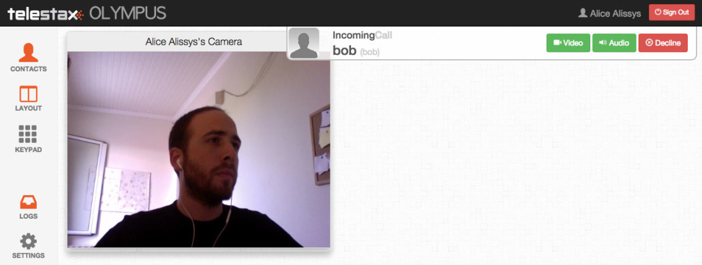
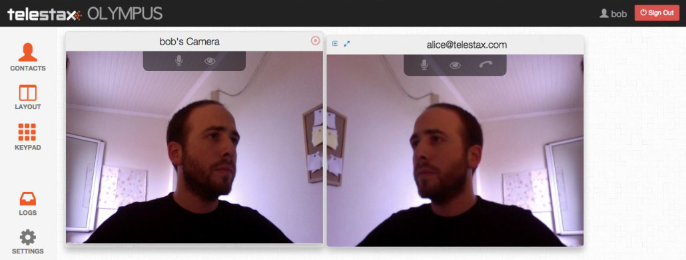
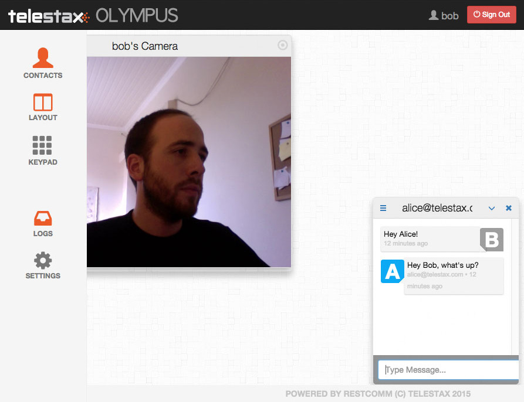

The Restcomm Web SDK comes with Olympus Client Web App that taps into  the SDK and presents to the user a full fledged application capable of video/audio WebRTC calls and text messages. If we add Restcomm Platform to the mix, we get full telecom programmability and access to PSTN/SMS. Let's see how this works.

You can use the latest version of Web Olympus by first registering for a new account https://accounts.restcomm.com/tadhackRegistration.jsp[here] and following along the registration process until you get your password via email. Then you can login to Olympus by using the user part of your email and the password you received. 

Once you login, you can use the Contacts menu on the left to call any of the default contacts, be it a Restcomm Application, like +1235 or another client like Bob who needs to be registered from another Olympus or generic SIP client. 

[[calling-a-restcomm-application]]
Calling a Restcomm Application
^^^^^^^^^^^^^^^^^^^^^^^^^^^^^^

Let's first try an audio call towards Restcomm Application +1235 that uses Text-to-Speech to greet you:

[[calling-another-restcomm-client]]
Calling another Restcomm Client
^^^^^^^^^^^^^^^^^^^^^^^^^^^^^^^

Now let's try a Client to Client video call. In the screenshots below Bob is calling Alice.

* Click on Contact icon, then Alice and finally do a video call as can be seen below:

* At that point, Olympus will start to ring in Alice’s window:

* Pick up from Alice tab and you are ready to talk (I'm calling myself which admittedly isn't very productive, but just to get an idea):

[[sending-a-text-message-to-another-restcomm-client]]
Sending a text message to another Restcomm Client
^^^^^^^^^^^^^^^^^^^^^^^^^^^^^^^^^^^^^^^^^^^^^^^^^

Click on the Contacts icon, then Alice and finally send a text message as can be seen below:

image:./images/olympus-texting-olympus-1.jpg[olympus-texting-olympus]

On the new text window that comes up write a text message and hit send. Go to the other client's window to see the incoming message and do the same to reply

That's about it. By taking further advantage of Restcomm's Apps capabilities you can now add a wealth of features in your flow, be it IVR, Conferencing, etc.

