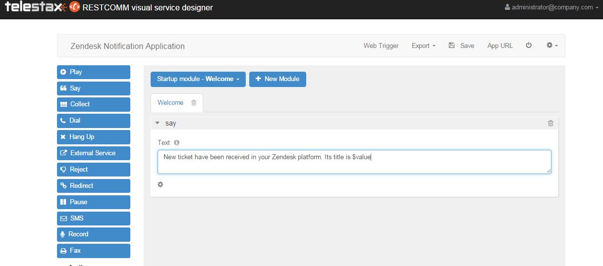
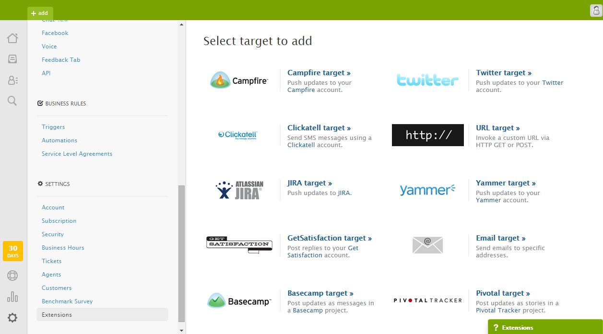
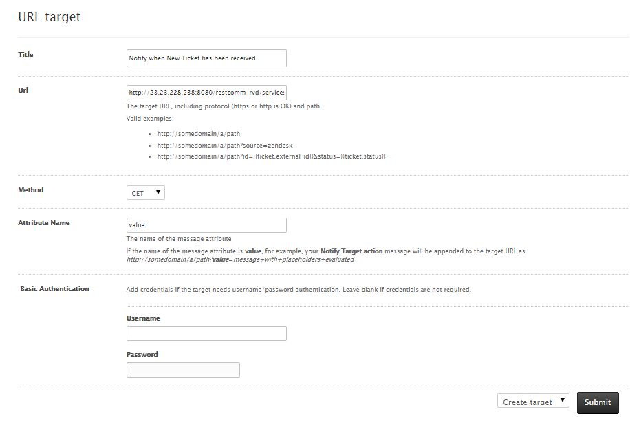
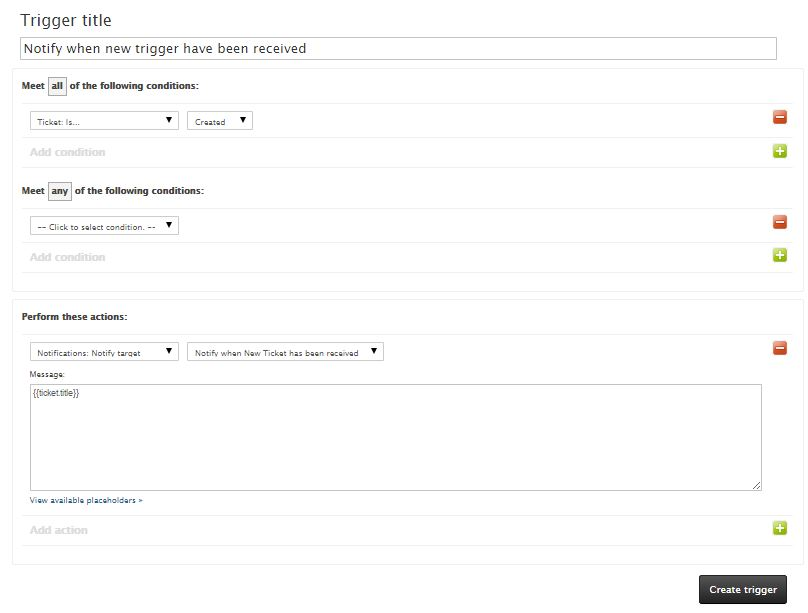

What if you run a Customer Support business that is open 24/7?  How will staff on standby know when a new customer ticket has been received?  Often, the support agent will either have to constantly check his email in order to ensure he is not missing any vital ticket. Wouldn't it be even better if the Customer Support person can receive an automated call to his mobile phone when an issue is logged? 

This tutorial is going to show how you can use Telestax Restcomm to act as a notification agent. The customer support portal used will be Zendesk. Whenever a customer ticket is received in Zendesk, a Web Trigger generated by Restcomm is called and a phone call notification is made to the customer support staff who has deal with the issue. 

The interesting thing about the Restcomm RVD Web Trigger is that it can also be use to send SMS as a form of notification. This tutorial will be limited to making a call to a DID number or to a SIP phone. 

You can use Restcomm Web Trigger with other  Customer Support platform or your choice   

= Technical Requirements

* Basic knowledge of Restcomm and the Visual Designer (RVD)
* Basic knowledge of Zendesk

= Use case scenario

* Customer publishes a new ticket in Zendesk
* A Restcomm Web hook will be called
* Customer support agent will receive a call on his cell phone or SIP client
* When user picks up the phone he will hear the ticket title

= Step 1

* Create an  RVD application.
* Log into the RVD and choose  new Voice Application
* Create a voice app with the name,  *Zendesk Notification Application*

image:./images/ZendeskApp.jpg[ZendeskApp,width=393,height=318]

= Step 2

* Change the default Welcome message to "**New ticket have been received in your Zendesk platform  Its title is $value**"
* The variable $value will hold the returned data  from Zendesk (for ex. Ticket Name, Ticket Requester, etc.). In our case we will want to request the ticket title.
+

+
* Click on the *Web Trigger* at the top of the page
* Make a note of the Web Trigger URL. It will be used as a hook in Zendesk.
+
image:./images/webtrigger1.jpg[image,width=458,height=371]
+
* In our case the Web Trigger *Url is __http://23.23.228.238:8080/restcomm-rvd/services/apps/Zendesk%20Notification%20Application/start__*
* in Fallback parameters  enter the  *To* and *From* values. See the screenshot above for example.
* * Save* the application

= Step 3

* In order to receive notifications from Zendesk you will need to create new Trigger and new Target that are going to work with the the RVD application.
* Go to your Zendesk admin account. Find Settings section.
* Click on Extensions.
* Choose to Add New Target.
* Choose to add URL target
+

+
* Specify Title for the new target. In our case we will use "**Notify when New Ticket has been received**"
* Now go back to RVD and copy the Web Trigger Url *(http://23.23.228.238:8080/restcomm-rvd/services/apps/Zendesk%20Notification%20Application/start)*
* Go to Zendesk and past the link in Target Url section
* Choose GET as Method
* Use "value" as attribute name. In our case that variable will get Ticket's title
* From the drop down menu under the *Basic Authentication* section choose to Create target and then *click Submit*

= Step 4

* Next, go to Business Rules section.
* Click on Triggers.
* Choose to Add New Trigger
+
image:./images/newTrigger.jpg[newTrigger,width=467,height=378]
+
* Specify Trigger title. Our trigger title is "**Notify when new trigger have been received**"
* In *Meet all of following conditions* section choose Ticket is.. ,  Created.
* In *Perform these actions section* choose to Notify target. From the drop down menu choose created target
* In Message text area type "**{{ticket.title}}**".
* Click on Create Trigger button

_**Tip:** If you want to get other Zendesk information, click on View available placeholders under the text area. There, you will find all the available placeholders, use them according to your needs._ 

Configuration is complete. You will receive notification call when a new ticket is created in your Zendesk platform.  
