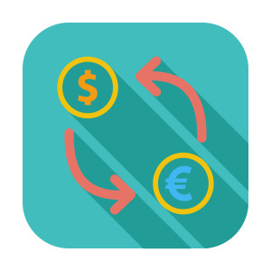
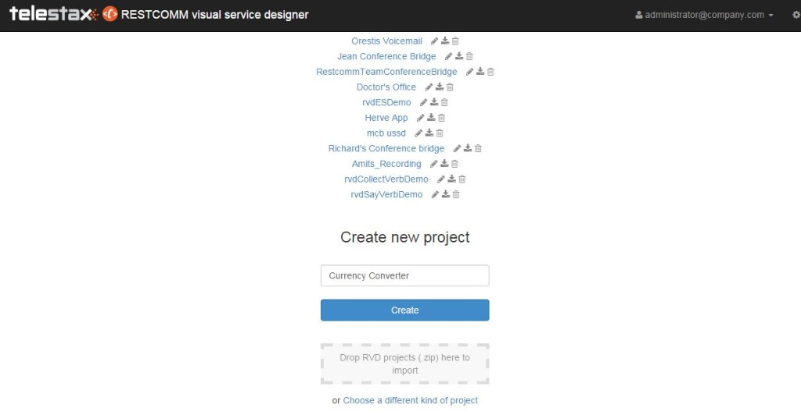
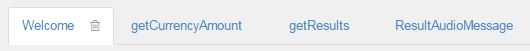
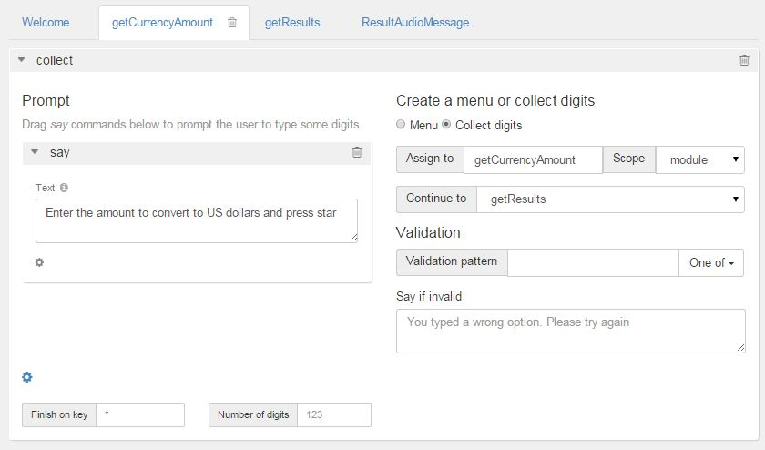
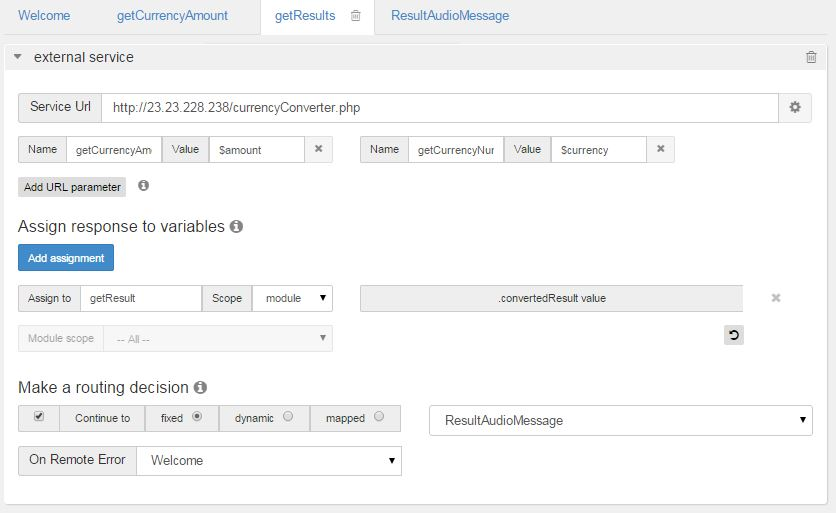

You love traveling abroad? You are tired of losing money because of exchange rate differences?  Be aware of daily exchange rates and change money with minimal loses with Currency Converter app. It is a simple solution provided by Telestax.  Currency Converter app gives you up-to-date exchange rate information using the power of Restcomm and Yahoo! Finance API. 

The following tutorial will show you how to build a fully functional Restcomm Visual Designer (RVD) powered app that allows users to  convert US dollars to six of the most traded currencies in the world.

*Main features of the application *

* menu 1 - User will hear to which currencies he can convert USD
* menu 2 - User is prompt to  enter an amount he want to convert
* menu 3 - User will hear the result of the conversion according to the daily rate of the chosen currency

*Technical Requirements:*

* Basic knowledge of Restcomm
* Basic knowledge of PHP, JSON
* Knowledge of Yahoo Finance API

[[step-1]]
*Step 1*
^^^^^^^^

* Go to RVD and create new project. In this example we will name it Currency Converter0

[[step-2]]
Step 2
^^^^^^

* Create the following modules: 
** Welcome
** getCurrencyAmount
** getResults
** ResultAudioMessage

[[step-3]]
Step 3
^^^^^^

* Go to Welcome module
* Insert **Collect, **use **Say **as **Collect Prompt. **Type: "Welcome to Telestax Restcomm Currency Converter. Choose a currency to convert to US dollars. For European Euros press 1. For Japanese Yen press 2. For British Pounds Sterling press 3. For Switzerland Francs press 4. For South African Rands press 5"
* Choose to collect digits.
* Assign to getCurrencyNumber. Choose module as a scope.
* Continue to GetCurrencyAmount
* Set number of digits to 1

image:./images/ccWelcomeModule.jpg[ccWelcomeModule,width=527,height=366]

[[step-4]]
Step 4
^^^^^^

* Go to *getCurrencyAmount*
* Insert Collect. Use Say to set users prompt message. Type the following in the text area: "Enter the amount to convert to US dollars and press star"
* Choose to Collect digits and assign to **getCurrencyAmount.** Set module as a scope
* Set *getResults* as Continue to module
* Set star as finish on key

[[step-5]]
Step 5
^^^^^^

* Next step is to create the PHP script that is going to work with the application

[source,lang:php,decode:true]
----
<?php
header('Content-Type: application/json');

//amount of USD that need to be converted

$getCurrencyToConvert = $_GET["currency"];
$getCurrencyAmount = $_GET["amount"];

$currencySymbols;
$currencyFullName;

if ($getCurrencyToConvert == 1){
$currencySymbols = "EUR";
$currencyFullName="European Euros";
}elseif($getCurrencyToConvert == 2){
$currencySymbols = "JPY";
$currencyFullName = "Japanese Yen";
}elseif($getCurrencyToConvert == 3){
$currencySymbols = "GBP";
$currencyFullName = "British Pounds Sterling" ;
}elseif($getCurrencyToConvert == 4){
$currencySymbols = "CHF";
$currencyFullName = "Switzerland Francs";
}elseif($getCurrencyToConvert == 5){
$currencySymbols = "ZAR";
$currencyFullName = "South African Rands";
}
//$from - Currency from which we will convert, $to - currency to which we will convert
$from = $currencySymbols;
$to = 'USD';

//Connecting to Yahoo Finance API
$url = 'http://finance.yahoo.com/d/quotes.csv?f=l1d1t1&s='.$from.$to.'=X';

$handle = fopen($url, 'r');

if ($handle) {
$result = fgetcsv($handle);
fclose($handle);
}

$conversionTotal = $result[0] * $getCurrencyAmount;

$conversionResult = $getCurrencyAmount . " " . $currencyFullName . " converted to US dollars is worth ". $conversionTotal . " dollars as of " . date("F j, Y") . " at ". $result[2];

$result = file_get_contents($url);
$result = json_decode($result);
if ($result->success)
{

}
//parse app days as array
$response = array ('convertedResult' => $conversionResult);

// Output the response as JSON
$json_response = json_encode($response);

//echo $c;
echo $json_response;

?>
----

[[step-6]]
Step 6
^^^^^^

* Go to *getResults* module
* Add External Service
* Copy and paste the URL to the PHP script that is going to operate with the application
* Add as Url parameters: *getCurrencyAmount* and its value - *$amount* *getCurrencyNumber* and its value - **$currency**
* Assign to getResult, use module as a scope. Add *convertedResult* as value
* Continue to *ResultAudioMessage*
* On Remote Error set Welcome module

[[step-7]]
Step 7
^^^^^^

*  Go to *ResultAudioMessage* module
* Insert Say. Type the following in the text area: "**$getResult**, Thank you for using the Telestax Restcomm currency converter application"

image:./images/resultAudioMessage.jpg[resultAudioMessage,width=559,height=181]

Now add a phone number to the newly created currency converter app using the Restcomm Management Interface. 

You can now dial the number you assigned to the app and follow the IVR instruction to convert any of the listed currency.

For more information about how Yahoo Finance API is working click https://code.google.com/p/yahoo-finance-managed/wiki/YahooFinanceAPIs[HERE].
