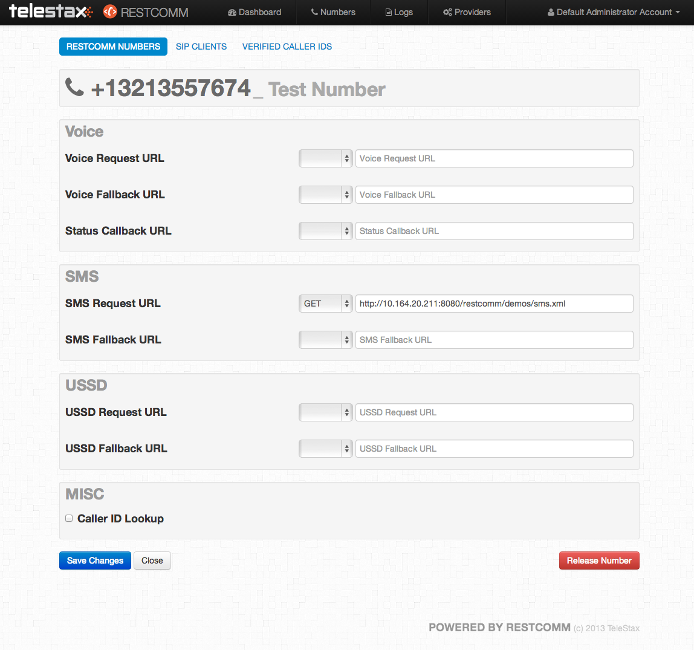
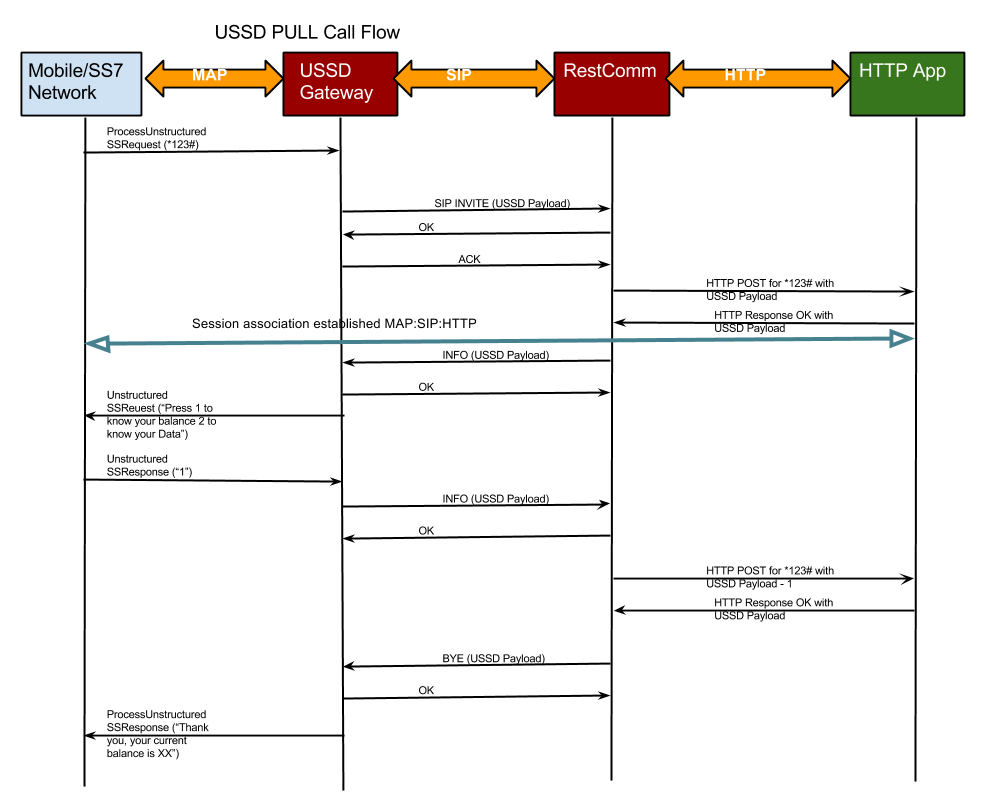
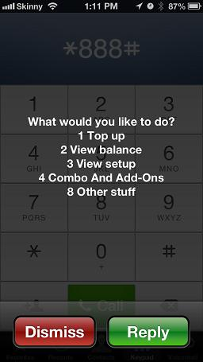

This is a first blog in a series that will cover the topic of building USSD apps for Restcomm. USSD is a popular mobile technology used widely in many emerging markets for online banking, mobile payments, e-commerce, travel reservations, social networking and many other use cases. 

USSD is a text based exchange of information between a mobile phone (any mobile phone) and a backend service. USSD is similar to SMS in user experience, however it has one major advantage in that it is session aware. In other words it is possible to have a conversation via USSD without losing track which message belongs to which context, while this is problematic with SMS. 

For example if a mobile banking service sends an SMS message to a mobile subscriber asking for approval of a wire transfer transaction and before the user responds another message is sent from the banking service to ask the user if they want to see their new checking account balance, there is no way for the user to respond unambiguously to either of the questions. SMS does not guarantee delivery of messages nor does it guarantee order of delivery. 

USSD was designed to resolve these issues with SMS being inherently stateless and unreliable. USSD is available on any 2G or later mobile phone, which means virtually all mobile phones in the world support USSD, just as they support SMS. 

In this first part of the series we will show how Restcomm interconnects with mobile networks to provide intuitive Web APIs to Restcomm app developers. 

First, let's look at the Restcomm Admin UI page where a number is configured. There are three key configuration settings: VoiceURL for handling voice calls by application logic, SMS URL for SMS interaction and USSD URL for USSD app logic.   

The screenshot above shows how a pone number driven by a Restcomm app is configured to trigger application logic for incoming calls, SMS or USSD messages. In a follow-up post we will look at an example Restcomm application that implements an USSD service. 

Next, let's look at the logical mapping between Restcomm API, SIP and SS7 networks to make USSD application development a breeze as compared to the traditional way telecom developers with highly specialized SS7 skills are used to. 

The diagram above shows an example flow of messages for a simple mobile self-service application that allows a mobile subscriber to check their account balance or data usage for the month. 

Here is the use case step by step:

1.  User dials **123#* on their phone keypad to check their mobile subscription account status. For the purpose of this example, *123# is the number of the mobile account self-service assigned by the mobile operator.
2.  The Restcomm USSD app responds with a text which describes several options "Press 1 for account balance, press 2 for Data usage status."
3.  *User presses 1.*
4.  Restcomm app received the user choice, looks up their balance in the backend user profile database and responds with the information.

Here is an example screenshot how this app would look on an iPhone: 

This type of app in USSD terminology is called USSD Pull app. In the sense that the user initiates a call to the service to "pull' information. There is another kind of USSD apps called USSD Push apps, which we will look at in a follow up blog post. 

Restcomm follows the guidelines of link:http://www.3gpp.org/DynaReport/24390.htm[3GPP TS 24.390] to bridge IMS networks to USSD services. Restcomm interacts with the Telestax USSD Gateway server over SIP, which in turn interacts with a legacy SS7 network link using the MAP sub-protocol. From a Restcomm developer point of view the Restcomm application sees an HTTP session similar to a regular web session that carries the information between the mobile subscriber and the app. The mobile subscriber appears as a user of a web browser sending HTTP requests for content. The Restcomm app serves the content over HTTP using a simple XML syntax (the Restcomm Markup Language). 

The rest of the magic is transparent to the Restcomm app developer. Restcomm implements the mapping between HTTP session and SIP session. It works closely with the Telestax USSD Gateway to establish a mapping between the SIP session and an SS7 MAP session. 

Conceptually the mechanics of abstracting out legacy network connectivity via intuitive, modern REST API are simple, aren't they? We will leave it to the Restcomm engineers and expert telecom developers to comment if this is actually the case. As far as Restcomm app developers are concerned, the mundane problem is solved and we can focus on fun things like building interesting new USSD apps that mobile subscribers would love to use.  
