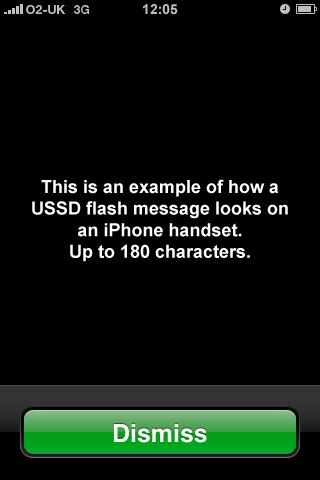
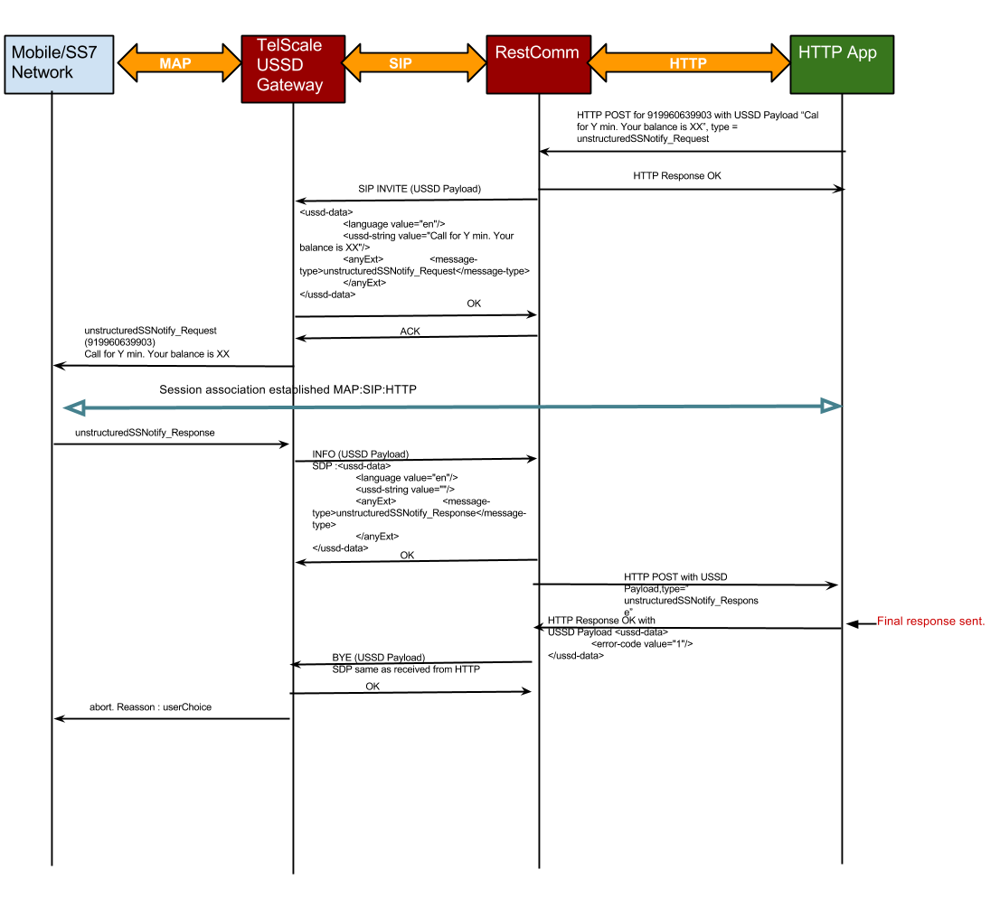

This article continues the topic of building USSD apps for Restcomm. Part 1 discussed USSD Pull apps. We will now cover USSD Push apps. 

Some examples of USSD Push apps are alert messages for high priority events such as reaching a low limit on a bank account, IT system failure, personal emergency, severe weather alert, important calendar event reminder, link:http://www.amberalert.gov/[Amber Alert] and others. USSD Push messages are referred to as USSD flash messages when the application does not expect the user to respond. Here is what an USSD flash message looks like on an iPhone. 

Unlike SMS messages, USSD Push messages are guaranteed to be delivered as long as the mobile phone is active. USSD messages are also implemented in a way that they take over priority over any other app and light up the phone screen even when the phone is locked. USSD is part of the core SS7 2G network. In other words it is available even when WiFi, GPRS, 3G, LTE and all other data services are not available due to location, network overload or other reasons. 

The following diagram illustrates the USSD message flow between a mobile phone user, the core mobile network and a Restcomm app. 

The message flow from the subscriber mobile phone to the core SS7 network, Restcomm and the app are similar to the case of USSD Pull. The difference is that the app initiates the USSD session in the case of USSD Push, while the mobile subscriber initiates the session in case of USSD Pull by dialing a USSD service number such as *1234#. 

Notice that even in the case of a USSD flash message, the app is aware that the mobile subscriber read the message and acknowledged it. This is a significant advantage of USSD over SMS and other messaging alternatives that do no guarantee delivery or receipt. Because of its proliferation and 100% availability across all kinds of smart and feature phones, USSD can be a powerful tool to deliver important information in an instant. It can be also used for legal signature because it is no less reliable and secure than a user accepting a legal agreement by clicking on a web page Accept button. 

In a follow up post we will look in the source code of a Restcomm app that uses USSD service. Prepare for a treat. The code may look all too familiar if you've done any web app development. You may be a little shocked to see no prior knowledge of telecom protocols is required and no prior telecom programming skills factor in. Stay tuned. 

In the meanwhile please share your thoughts and experience with USSD apps in the comments section of this blog.  
