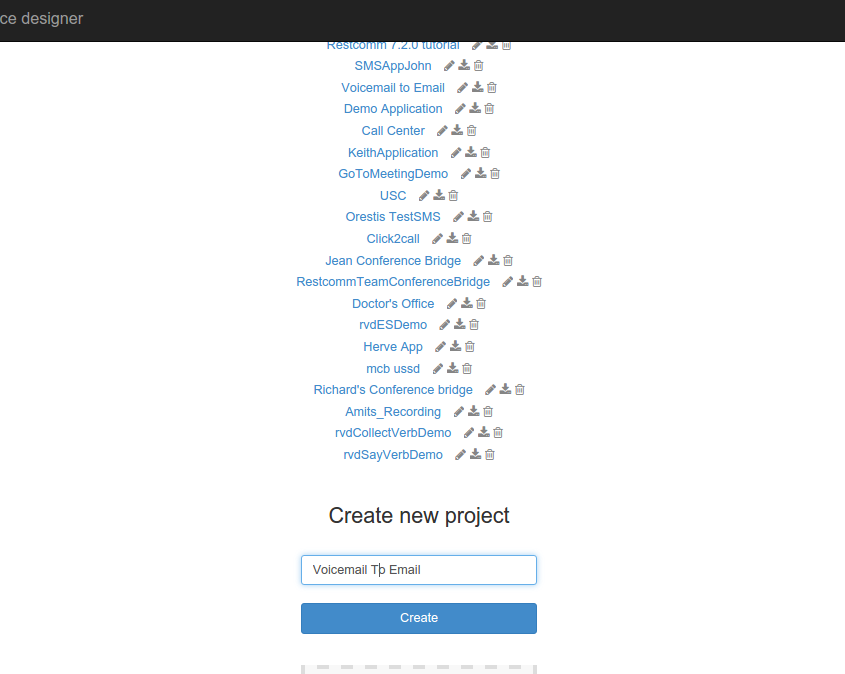
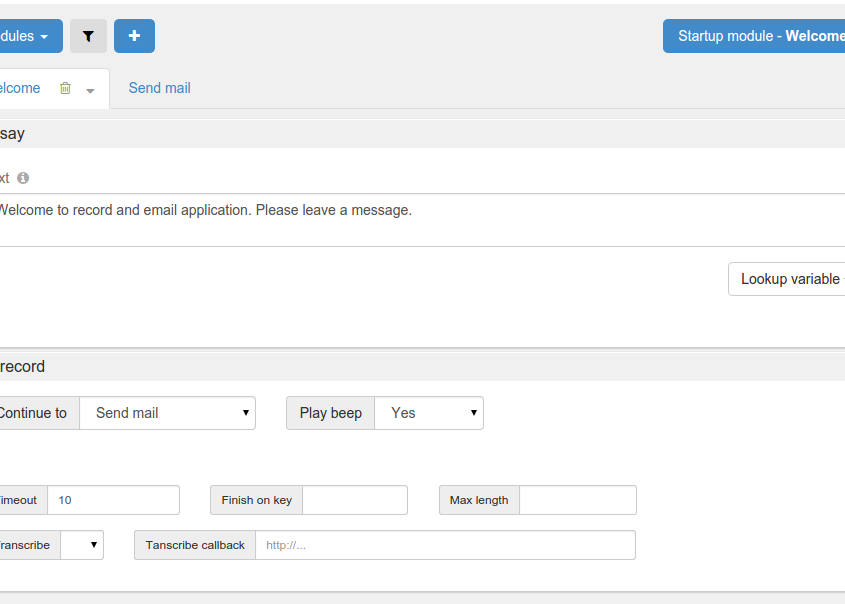
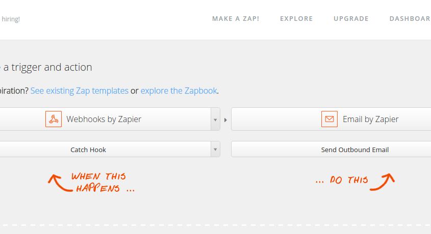
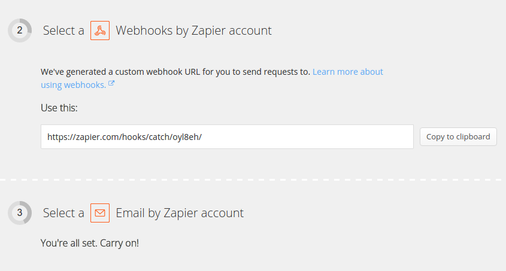
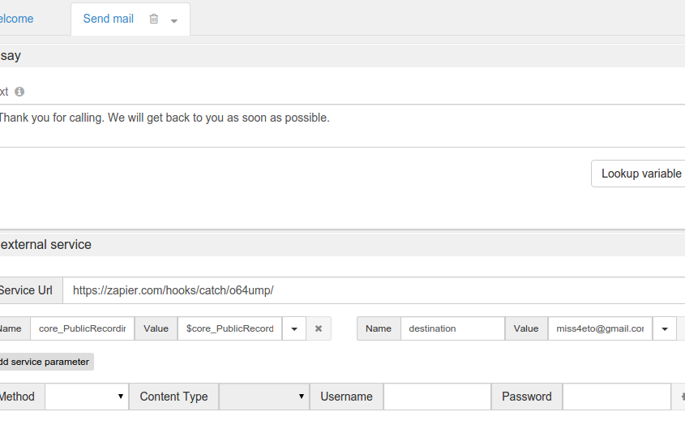
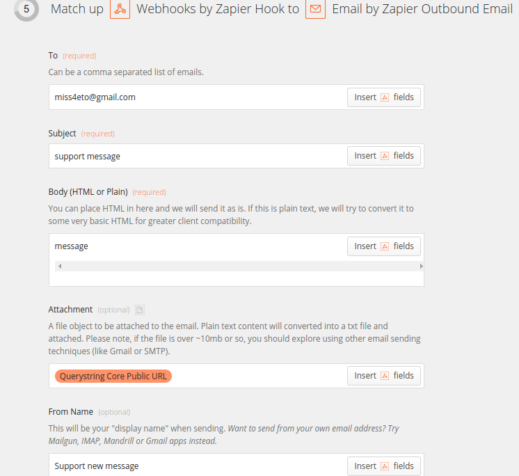
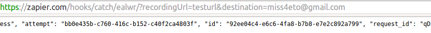
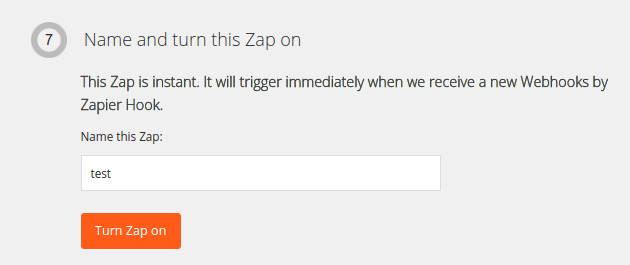

Restcomm Visual Designer (RVD) is an intuitive web interface designed by Telestax to help developers build  communication applications rapidly. In this tutorial, you will learn how to create a voicemail application without writing a single line of programming language code. The voice message can then be emailed to your desired address.

Use case scenarios:

* Voicemail directly to your email,
* Voicemail to a third party (Assistant) for further processing
* Access email where voicemail server is not available.

*Technical Requirements:*

* Basic knowledge of Restcomm
* Basic knowledge of Zapier service (or alternatives web services integration tool such as IfTTT.com)

[[step-1]]
Step 1
------

You must create an RVD project.

* Log into RVD on your Restcomm installation. *http://IP_ADDRESS:8080/* Please go to this link under step 4 and see how to link your RVD post to a Restcomm number. Then use a sip phone to call that number and an email will be sent to your_email@company.com link:/?p=2486[http://www.telestax.com/telephone-survey-with-restcomm-visual-designer/]
* Go to Restcomm Visual Designer, Voice and create new project. In this example we will name the project "Voicemail To Email".

* You need to create two modules, *Welcome* module and *Send email* module.
* For the Welcome module, in the *Say* verb text area, enter your welcome message. In the screenshot below the text is "Welcome to record and email application. Please leave a message.".
* Drag and drop the  **Record**  verb into the Welcome module as show in the screenshot below.
* In the *Continue To* drop down menu field, choose the **Send email**,
* Check **Play beep**.
* Set the *Timeout* field to  10 seconds .
* Leave the rest of the fields as default.

 

[[step-2]]
Step 2
------

* Go to http://www.zapier.com, make a registration and then log in. Following screen will appear.

image:./images/zapierDashboard-845x305.png[zapierDashboard,width=845,height=305]

* Click on Make a Zap.
* Get Web Hook trigger and an Email action app from the drop down menus.
* Choose a trigger and an action to send an  outbound email.
* Press *Continue* and go to the next step, Web Hook.

 

* Copy the Webhook URL to clipboard and click on Continue
* Select an email account if not already done

[[step-3]]
Step 3
------

[[send-email-module-steps]]
Send email module steps
^^^^^^^^^^^^^^^^^^^^^^^

* Go back to RVD
* Go to **Send email** module and paste the WebHook URL in the **Service Url**  text area.
* Drag and drop *Say* module. In the text area enter the following text: "Thank you for calling. We will get back to you as soon as possible."
* The *Send email* module requires an External Service called Zapier. where the recorded message will be processed and a URL will the recorded message will be returned to Restcomm
* Restcomm will return the URL of the recorded message to the Destination email specified in the Send email module.
* The user can then listen to the voicemail message by accessing the  URL contained in the message email message.
* The recorded message will be available in the **$core_PublicRecordingUrl** variable.
* In older versions of Restcomm, the variable is $core_RecordingUrl.

Fill the following URL parameters as follows

* Name: recordingUrl
* Value:  $core_RecordingUrl
* Name: destination
* Value: DESTINATION_EMAIL_ADDRESS

[[step-4]]
 Step 4
-------

* Go back to Zapier. and enter the name of the Values: $core_RecordingUrl
* Enter the  email address to which the email will be sent.

image:./images/filterwebhook.png[filterwebhook,width=655,height=365]

* Match up the web hook to the outbound email.
* Enter the email, subject, body text etc.
* It is important to choose the appropriate type of attachments

* Finally, test the Zap.
* Copy the `Webhook URL` to your web browser and add the following parameters:
+
https://zapier.com/hooks/catch/ealwr/?recordingUrl=testurl&destination=miss4eto@gmail.com
+
* Your email will be different
* This will return a Json object as shown below

* You can now give your Zap a name and activate it.

Application is finished. You can call your Restcomm number and test it.

[[for-more-information]]
For more information
~~~~~~~~~~~~~~~~~~~~

* For more information what is Restcomm and how it works please read these documents: http://www.telestax.com/restcomm-7-1-4-getting-started-guide/, http://telestax.wpengine.netdna-cdn.com/wp-content/uploads/2013/08/RestComm_API_User_Guide.pdf, http://www.telestax.com/restcomm-sip-tutorial-basic-usage-and-voice-dtmf/

* For more information what is Zapier and how it works please follow these links: https://zapier.com/help/what-is-zapier/ https://zapier.com/how-it-works/

 
