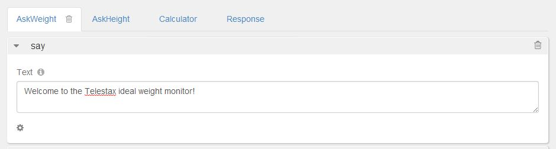
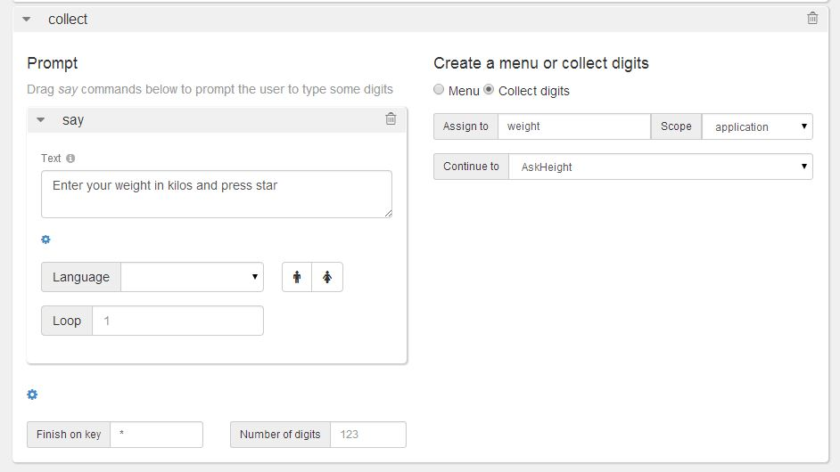
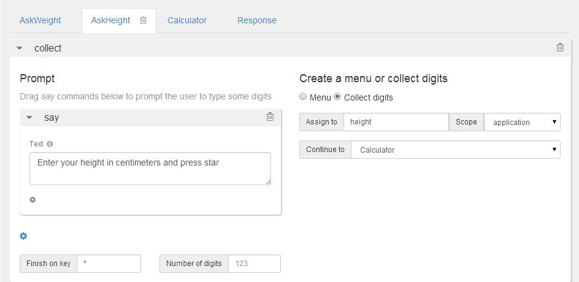

Restcomm Visual Designer (RVD) is an intuitive web interface which helps developers build communication applications rapidly. In this tutorial you will learn how to use RVD not only for communication purposes but also for your health care, monitor your weight via weight calculator. It will allows you to calculate your ideal weight according to your height. It will also give you information about your weight status: under weight, on weight or over weight. 

= Requirements

* _Basic knowledge of Restcomm;_
* _Basic knowledge of PHP;_

Тhis application will have four modules: AskWeight, AskHeight, Calculator and Response. Let's begin with AskWeight! 

= Step 1

* Log into RVD on your Restcomm installation: http://IP_ADDRESS:8080/restcomm-rvd/
* Create a new project
* Change the name of the Welcome module to *AskWeight*
* In the text area, edit the default RVD welcome message to the following: "Welcome to the ideal weight monitor!"

* Drag and drop the *Collect* verb into the AskWeight module**.**
* Drag and drop the *Say* verb into the *Collect* verb prompt textarea..
* In the Say verb textarea, enter the following : "Enter your weight in kilos and press star".
* Enter the star * symbol in the *Finish on Key* textarea.
* Under **Create a menu or collect digits**, choose to *Collect digits.*
* In *Assign to* textarea enter "**weight**". This is the name of the first value the php script will look for.
* *Scope* = application
* *Continue to =* AskHeight.

= Step 2

* AskHeight module has only *Collect* verb. In *Collect* there is *Say* which will prompt the user to type his height in centimeters and press star: "Enter your height in centimeters and press star".
* Star is chosen as a finish key.
* Again digits will be collected.
* The name of the value which should be entered in *Assign to* is height.
* The *scope* should be again the whole application.
* Select to *Continue to* the third module - Calculator.

= Step 3

* Calculator module consists of *External Service.* It has *Service Url* which is actually the location of the php script used by the application. In the *external service* there are also the names of the variables which are used by the application.
* In this example the first *Value* is "$weight" and its *Name* is "weight". The second one is "$height" and its name is "height". This module has also three assignments.
* In the first *Assign to* area type "status", choose the scope to be the whole application.
* In the second *Assign to* area enter: "minWeight", chose as a scope again the application.
* And for the third one type "maxWeight" in the *Assign to* field and define the same scope - application.
* From the drop down menu on the right side select *value* for all of the assignments.
* Finally for *Make a routing decision* check it to be fixed. From the drop down menu on the right select the last module Response.

image:./images/4.jpg[4,width=706,height=551]

= Step 4

* The final Response module gives information to user about his status - if he is under weight, on weight or over weight and the min and max weight he should be. This module has three *Say* verbs.
* In the first *Say* text area enter: "You are $status!".
* In the second: "The minimum weight is $minWeight kilos". and in the third one: "The maximum weight is $maxWeight kilos".
* And the whole four modules are finished.

image:./images/5.jpg[5,width=701,height=475]

= Step 5

* The final step is to create the PHP script.
* The first function convert the height from centimeters to meters and calculate the mass.
* The second one calculate height from centimeters to meters and calculate the weight.

[source,lang:php,decode:true]
----
<?php
header('Content-Type: application/json');

function getMass($weight, $height) {
    // convert height from centimeters to meters
    $height_meters = ($height / 100);
    // calculate mass
    $mass=($weight / ($height_meters * $height_meters));
    return round($mass, 1);
}

function getWeight($mass, $height) {
    // convert height from centimeters to meters
    $height_meters = ($height / 100);
    // calculate weight
    $weight=($height_meters * $height_meters * $mass);
    return round($weight);
}
----

* The second part of the script calculates the data and gives information about users minimum and maximum weight and his status by requesting the weight and height variables.

[source,lang:php,decode:true]
----
// Calculate data
$min_mass = 18.5;
$max_mass = 24.9;

$weight=$_REQUEST['weight'];
$height=$_REQUEST['height'];

$mass = getMass($weight, $height);
$min_weight = getWeight($min_mass, $height);
$max_weight = getWeight($max_mass, $height);

$status = '';
if($min_mass > $mass) {
    $status = 'under weight';
} elseif($max_mass < $mass) {
    $status = 'over weight';
} else {
    $status = 'on weight';
}

$response = array('minWeight' => $min_weight, 'maxWeight' => $max_weight, 'weight' => $weight, 'height' => $height, 'status' => $status);
$json_response = json_encode($response);
echo $json_response;
?>
---- 
