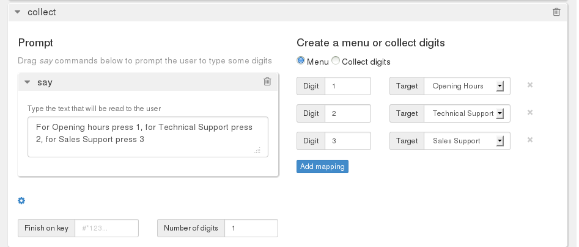
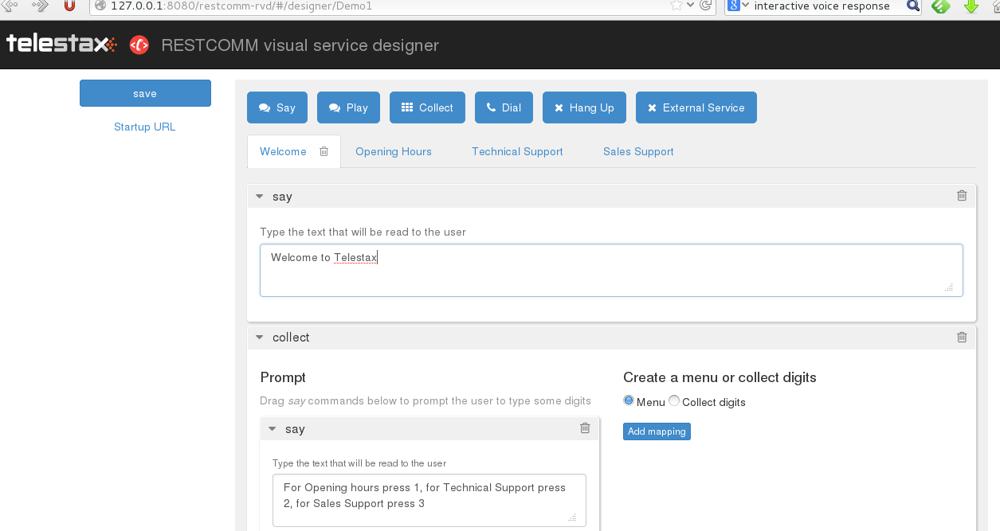
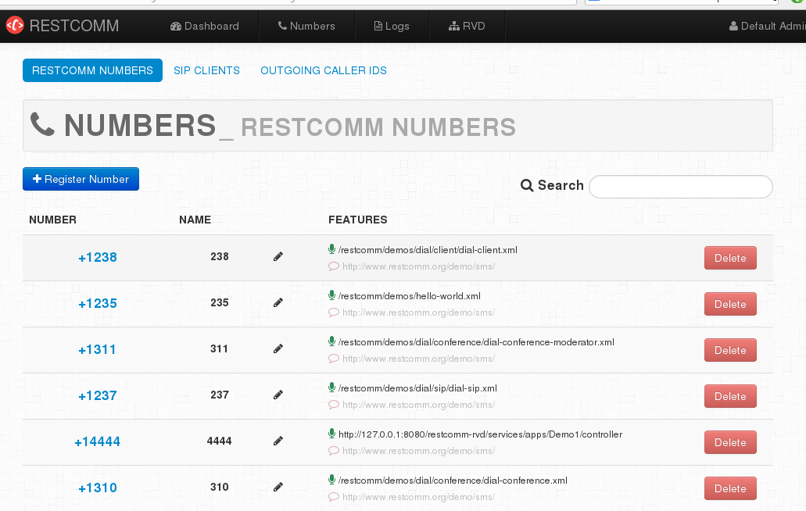
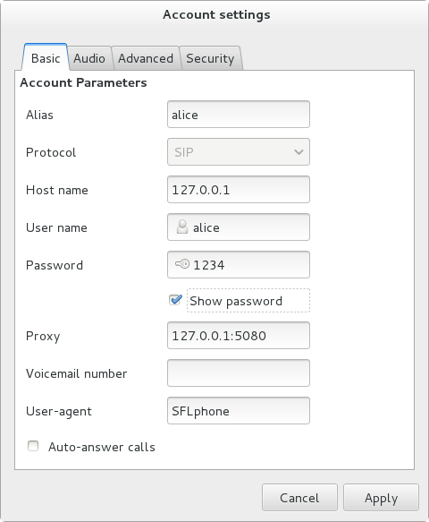

This tutorial will help you create an Interactive Voice Response application using the Restcomm Visual Designer. It is assumed that you are running Restcomm on a local server. Open your web browser and go the following url.   

NOTE: It is assumed you are running Restcomm on your local installation using the default 127.0.0.1 interface

= Step 1

* go to the link *http://127.0.0.1:8080/restcomm-rvd/*
* Enter a name for your new project (Demo1 is used in this tutorial) and press the button *"Create"*

In the main dashboard of the RVD, you will see the default module "Welcome": 

In the Welcome tab

* Change the default text to the following:
* Welcome to Telestax,
* Click the "Collect" verb and drag it onto the module window below the "Say" verb.
* Click and drag another *"Say"* onto the *"Collect"* verb so that it appears below the *"Prompt"*
* In the text area of the new *"Say"* verb, add the following texts:
* For Opening hours press 1, for Technical Support press 2, for Sales Support press 3
* Click on the options button at the bottom of the "Collect" verb window and set *"Number of Digits" to 1*
* The *Number of Digits* tells the media server to process the request after receiving only a single digit.

See screenshot below: 

* Click on the Save button to update your changes.

At the top of the page, create a new module by clicking on *"New Module"*

* A new tab called *"Untitled module"* will appear beside the *"Welcome"* tab
* Click on the title of the new module and change the name to "Opening Hours"
* Create another module and change the name to "Technical Support"
* Create a third module and change the name to "Sales Support"

You should now have 4 tabs with the following names

* Welcome
* Opening Hours
* Technical Support
* Sales Support

See the screenshot below 

*Click on the Openining Hours tab*

*     Click the Say verb and drag it to the module window. Type the following text in the text area.
*     Welcome to Telestax, our openining hours are from 8 AM to 8 PM Mondays to Friday.

*Click on the Technical Support tab*

*     Click the Say verb and drag it to the module window. Type the following text in the text area.
*     Welcome to Telestax Technical Support, all our engineers are please at the moment please hold the line.

*Click on the Sales Support tab*

* Click the Say verb and drag it to the module window. Type the following text in the text area.
* *Welcome to Telestax Sales Support, all our sales engineers are busy counting their huge bonuses, please call back at a better time.*

Click on the *Save* button to update your changes.   

= In the "Welcome" Tab

In the "Collect" verb window, click on the "Add Mapping" three times. In the target option,

* link digit 1 to target : "Opening Hours"
* link digit 2 to target : "Technical Support"
* link digit 3 to target : "Sales Support"

*Save* your application. In this tutorial, the project is called Demo1. 

= Restcomm Managment User Interface

Next you need to link the Demo1 project to a phone number so that you can test the application. In another internet browser window, open the following *url http://127.0.0.1:8080/* 

Login and click on the menu "Numbers" 

Click on the button "+Register Number" 

In the "Register Number" window click on "Optional Parameters" to reveal the full options

* Fill out the window as follows:
** Phone number: *4444*
** Voice Request Url: *Demo1*

The Demo1 is the name of the project you created using the RVD 

Leave the rest of the fields as default and press *"Register"* 

If the register is successful, you will see the new number you have just linked to the Demo1 project in the list of numbers as show in the screenshot below:  

= Calling and Testing your Demo1

You can now make a SIP call to your application using any SIP phone. In this tutorial, we shall configure Sflphone to connect to Restcomm and make a call to number **4444**. 

Use the following settings to connect your SIP client Sflphone to Restcomm.   

Make a call to number *4444* and follow the menu instruction. With this tutorial, you can see how easy and quick it is to create an Interactive Voice Response application using Restcomm.
