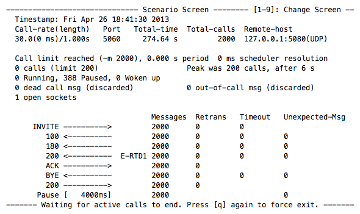

In this tutorial, you will learn how to load test RestComm using SIPp. Load testing is performed to determine a system’s behaviour under both normal and anticipated peak load conditions. It helps to identify the maximum operating capacity of an application.

= Configuration

To run this tutorial you will need the following components:

1. RestComm with the appropriate RCML application.
2. An MSS instance responsible for processing the load sent from the RCML application.
3. SIPp to initiate calls to RestComm.

= RestComm

Restcomm is a Communications Platform to rapidly build voice and text messaging applications, using your existing web development skills. You can install RestComm and the hello-world demo application

Make sure your MGCP server is configured as follows: *$RESTCOMM_HOME/server/default/deploy/restcomm.war/WEB-INF/conf/restcomm.xml*

[source,lang:default,decode:true]
----
<media-server-manager>
<mgcp-server name="Mobicents Media Server">
<local-address>127.0.0.1</local-address>
<local-port>2727</local-port>
<remote-address>127.0.0.1</remote-address>
<remote-port>2427</remote-port>
<response-timeout>2000</response-timeout>
</mgcp-server>
</media-server-manager>
----

NOTE: Although this tutorial is supposed to be run locally, keep in mind that it is recommended to use separate server for RestComm and Media Server.

After running the cURL command the address *sip:1234@localhost:5080* became bound to the hello-world application. This will be the phone number used by SIPp to communicate with RestComm.

= Restcomm Media Server

The Restcomm Media Server is a Java based Real Time Media server that offers streaming, conferencing, recording, playback, IVR, Text To Speech and other rich media features. It can be accessed programmatically via MGCP or a Media Control (JSR 309) driver that runs in Java EE, SIP Servlets and JSLEE containers. 

For this tutorial, we need to configure the UDP Manager of the Media Server: 

*$RESTCOMM_HOME/mobicents-media-server/deploy/server-beans.xml*  

[source,lang:default,decode:true]
----
<bean name="localhost" class="org.mobicents.media.server.io.network.UdpManager">
<constructor>
<parameter><inject bean="Scheduler"/></parameter>
</constructor>
<property name="bindAddress">127.0.0.1</property>
<property name="lowestPort">10000</property>
<property name="highestPort">65535</property>
<property name="localBindAddress">127.0.0.1</property>
<property name="localNetwork">127.0.0.1</property>
<property name="localSubnet">255.255.255.255</property>
<property name="useSbc">false</property>
<property name="rtpTimeout">0</property>
</bean>
----

Its worth mentioning that the lowerPort and highestPort properties define a RTP port range that should be large enough to carry the load that the performance test will create. These parameters are optional since MSS default RTP port range is 1024 - 65534. For every call, MSS cyclically starts with the higher available port and for every next call will user the next lower port.

Also, we need to declare the audio codecs supported by the Media Server. The scenario used in this tutorial is configured to use G711 A-law. Below is a list of commonly used codecs:

*$RESTCOMM_HOME/mobicents-media-server/deploy/server-beans.xml*

[source,lang:default,decode:true]
----
<bean name="DSP" class="org.mobicents.media.server.component.DspFactoryImpl">
<property name="codecs">
<list value-type="java.lang.String">
<value>org.mobicents.media.server.impl.dsp.audio.l16.Encoder</value>
<value>org.mobicents.media.server.impl.dsp.audio.l16.Decoder</value>

<value>org.mobicents.media.server.impl.dsp.audio.g711.alaw.Encoder</value>
<value>org.mobicents.media.server.impl.dsp.audio.g711.alaw.Decoder</value>

<value>org.mobicents.media.server.impl.dsp.audio.g711.ulaw.Encoder</value>
<value>org.mobicents.media.server.impl.dsp.audio.g711.ulaw.Decoder</value>

<value>org.mobicents.media.server.impl.dsp.audio.g729.Encoder</value>
<value>org.mobicents.media.server.impl.dsp.audio.g729.Decoder</value>

<value>org.mobicents.media.server.impl.dsp.audio.gsm.Encoder</value>
<value>org.mobicents.media.server.impl.dsp.audio.gsm.Decoder</value>
</list>
</property>
</bean>
----

= SIPp

SIPp is a traffic generator for the SIP protocol. It includes a few basic SipStone user agent scenarios (UAC and UAS) and establishes and releases multiple calls with the INVITE and BYE methods. You can install SIPp as explained in link:http://sipp.sourceforge.net/doc/reference.html#Installation[HERE].

SIPp can read XML scenario files describing call flows. For this tutorial, create the following xml file: 

*UAC_G711alaw.xml*

[source,lang:default,decode:true]
----
<?xml version="1.0" encoding="ISO-8859-1" ?>
<!DOCTYPE scenario SYSTEM "sipp.dtd">

<scenario name="Basic Sipstone UAC">
<!-- send INVITE -->
<send retrans="500">
<![CDATA[
INVITE sip:[service]@[remote_ip]:[remote_port] SIP/2.0
Via: SIP/2.0/[transport] [local_ip]:[local_port];branch=[branch]
From: sipp <sip:sipp@[local_ip]:[local_port]>;tag=[call_number]
To: sut <sip:[service]@[remote_ip]:[remote_port]>
Call-ID: [call_id]
CSeq: 1 INVITE
Contact: sip:sipp@[local_ip]:[local_port]
Max-Forwards: 70
Subject: Performance Test
Content-Type: application/sdp
Content-Length: [len]

v=0
o=user1 53655765 2353687637 IN IP[local_ip_type] [local_ip]
s=-
c=IN IP[media_ip_type] [media_ip]
t=0 0
m=audio [media_port] RTP/AVP 8
a=rtpmap:8 PCMA/8000
]]>
</send>

<!-- receive TRYING -->
<recv response="100" optional="true" />

<!-- receive RINGING -->
<recv response="180" optional="true" />

<!-- receive OK -->
<!-- By adding rrs="true" (Record Route Sets), the route sets -->
<!-- are saved and used for following messages sent. Useful to test -->
<!-- against stateful SIP proxies/B2BUAs. -->
<recv response="200" rtd="true" />

<-- send ACK -->
<send>
<![CDATA[
ACK sip:[service]@[remote_ip]:[remote_port] SIP/2.0
Via: SIP/2.0/[transport] [local_ip]:[local_port];branch=[branch]
From: sipp <sip:sipp@[local_ip]:[local_port]>;tag=[call_number]
To: sut <sip:[service]@[remote_ip]:[remote_port]>[peer_tag_param]
Call-ID: [call_id]
CSeq: 1 ACK
Contact: sip:sipp@[local_ip]:[local_port]
Max-Forwards: 70
Subject: Performance Test
Content-Length: 0
]]>
</send>

<!-- receive BYE -->
<recv request="BYE" />

<!-- send OK -->
<send>
<![CDATA[
SIP/2.0 200 OK
[last_Via:]
[last_From:]
[last_To:]
[last_Call-ID:]
[last_CSeq:]
Contact: <sip:[local_ip]:[local_port];transport=[transport]>
Content-Length: 0
]]>
</send>

<!-- STATISTICS -->
<!-- definition of the response time repartition table (unit is ms) -->
<ResponseTimeRepartition value="10, 20, 30, 40, 50, 100, 150, 200"/>

<!-- definition of the call length repartition table (unit is ms) -->
<CallLengthRepartition value="10, 50, 100, 500, 1000, 5000, 10000"/>
</scenario>
----

= Executing Load Tests

Now that all the required components are configured, its time to execute the load test.

By running the following instruction in your command line, SIPp will start generating SIP traffic according to the specified scenario.

----
sipp -sf ./UAC_G711alaw.xml -s 1234 127.0.0.1:5080 -l 200 -m 2000 -r 30 -trace_screen -trace_shortmsg -trace_err -recv_timeout 400000 -t un -nr
----

Let's shed some light on the command's parameters:

* *-sf ./UAC_G711alaw.xml* indicates the SIPp script to be run.
* *-s 1234 127.0.0.1:5080* directs the call to sip:1234@localhost:5080 which is the phone number bound to the hello-world application.
* *-l 200* indicates the number of simultaneous calls. Once this limit is reached, traffic is decreased until the number of open calls goes down.
* *-m 2000* indicates the number of calls to be processed before the calls are processed.
* *-r 30* represents the call rate. This value means 30 calls per second.
* *-trace_screen* will create a log file containing the statistic screens.
* -**trace_shortmsg** will create a log file containing sent and received SIP messages.
* *-trace_err* will create a log file containing unexpected messages.
* *-recv_timeout 400000* represents the global receive timeout in milliseconds. If an expected message is not received in this time, then the call times out and is aborted.
* *-t un* indicates the transport mode is UDP with on socket per call.
* *-nr* disables retransmission in UDP mode.

NOTE: If you intend to reach high call rates and/or high number of simultaneous SIP calls consider limiting the traces to a minimum.

SIPp provides screens to summarise the results of the load test:

* *Scenario Screen* - Displays the call flow of the scenario as well as some important informations.
* *Statistics Screen* - Displays the main statistics counters. The "Cumulative" column gather all statistics, since SIPp has been launched. The "Periodic" column gives the statistic value for the period considered.
* *Repartition Screen* - Displays the distribution of response time and call length, as specified in the scenario.

= Result Analysis

The following test cases were executed on a machine with the following specs:

* MacBook running OSX 10.8.3 (Mountain Lion).
* *Processor* 2.4 GHz Intel Core 2 Duo.
* *Memory* 4Gb 1067 MHz DDR3

[[case-1---test-run-with-trace-logging-activated]]
Case 1 - Test run with trace logging activated
++++++++++++++++++++++++++++++++++++++++++++++

Below are the result screens of this test . Keep in mind that the SIPP command was run with trace logging turned on.   

*Scenario Screen*

image:./images/load_test_sipp_scen.png[sipp scenarion screen,width=590,height=352]

////
* Statistics Screen* 

image:./images/load_test_sipp_stats.png[sipp scenario screen,width=590,height=352]

*Repartition Screen*

image:./images/load_test_sipp_repartition.png[sipp repartition screen,width=590,height=349]
////

Looking at the results we can immediately see that the system took 434.33 seconds to process 2000 calls, while receiving calls at a rate of 30 calls per second. This means that the system could process 4.602 calls per second. We can also see that out of the 2000 calls only 1480 were successful. A quick search in the errors log will show us the motives why those 520 calls failed:

* Aborting call on unexpected message for Call-Id 'xx-xx@xxx.xxx.x.xx': while expecting '180' (index 2), received 'SIP/2.0 500 Server Internal Error.

* 2013-04-26 11:22:10:832 1366971730.832413: Call-Id: xx-xxx@xxx.xxx.x.xx, receive timeout on message Basic Sipstone UAC:1 without label to jump to (ontimeout attribute): aborting call.

These kinds of errors were originated due to the stress the system was under. Looking back at the results, we can conclude that our quality of service is a bit poor since one quarter of the calls failed.

[[case-2---test-case-run-without-trace-logging]]
Case 2 - Test case run without trace logging
++++++++++++++++++++++++++++++++++++++++++++

In the previous example we concluded that the system was providing a poor quality of service because it was under too much stress. One immediate strategy to try to alleviate stress is to turn off trace logging. In this way we are saving a file write operation each time a SIP message is sent or received.   

*Scenario Screen* 

////
*Statistics Screen*

image:./images/load_test_sipp_case2_stats.png[load_test_sipp_case2_stats,width=590,height=351]

*Repartition Screen*

image:./images/load_test_sipp_case2_repartition.png[load_test_sipp_case2_repartition,width=590,height=351]
////

Looking at the results we can immediately see a huge improvement when comparing with the previous results. Without trace logging the system took 274.64 seconds to process 2000 calls, while receiving calls at a rate of 30 calls per second. This means that the system could process 7.282 calls per second. Also, all the 2000 calls were processed without errors. 

The simple fact of turning off trace logging made possible to process the same amount of calls in almost half of the time and without errors, thus providing a good quality of service. Also, this means that our server can support even higher levels of stress. 

= Future Work

*We strongly encourage you to:*

* Invent your own scenarios.
* Run SIPp with different sets of parameters and analyse the results. This is an essential step to discover the true load capacity of your server. If needed, use tools like link:http://www.wireshark.org/[Wireshark] to measure response times with a high precision.
* Test more complex RCML applications.
