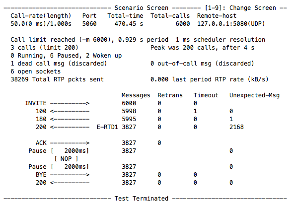
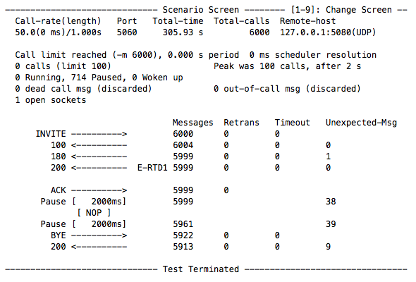
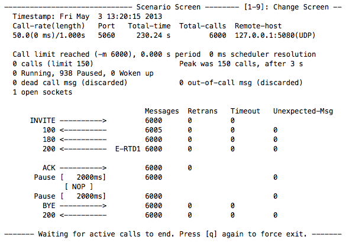

In the second part of the RestComm Load Testing Tutorial you will learn how to use SIPp to test an Interactive Voice Response (IVR) application. You will also fine tune traffic levels and memory allocation to test your system's true capacity.

Although the sample is based on PHP, you can use other programming language of your choice.

= Requirements

For this tutorial, it's required that you:

* Understand part 1 of this tutorial.
* Setup your Apache Web Server as explained.

= Configuration

The application's entry point will be the *ask-digit.xml* file that asks the user to insert a digit of his choice. The application will wait up to 10 seconds for the user to insert one digit. If the user fails to provide the digit in that interval then a message will be played telling the user to try again later.

* $RESTCOMM_HOME/server/default/deploy/restcomm.war/demo/ask-digit.xml

[source,lang:default,decode:true]
----
<?xml version="1.0" encoding="UTF-8"?>
<Response>
<Gather action="http://127.0.0.1/say-digit.php" numDigits="1" timeout="10">
<Say>Please, enter one digit</Say>
</Gather>
<Say>Operation timeout. Please try again later.</Say>
</Response>
----

After the user inserts a digit, the application will invoke *say-digit.php* using the inserted digit as parameter. The function of this file is simply to play the digit inserted by the user. Note that this file only needs *Read* permission.

For debugging purposes, we added a flag in the code called $**active_log** that defines whether the application should log the DTMF validation into a log file called *say-digit-result.txt* located in the *$DOCUMENT_ROOT* directory. Basically, if the application finds that the digit inserted by the user is the expected then it will write a _pass_ line in the log file. Otherwise, it will write __fail__. Don't forget to grant *Write* permission to this file.

NOTE: The $DOCUMENT_ROOT variable refers to the root of your web server directory. Its value depends on the Operating System you're using.

After testing the application you can use the following command to check if SIPp is sending DTMF signals as expected:

[source,lang:default,decode:true]
----
grep -c ^fail$ $DOCUMENT_ROOT/say-digit-result.txt
----

The number returned by the command equals the number of unexpected DTMF signals that were sent to the application, thus it must always be zero. If you change the regular expression to *^pass$* you can obtain the number of expected DTMF signals that were sent.

As mentioned before, this is simply a tool created for debugging purposes. You should disable it if you're aiming for high traffic levels!

As you will see further down in this example, SIPp will be configured to send a DTMF '5' signal to the application. If you choose to create your own scenario, please change the value of the *$expected_num* variable accordingly.

IMPORTANT: If you are logging the DTMF signal validations then don't forget to clean the contents of the file *say-digit-result.txt* before running a new test.

*$DOCUMENT_ROOT/say-digit.php*  

[source,lang:default,decode:true]
----
<?php
header('Content-type: text/xml');

$patient_num = (int) ($_REQUEST['Digits']);
$active_log = true;

if($active_log == true) {
$expected_num = 5;
$file_name = 'say-digit-result.txt';

$result = "fail\n";
if($patient_num == $expected_num) {
$result = "pass\n";
}
file_put_contents($file_name, $result, FILE_APPEND|LOCK_EX);
}

echo '<?xml version="1.0" encoding="UTF-8"?>';
echo '<Response>';
echo '<Say>The digit you inserted was '.$patient_num.'</Say>';
echo '</Response>';
?>
----

Now that both files are created, we can start the Media Server and Application Server. Finally, use cURL to bind the ask-digit.xml to RestComm as explained in previous tutorials.

IMPORTANT: Don't forget to use a different phone number from the one used in the previous tutorial! You can also unbind the previous phone number from the *hello-world* application if you prefer.

= SIPp

Although SIPp is mainly used as a traffic generator for the SIP protocol, it can also send media traffic through link:http://sipp.sourceforge.net/doc/reference.html#RTP+echo[RTP echo] and link:http://sipp.sourceforge.net/doc/reference.html#PCAP+Play[RTP / pcap] replay. In this tutorial we will use the PCAP PLAY feature to send DTMF signals to our application.

PCAP play commands allows you send a pre-recorded RTP stream using link:http://www.tcpdump.org/pcap3_man.html[pcap library]:

* **play_pcap_audio** sends the RTP stream using the __m=audio__ SIP/SDP line port as a base for the replay.
* **play_pcap_video** sends the RTP stream using the _m=video_ SIP/SDP line port as a base for the replay.

The scenario used in this example is the following: *uac_pcap.xml*

[source,lang:default,decode:true]
----
<?xml version="1.0" encoding="ISO-8859-1" ?>
<!DOCTYPE scenario SYSTEM "sipp.dtd">
<scenario name="UAC with media">

<!-- Send INVITE-->
<send retrans="500">
<![CDATA[
INVITE sip:[service]@[remote_ip]:[remote_port] SIP/2.0
Via: SIP/2.0/[transport] [local_ip]:[local_port];branch=[branch]
From: sipp <sip:sipp@[local_ip]:[local_port]>;tag=[call_number]
To: sut <sip:[service]@[remote_ip]:[remote_port]>
Call-ID: [call_id]
CSeq: 1 INVITE
Contact: sip:sipp@[local_ip]:[local_port]
Max-Forwards: 70
Subject: Performance Test
Content-Type: application/sdp
Content-Length: [len]

v=0
o=user1 53655765 2353687637 IN IP[local_ip_type] [local_ip]
s=-
c=IN IP[local_ip_type] [local_ip]
t=0 0
m=audio [auto_media_port] RTP/AVP 8
a=rtpmap:8 PCMA/8000
a=rtpmap:101 telephone-event/8000
a=fmtp:101 0-11,16
]]>
</send>

<!-- Receive TRYING -->
<recv response="100" optional="true" />

<!-- Receive RINGING -->
<recv response="180" optional="true" />

<!-- Receive OK -->
<!-- By adding rrs="true" (Record Route Sets), the route sets -->
<!-- are saved and used for following messages sent. -->
<!-- Useful to test against stateful SIP proxies/B2BUAs. -->
<recv response="200" rtd="true" crlf="true" />

<!-- Send ACK -->
<send>
<![CDATA[
ACK sip:[service]@[remote_ip]:[remote_port] SIP/2.0
Via: SIP/2.0/[transport] [local_ip]:[local_port];branch=[branch]
From: sipp <sip:sipp@[local_ip]:[local_port]>;tag=[call_number]
To: sut <sip:[service]@[remote_ip]:[remote_port]>[peer_tag_param]
Call-ID: [call_id]
CSeq: 1 ACK
Contact: sip:sipp@[local_ip]:[local_port]
Max-Forwards: 70
Subject: Performance Test
Content-Length: 0
]]>
</send>

<!-- Simulate user listening to message -->
<pause milliseconds="2000"/>

<!-- Simulate user response by playing an out of band DTMF '5' -->
<nop>
<action>
<exec play_pcap_audio="$SIPP_HOME/pcap/dtmf_2833_5.pcap"/>
</action>
</nop>

<!-- Simulate user listening to message -->
<pause milliseconds="2000"/>

<!-- Send BYE -->
<send retrans="500">
<![CDATA[
BYE sip:[service]@[remote_ip]:[remote_port] SIP/2.0
Via: SIP/2.0/[transport] [local_ip]:[local_port];branch=[branch]
From: sipp <sip:sipp@[local_ip]:[local_port]>;tag=[call_number]
To: sut <sip:[service]@[remote_ip]:[remote_port]>[peer_tag_param]
Call-ID: [call_id]
CSeq: 2 BYE
Contact: sip:sipp@[local_ip]:[local_port]
Max-Forwards: 70
Subject: Performance Test
Content-Length: 0
]]>
</send>

<!-- Receive OK -->
<!-- The 'crlf' option inserts a blank line in the statistics report. -->
<recv response="200" crlf="true" />

<!-- STATISTICS -->
<!-- response time repartition table (unit is ms) -->
<ResponseTimeRepartition value="100, 500, 1000, 2000, 3000, 4000, 5000, 6000"/>
<!-- call length repartition table (unit is ms)-->
<CallLengthRepartition value="500, 1000, 2500, 5000, 6000, 7000, 8000, 9000, 10000"/>
</scenario>
----

= Executing Load Tests

Now that all the required components are configured, its time to execute the load tests.

By running the following instruction in your command line, SIPp will start generating SIP traffic according to the specified scenario. Notice the parameter *-mi 127.0.0.1* which is used to identify the local IP address for RTP echo. Without it the application will not receive the DTMF signals.

Also, the parameters that define the traffic levels were raised in order to find the server's maximum capacity. With that purpose in mind, it's desired that your system dedicate all available resources to the stress test.

----
sudo sipp -sf ./uac_pcap.xml -s 1234 127.0.0.1:5080 -mi 127.0.0.1 -l 200 -m 6000 -r 50 -trace_screen -recv_timeout 400000 -t un -nr"
---- 

NOTE: You may need to run this command as root because the PCAP play feature uses pthread_setschedparam calls from pthread library.

NOTE: To check if the PCAP PLAY feature is actually working, assert that you have the correct audio files in the directory _$RESTCOMM_HOME/server/default/deploy/restcomm.war/cache/acapela_ after running the test.

= Result Analysis

The following test cases were executed on a machine with the following specs:

* MacBook running OSX 10.8.3 (Mountain Lion).
* *Processor* 2.4 GHz Intel Core 2 Duo.
* *Memory* 4Gb 1067 MHz DDR3

[[test-case-1---server-under-too-much-stress]]
Test Case 1 - Server under too much stress
++++++++++++++++++++++++++++++++++++++++++

In this test case we ran the previous SIPp command to discover how the system would behave under bigger stress levels than the ones described in the first part of this tutorial. Basically, the system will be receiving calls at a rate of 50 calls per second, with a limit of 200 open calls. The main objective is to process a total of 6000 calls.

It's also important to mention the memory allocation parameters of the Application Server:

* -Xms = 512M
* -Xmx = 1536M
* -Xmn = 256M
* -XX:MaxPermSize=256M

*Scenario Screen* 

////
*Statistics Screen* 

image:./images/loadtest2_case1_stats.png[loadtest2_case1_stats,width=590,height=355]  
////

According to the results obtained, the system took 470.45 seconds to process 6000 calls, while receiving calls at a rate of 50 calls per second. This means the system could process 12.753 calls per second. Also, the maximum number of open calls was 200.

From the 6000 calls, only 3827 were successful. This means that our system is not providing a good quality of service, since it was unable to process a third of the received traffic under these stress conditions.

A quick look at the Application Server's log shows a list of the most common errors originated by stress:

* The Mgcp Stack Provider cannot handle transactions due to transient errors. This often occurs because of timeouts.
* *SpeechSynthesizerException* caused by timeouts related to the Acapela service.
* *OutOfMemoryException* caused by memory limitations does not allow the server to create more threads to process the calls.

The system seemed to be able to process the traffic until, more or less, 3000 calls. Then, due to memory limitations, the system became stressed and was unable to process the following calls that corresponded to approximately a third of total traffic. The problem is that the system is not capable of processing all the opened calls while receiving more and more traffic each and every second.

= Case 2 - Lowering stress to accommodate server's capacity

In the previous example we concluded that the system was providing a poor quality of service because it was under too much stress. However, the problems only occurred after half of the calls were already processed without errors and the main cause was memory issues. So, in this case, we'll maintain the objective of processing 6000 calls while receiving 50 calls per second, but we'll alleviate stress by lowering the number of open calls allowed to 100.

*Scenario Screen*

////
*Statistics Screen*

image:./images/loadtest2_case2_stats.png[loadtest2_case2_stats,width=590,height=351]

*Repartition Screen*

image:./images/loadtest2_case2_repartition.png[loadtest2_case2_repartition,width=590,height=319]
////

Looking at the results we can immediately see a huge improvement when comparing with the previous results. Just by lowering the maximum number of open calls to 100, the system needed 305.93 seconds to process the 6000 calls, while receiving calls at a rate of 50 calls per second. The means the system could process 19.609 calls per second. Also, the number of failed calls dropped to 87!

Looking at the Application Server's log, the causes behind the failed calls are all related to timeouts.

= Case 3 - Allocating more memory to the Application Server

By analysing previous test results, we saw that the system couldn't handle the stress of having 200 open calls. After some time under stress, services like the Speech Synthesizer became unresponsive and memory-related problems occurred. Then, by lowering the maximum number of open calls to 100 the problems related to memory shortage disappeared but some timeouts still occurred.

To solve such problems we will try to find a balance between the stress levels and memory needs. In this test case, we will define the number of maximum open calls to 150 and allocate more memory to the Application Server:

* -Xms = 1024M
* -Xmx = 1536M
* -Xmn = 512M
* -XX:MaxPermSize=512M

*Scenario Screen*

////
*Statistics Screen*

image:./images/loadtest2_case3_stats.png[loadtest2_case3_stats,width=590,height=350]

*Repartition Screen*

image:./images/loadtest2_case3_repartition.png[loadtest2_case3_repartition,width=590,height=321]
////

Looking at the results we can immediately see a huge improvement when comparing with the previous results. The system only needed 230.24 seconds to process the 6000 calls, while receiving calls at a rate of 50 calls per second. The means the system could process 26.057 calls per second. And the quality of service is excellent since all the calls were processed without errors!

= Future Work

*We strongly encourage you to:*

* Test more complex applications like the Doctor's Appointment.
* Run SIPp with different sets of parameters and analyse the results.
* Try to fine tune SIPp parameters and memory allocation to find the true load capacity of your server.
* Use tools like link:http://www.wireshark.org/[Wireshark] to measure response times with a high precision.
