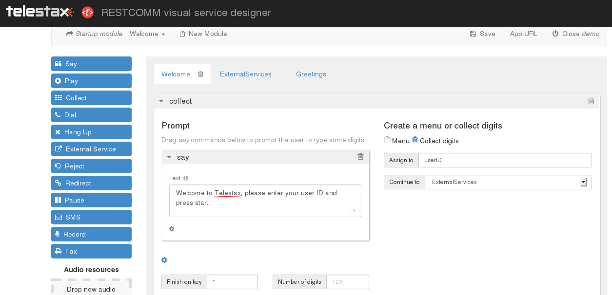
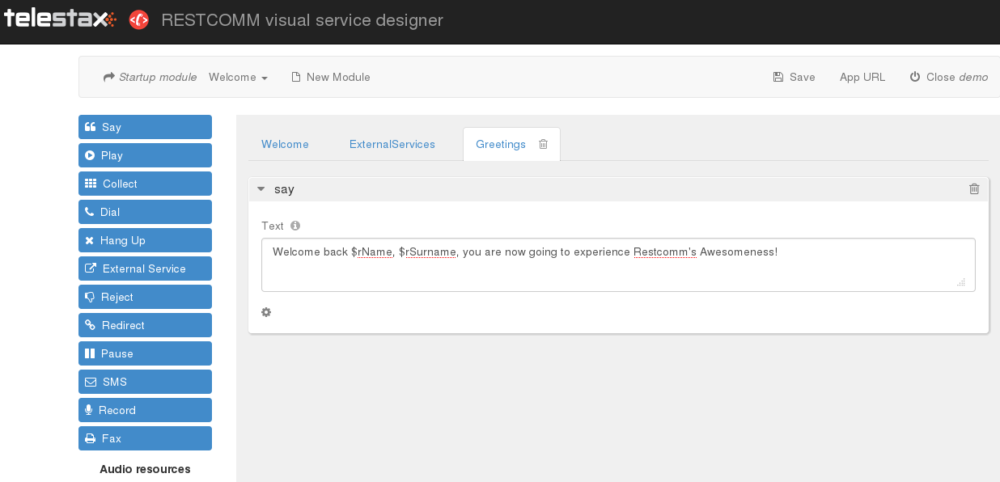
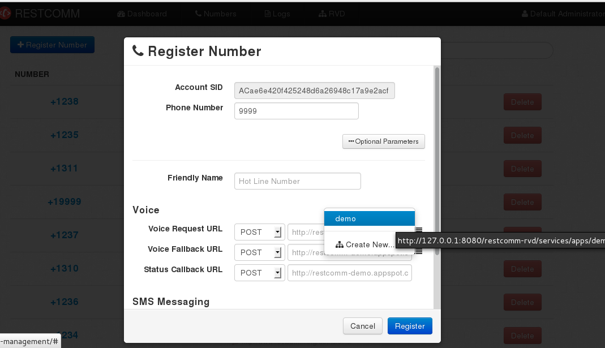

The Restcomm Visual Designer is a quick and great way to create communications application. However, when you have to deal with more complex applications, you might find the graphics interface limited. This is where the External Services can become a formidable tool. You will be able to design your application using the Visual Designer and build the logic using any programming language of your choice. This tutorial will help you understand the main features of the External Services. 

= Overview of the  demo

This demo application invites a user to enter his user ID. If the ID is correct, the user hears a welcome message. The checkID.php file provides the logic. You can see the content of the file at the end of this tutorial. 

== Step 1

Go to the RVD url on your web browser. In this demo application, the RVD url is http://127.0.0.1:8080/restcomm-rvd

* Next, create a new project
* In the main dashboard,
* Click on the "**New Module**" and change the name of the Untitled Module to "**ExternalServices**
* Click on the "**New Module**" and change the name of the Untitled Module to "**Greetings**,

You should now have 3 modules Welcome, ExternalServices and Greetings

[[configure-welcome-module]]
=== Configure Welcome Module

* In the Welcome module,delete the default welcome *Say* verb
* *Drag-and-drop* the *Collect* verb into the *Welcome* module
* Next drag-and-drop the *Say* verb onto the *Prompt* window of the *Collect* Verb
* Type the following in the textarea of the Say verb: *Welcome to Telestax, please enter your user ID and press star.*
* Click the option button at the bottom of the page to expose the "**Finish on key**"
* Enter asterisk or the star sign (*) without the brackets in the "**Finish on key**" textarea
* Under the *Create* a menu or collect digits, select "**Collect digits**"
* In the *Assign to* text area, type *userID*
* **Continue to**, select "**ExternalServices**"
* Press the *Save* button at the top of the page

You should see a screen similar to the one below 

=== Configure ExternalServices Module

* Click on the ExternalServices module you created previously.
* Drag-and-drop the *External Services* button into the module window.
* In the **Services URL**, enter the URL of your external service. In this demo, the URL is http://127.0.0.1/checkID.php
* Click on "**Add URL parameter**"
* Name = custID, Value = $userID .

____________________________________________________________________________________________________________
(**custID is a variable in the checkID.php and the $userID is the same variable set in the Welcome module**)
____________________________________________________________________________________________________________

* Under, *Assign response to* variables, click on the "Add assignment" button
* in the *Assign to* textarea, type **rName**,
* Select *Object->PropertyNamed.*
* Type *userName* in the textarea and press "**Add operation**"
* Select "**value**" and then click "**Done**"
* **Module Scope**, select "**Greetings**"

________________________________________________________________________________________________________________________________________________________________________________________________________________________________________________________________________________
The checkID.php file exposes the following json object **\{"userName":"John","userSurname":"Smith","userID":"11","nextModule":"Greetings"}.**the *rName* you created above is an RVD variable that will hold the content of the *userName* object property from the checkID.php.
________________________________________________________________________________________________________________________________________________________________________________________________________________________________________________________________________________

* Next, click on the "**Add assignment**" button a second time
* in the *Assign to* textarea, type **rSurname**,
* Select *Object->PropertyNamed.*
* Type *userSurname* in the textarea and press "Add operation"
* Select "**value**" and then click "**Done**"
* **Module Scope**, select "**Greetings**"

* Under **Make a routing decision**, check *Continue to* and select *Dynamic*
** Select *Object->PropertyNamed.*
** Type *nextModule* in the textarea and press "**Add operation**"
** Select "**value**" and then click "**Done**"
** Press the *Save* button at the top of the page

______________________________________________________________________________________________________________________
The *nextModule* object property will contain *Greetings* which is the module to which the application will be routed.
______________________________________________________________________________________________________________________

The finished configuration will be similar to the screenshot below: 

image:./images/rvd-ES-1.png[rvd-ES-1,width=674,height=327]

=== Configure Greetings Module

* *Drag-and-drop* the *Say* verb into the *Greetings* module
* In the textarea, enter the following text : *Welcome back $rName, $rSurname, you are now going to experience Restcomm's Awesomeness!*

_________________________________________________________________________________________________________________________________________
The *$rName* and *$rSurname* are the RVD variables created in the previous module and they will now contain the value of the Json object.
_________________________________________________________________________________________________________________________________________

* Press the *Save* button at the top of the page

Screenshot below 

== Step 2

In order to be able to use the application, you must link it to a Restcomm phone number. Log into the Restcomm management dashboard. On a local default install, it is located at this URL http://127.0.0.1:8080/

* Click on the menu *Numbers*
* Click on *+Register Number* button **
* *Phone Number* = 9999
* Click on *Optional Parameters*
* In the **Voice Request URL**, click on the select list and choose the name of the application you created in the RVD. In this case, the name is *demo*
* leave the rest of the options as default
* Click on the *Register* button.

Screenshot below 

Log into a SIP phone using any of the default Restcomm client (bob or alice) and make a phone call to the number 9999 you created and linked to the demo application. You will be prompted to enter your user ID (11 or 12). You will then hear the corresponding welcome message depending on your user ID.  

[[content-of-checkid.php]]
=== Content of checkID.php

You can host this file anywhere you desire and link it to the RVD demo application above.  

[source,lang:php,decode:true]
----
<?php

$userID = (int)$_REQUEST['custID'];

//create associative arrays

$userMale = array("userName"=>"John", "userSurname" => "Smith", "userID" => "11", nextModule => "Greetings");

$userFemale = array("userName"=>"Alice", "userSurname" => "Jackson", "userID" => "12", nextModule => "Greetings");

if ($userID == 11) {

echo json_encode ($userMale);

}
 elseif ($userID == 12){
echo json_encode ($userFemale);
}

?>
----   
