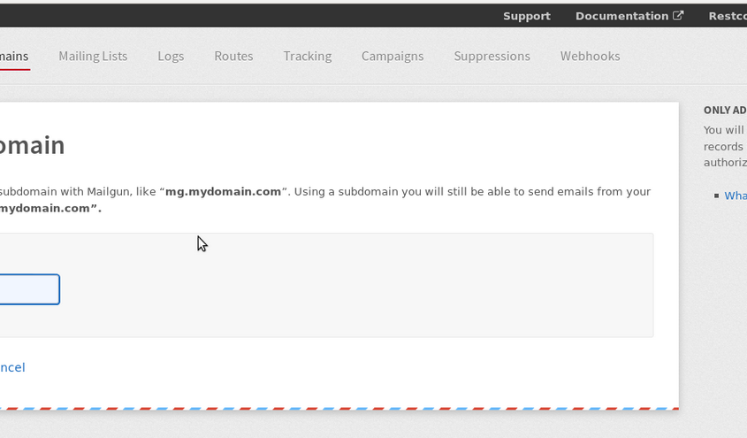
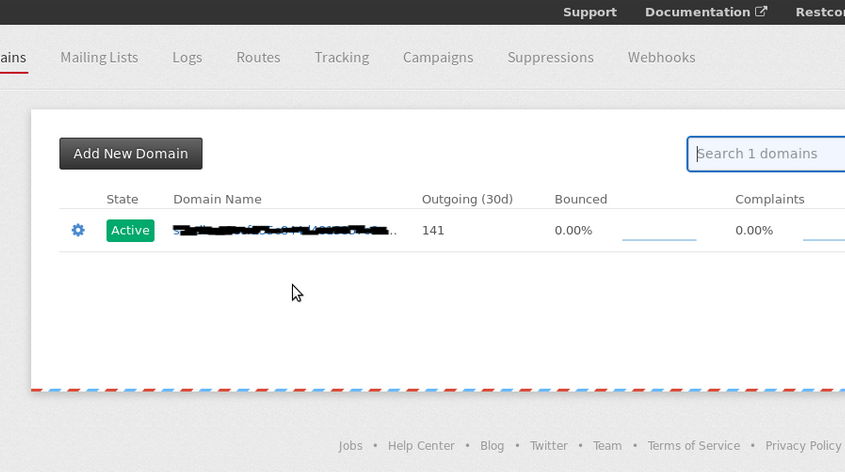
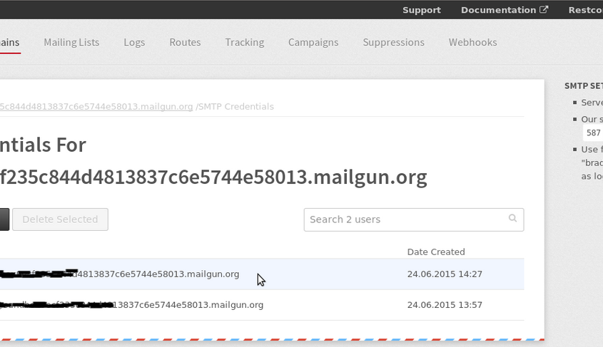

[[requirements]]
Requirements
^^^^^^^^^^^^

* Knowledge of MailGun

RestComm email verb uses SMTP protocol to send emails. Mailgun supports SMTP, using the server “smtp.mailgun.com” (google: smtp.gmail.com, hotmail:smtp.live.com). To use mailgun as an email service follow the steps below:

[[create-an-account-in-mailgun]]
Create an account in MailGun
^^^^^^^^^^^^^^^^^^^^^^^^^^^^

image:./images/createMailGunacc-845x425.png[createMailGunacc,width=845,height=425]

[[add-custom-domain]]
Add a custom domain 
^^^^^^^^^^^^^^^^^^^

Associate an account with an external email server -  e.g. gmail.

[[verify-the-custom-domain]]
Verify the custom domain
^^^^^^^^^^^^^^^^^^^^^^^^

[[manage-smtp-credentials]]
Manage SMTP credentials
^^^^^^^^^^^^^^^^^^^^^^^

To manage SMTP credentials, go to Domains section in Mailgun Dashboard. Click on the New SMTP Credential to add new credential

The configured credentials will be used in RestcComm configuration to send email. 

[[email-configuration]]
RestComm Email Configuration
^^^^^^^^^^^^^^^^^^^^^^^^^^^^

The email configuration for RestComm, needs to be set at the Restcomm.xml file (standalone/deployments/restcomm.war/WEB-INF/conf). 

Email configuration example:

[source,lang:default,decode:true]
----
<smtp-service>

               <host>smtp.mailgun.com</host>

               <user>Login Set at the SMTP Credentials step</user>

               <password>Password set at SMTP Credentials step</password>

</smtp-service>
----

* Port number can be set using the port tag. If not set default SMTP port (25) is used. E.g. <port>3025</port>  
