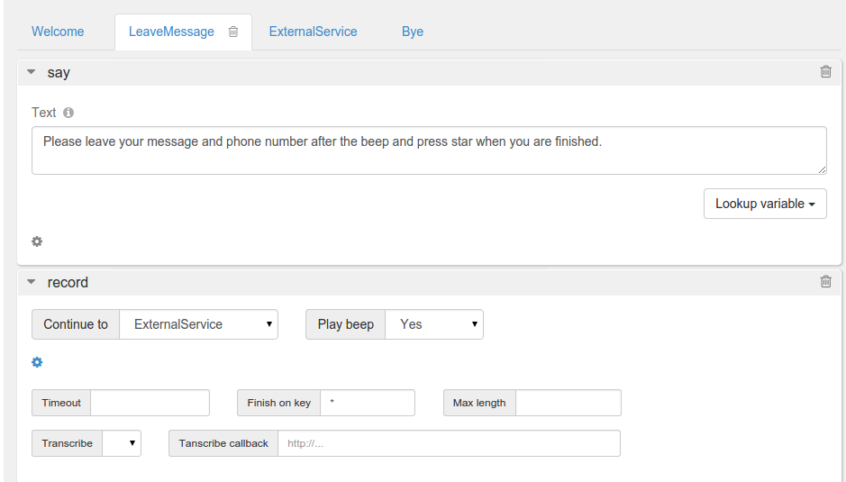
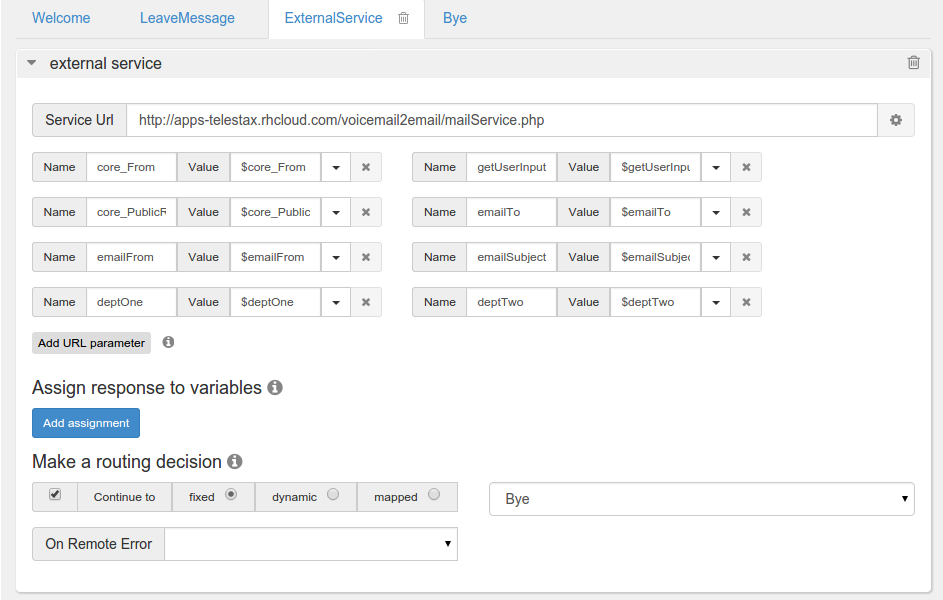
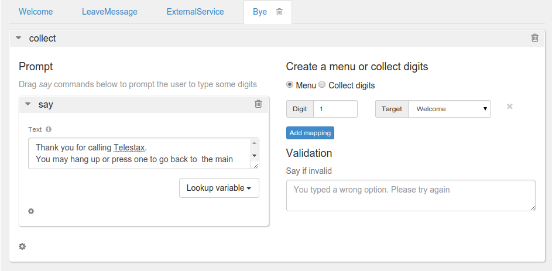

This tutorial will show you how to build a Restcomm powered app *Voicemail to Email* that can be used within the context of a small business. When a customer leaves a voicemail, an email is automatically sent to the callee. The email will contain details about the caller and a URL link to listen to the voicemail. You can download a working  "Voicemail to Email" app http://apps.restcomm.com/apps/[HERE] or proceed below to learn how to build a similar app.

The email part of the app is powered by Mailgun but you are free to use any email service provider of your choice.

= Requirements

* knowledge of Restcomm
* knowledge of PHP
* knowledge of JSON
* knowledge of MailGun service
* Web server to host PHP scripts

[[application-features]]
= Application features

* *Welcome module* - choose a department to leave a message for
* *LeaveMessage* – leave a message
* *ExternalService* – this module attach your voicemail and sent it to an email
* *Bye* - you can hang up or press 1 to go to the Welcome module

NOTE: To get the application working you will need to make and configure a MailGun account. You will also need Composer (https://getcomposer.org/) configured on your local host.

[[step-1]]
= Step 1

* Log into Restcomm Admin UI
* Create a new project
* Create the following modules: 
** Welcome 
** LeaveMessage 
** ExternalService 
** Bye

[[voicemail2email-modules]]
image:./images/Selection_004.png[Voicemail2Email modules,width=482,height=113]

[[step-2]]
= Step 2

* Go to *Welcome* module
* Add Collect verb
* Drag and drop Say verb into collect prompt. Enter the following text in the Say text area: "Welcome to Telestax. To leave a message for *$deptOne* press 1. For *$deptTwo* and general inquiries press 2."
* From the right side choose to collect digits.
* Enter **getUserInput** in Assign to text area. Choose application as a scope.
* Choose to continue to *LeaveMessage* module
* Go to Say if invalid area and type the following text: "**You have entered an invalid value, please try again."**
* Set 1 as Number of digits

image:./images/Selection_005.png[Welcome Module Voicemail2Email,width=845,height=552]

[[step-3]]
= Step 3

* Go to *LeaveMessage* module
* Drag and drop Say verb.
* Type the following in the text area: "**Please leave your message and phone number after the beep and press star when you are finished.**"
* Drag and drop Record verb
* Choose to continue to External Service module
* Choose beep to be played
* Set star as *Finish on key*

[[step-4]]
= Step 4

* Go to *ExternalService* module
* Drag and drop External Service
* Add as Url Parameters following variables:

|===
|Variable Name | Variable Value
| core_From | $core_From
| core_PublicRecordingUrl | $core_PublicRecordingUrl
| emailFrom | $emailFrom
| deptOne | $deptOne
| deptTwo | $deptTwo
| emailSubject | $emailSubject
| emailTo | $emailTo
| getUserInput | $getUserInput
|===

* Choose to Continue to Bye module
* When you are done the page should look similar to the screenshot below

[[step-5]]
= Step 5

* In this step we will create a PHP script that is going to send the recorded messages and caller ID from RestComm to e specific email address.

[source,lang:php,decode:true]
----
<?php

//require Composer autoload file
require 'vendor/autoload.php';
use Mailgun\Mailgun;

//External Service variables needed for the Application Voicemail2Email
$mgKey = $_GET["mgKey"];
$mgDomain = $_GET["mgDomain"];
$emailTo = $_GET["emailTo"];
$emailFrom = $_GET["emailFrom"];
$emailSubject = $_GET["emailSubject"];
$emailBody = $_GET["emailBody"];
$deptOne = $_GET["deptOne"];
$deptTwo = $_GET["deptTwo"];

//Get user's option for which department to leave a message.
$getUserInput = $_GET["getUserInput"];
//Get user phone number
$core_From=$_GET['core_From'];
//Get recording URL
$core_PublicRecordingUrl=$_GET['core_PublicRecordingUrl'];
//Warning message included in the email body
$warning = 'This is an automatic message sent from Smaill Company IVR. Please DO NOT reply to this message.';

//Sending the message to the department of choice
$messageFor;

if ($_GET['getUserInput'] == 1){

$GLOBALS['messageFor'] = $deptOne;

    } elseif($_GET['getUserInput'] == 2){
$GLOBALS['messageFor'] = $deptTwo;
}

//Sending the recording and caller information to specific email
$mgClient = new Mailgun($mgKey);
$result = $mgClient->sendMessage($mgDomain, array(
    'from'    => $emailFrom,
    'to'      => $emailTo,
    'subject' => $GLOBALS['messageFor'] . ':' . $emailSubject,
    'text'    =>   $emailBody . "\r\n" .
            ' Caller info : '. $core_From . "\r\n" .
            ' Click on the voicemail URL: ' .  $core_PublicRecordingUrl  ));

?>
----

*  Now go back to the ExternalService module and use the link to this script as Service URL

[[step-6]]
= Step 6

* Go to *Bye* module
* Drag and drop Collect verb
* Drag and drop Say into the collect prompt. Type the following in the Say text area: *"Thank you for calling Telestax.* *You may hang up or press one to go back to the main menu"*
* Choose to Create menu. Enter 1 as digit and choose Welcome module as a target.

You now have a fully functional Voicemail To Email service that can be used as a standalone solution or integrated into a more complex PBX solution.
