Restcomm Connect WebRTC makes tedious video call setup a thing of the past. You no longer need to install a client in order to communicate with business partners or worry about opening special ports on your firewall. All you need is a web browser and you are good to go.

In this quick tutorial, you will learn how to set up live video call and chat session powered by Restcomm WebRTC.   

= Technical Requirements

* _Basic knowledge of Restcomm_
* _Latest version of Google Chrome or Mozilla Firefox_

= Step 1

* to start with you have to access you own instance: http://YOUR_PUBLIC_IP_ADRESS:8080/webrtc/
* As default *Display Name* and *User Name* you should see *alice.*
* The *Domain* is *telestax.com*
* After entering these details click on the *Register* button.

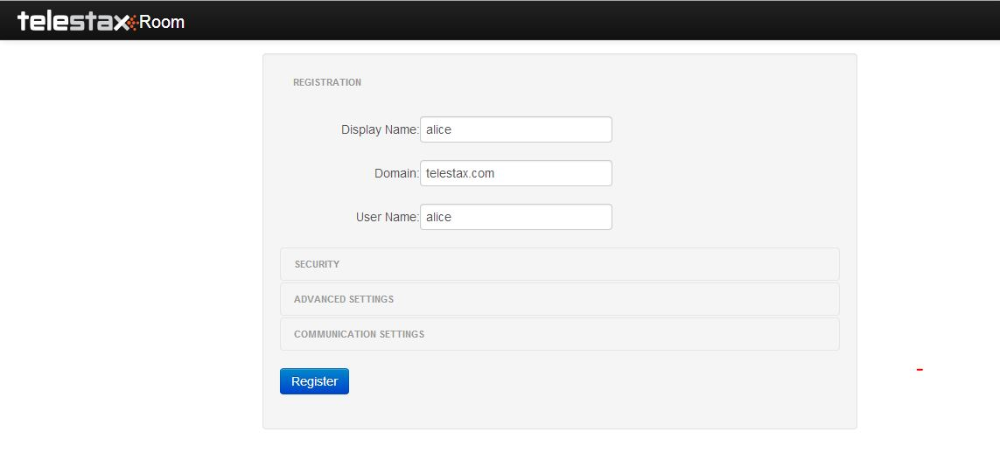

* The following screen should appear:

image:./images/31.jpg[3,width=743,height=244]

* Allow the browser to use you camera and microphone.

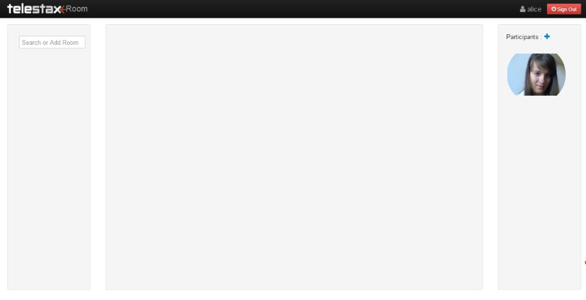

= Step 2

* Access **http://YOUR_PUBLIC_IP_ADRESS:8080/webrtc**/ from a new tab in your browser.
* Change the *User Name* and *Display Name* to **bob**.
* In the *Security* section also modify to **bob**.

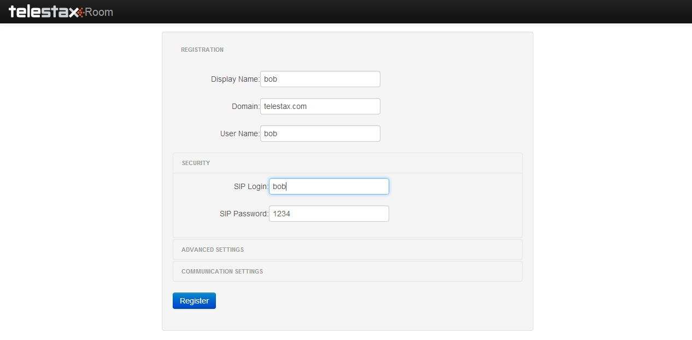

* Then click **Register**.
* Allow your browser to access you camera and microphone

image:./images/61.jpg[6,width=688,height=202]

[[bobuser]]
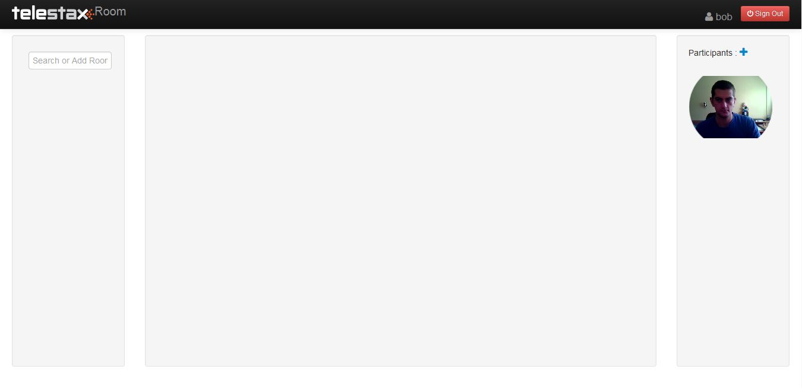

= Step 3

* Go back to *alice* client and click on *Search or add room*
* Type *bob* and click on the plus button.

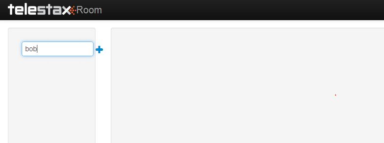

* Then click on *bob* that appears below and start typing

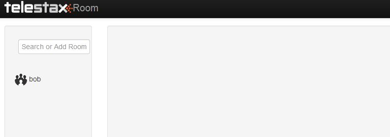

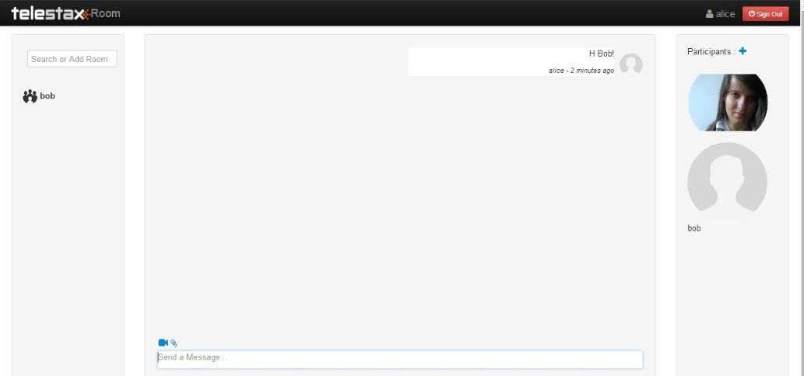

= Step 4

* Click on the cam icon to start a video call.

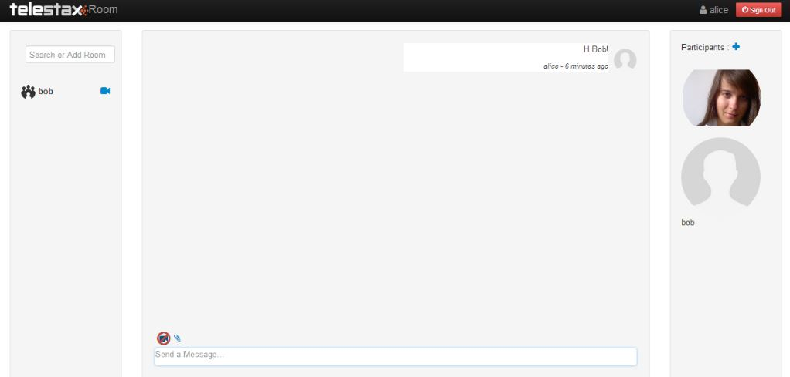

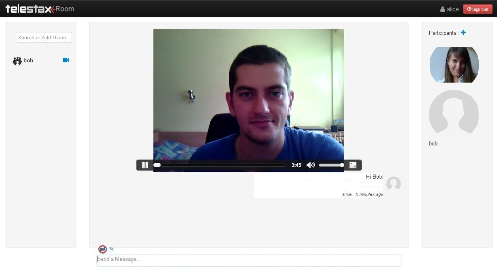

= Step 5

* Go back to *bob* user and answer the call.

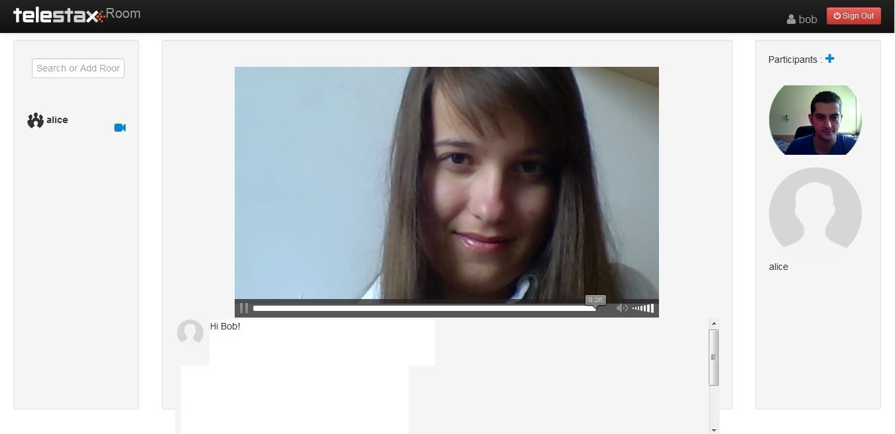

Conversation between two clients will look like this:

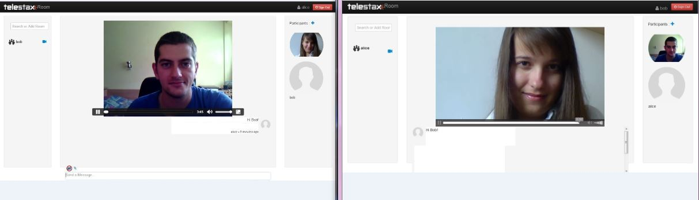
