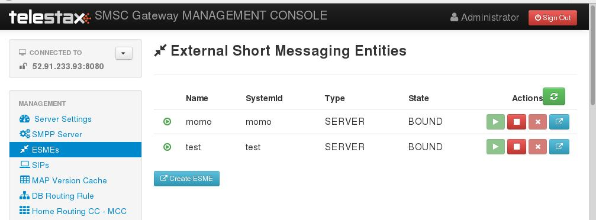
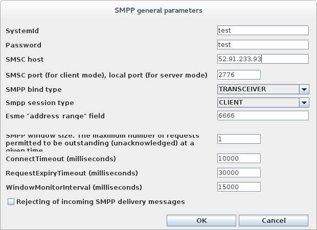
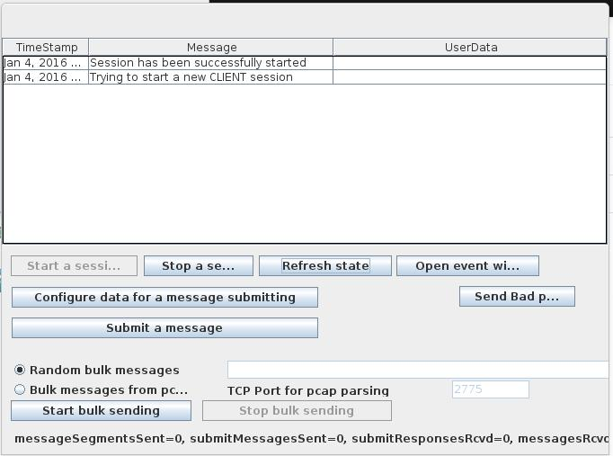
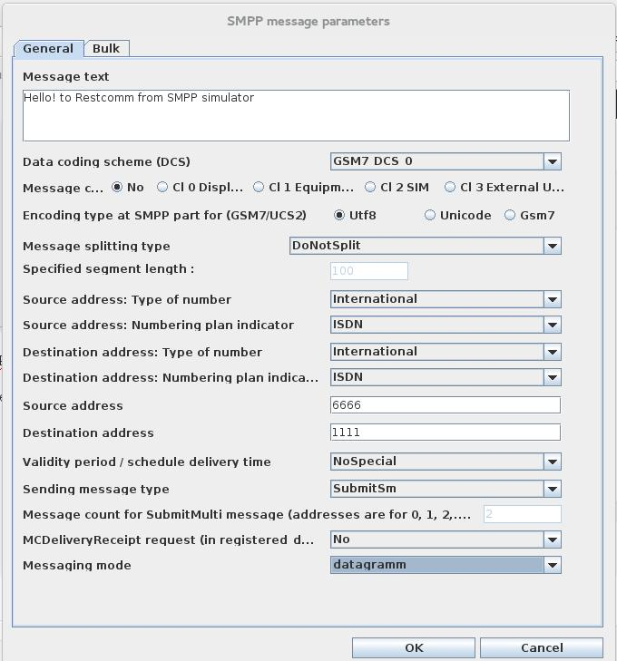
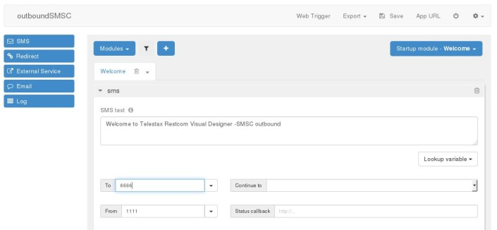
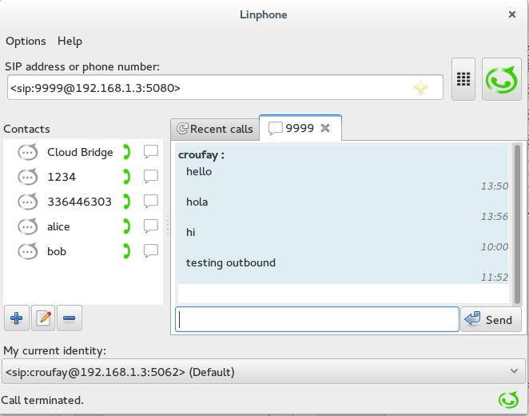
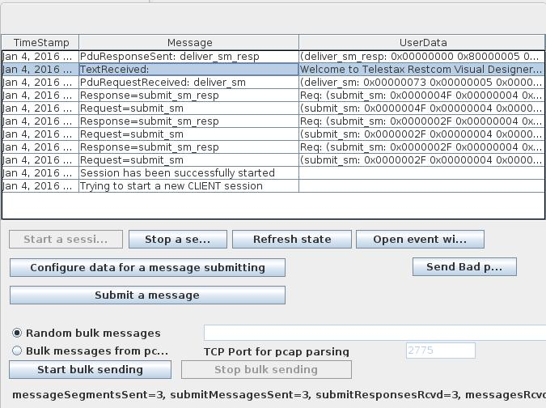

This tutorial will show how to configure Restcomm to allow messages from any SMPP endpoint through the Telscale SMSC gateway.

[[requirements]]
Requirements
~~~~~~~~~~~~

* Latest Restcomm version
* Latest Telscale SMSC Gateway
* You must understand how to Install and run Restcomm and Telscale SMSC Gateway (http://docs.telestax.com/smsc-quick-start-user-guide/[Install and Start SMSC Gateway])

[[step-1---start-telscale-smsc-gateway]]
Step 1 - Start Telscale SMSC Gateway
~~~~~~~~~~~~~~~~~~~~~~~~~~~~~~~~~~~~

* Make sure the Cassandra DB is already started and configured as explained http://docs.telestax.com/smsc-quick-start-user-guide/[HERE]
* Start the Telscale SMSC gateway as follows :  *$SMSC_HOME/bin/run.sh -b 192.168.1.3 -c simulator*
* Open your web browser and go to the url : *http://192.168.1.3:8080/smsc-management/*

Enter the default credentials as follows:

* username : admin
* passwood : admin

[[step-2---create-2-esmes]]
Step 2 - Create 2 ESMEs
~~~~~~~~~~~~~~~~~~~~~~~

In the SMSC admin GUI, create 2 ESMEs. In the example below we have "test" and "momo"

[[restcomm-smsc-integration]]

[[esme-test]]
ESME test
^^^^^^^^^

Use the configuration below and any field not mentioned should be left as default

[source,lang:default,decode:true]
----
ESME Name = test
System Id = test
Password = test
IP Address = -1
Port = -1
Smpp Bind Type = Tranceiver
Smpp Session Type = Server
ESME Range = 6666
Source Range = 6666
Routing Range = 6666
----

[[esme-momo]]
ESME momo
^^^^^^^^^

Use the configuration below and any field not mentioned should be left as default

[source,lang:default,decode:true]
----
ESME Name = momo
System Id = momo
Password = momo
IP Address = -1
Port = -1
Smpp Bind Type = Tranceiver
Smpp Session Type = Server
ESME Range = 1111
Source Range = 1111
Routing Range = 1111
----

[[step-3---start-the-smpp-simulator]]
 Step 3 - Start the SMPP Simulator
~~~~~~~~~~~~~~~~~~~~~~~~~~~~~~~~~~

* Start the SMPP simulator as follows : *$SMSC_HOME/tools/TelScale-smpp-simulator/bin/run.sh*
* Click on the button : *Configure*
* Change the *SMSC Host* address to point to the Telscale SMSC gateway IP address.
* Click on the button "**Ok**" to validate the changes (Screenshot below)

* Click on the button "**Run test**" - In the window, click on the button "Start a session". Make sure the session is successfully started

[[step-4---configure-restcomm-to-use-smpp]]
Step 4 - Configure Restcomm to Use SMPP
~~~~~~~~~~~~~~~~~~~~~~~~~~~~~~~~~~~~~~~

Edit the file  *$RESTCOMM_HOME/bin/restcomm.conf* 

You must set the *SMPP_ACTIVATE variable to true for SMPP to be activated*

[source,lang:default,decode:true]
----
# Connection details for SMPP Restcomm integration
SMPP_ACTIVATE='true'            #default SMPP activate is always false. Set to true to activate SMPP
SMPP_SYSTEM_ID='momo'
SMPP_PASSWORD='momo'
SMPP_SYSTEM_TYPE='' #This is required when working with Nexmo for inboudn SMS
SMPP_PEER_IP='52.91.233.93'  #use IP or DNS name of peer SMPP server
SMPP_PEER_PORT='2776'
----

[[step-5---configure-restcomm-ip-and-required-features]]
Step 5 - Configure Restcomm IP and Required Features
~~~~~~~~~~~~~~~~~~~~~~~~~~~~~~~~~~~~~~~~~~~~~~~~~~~~

The next step is to configure the IP address and other features required to start Restcomm as explained <<../configuration/Starting Restcomm-Connect.adoc#start-restcomm-connect,Starting Restcomm-Connect>>

If SMPP is correctly started, you should see an output similar to the one below in the console.

[source,lang:default,decode:true]
----
08:19:22,697 INFO  [org.mobicents.servlet.restcomm.smpp.SmppClientOpsThread] (Thread-602) SmppClientOpsThread started.
08:19:22,697 INFO  [org.mobicents.servlet.restcomm.smpp.SmppService] (RestComm-akka.actor.default-dispatcher-6) SMPP Service started
08:19:22,796 INFO  [org.jboss.as] (Controller Boot Thread) JBAS015961: Http management interface listening on http://127.0.0.1:9990/management
08:19:22,797 INFO  [org.jboss.as] (Controller Boot Thread) JBAS015951: Admin console listening on http://127.0.0.1:9990
08:19:22,797 INFO  [org.jboss.as] (Controller Boot Thread) JBAS015874: JBoss AS 7.2.0.Final "Janus" started in 10923ms - Started 477 of 557 services (79 services are passive or on-demand)
----

If you check the Telscale SMSC Gateway GUI, you should now see that the 2 ESMEs are now in state "BOUND"

[[step-6---sending-sms-to-restcomm-from-the-smpp-simulator]]
Step 6 - Sending SMS to Restcomm from the SMPP Simulator
~~~~~~~~~~~~~~~~~~~~~~~~~~~~~~~~~~~~~~~~~~~~~~~~~~~~~~~~

* Create an SMS application as shown in the screenshot below
* Enable *Application Logging* from the Project Setting at the top right hand corner of the screen

image:./images/inboundSMSC-app.jpg[inboundSMSC-app,width=648,height=240]

* Register a SIP number *1111*
* Attach the app inboundSMSC to the *SMS URL Request*
* Whenever a message is sent to the number 1111, Restcomm will log the content as defined in the application *inboundSMSC*

[[send-a-message-from-the-smpp-simulator-to-restcomm]]
Send a Message from the SMPP simulator to Restcomm
^^^^^^^^^^^^^^^^^^^^^^^^^^^^^^^^^^^^^^^^^^^^^^^^^^

* In the SMPP simulator "Run Test" window, press the button "**Configure data for message submitting**" (see screenshot below)
* Validate your changes and press the button "Submit a message "

In the Restcomm console, you should see a message similar to the one below

[source,lang:default,decode:true]
----
09:51:37,815 INFO  [org.mobicents.servlet.restcomm.smpp.SmppHandlerInboundForwarder] (RestComm-akka.actor.default-dispatcher-39) SMPP Message Accepted - 
A Restcomm Hosted App is Found for Number : 1111
----

[[step-7-sending-sms-to-the-smpp-simulator-from-restcomm]]
Step 7  Sending SMS to the SMPP Simulator from Restcomm
~~~~~~~~~~~~~~~~~~~~~~~~~~~~~~~~~~~~~~~~~~~~~~~~~~~~~~~

* Create an SMS app using RVD to send outbound message (See screenshot below)

* Note that the message will be sent to the number 6666 which is the number on which the SMPP simulator is listening.
* Register a SIP number 9999 and attach it to the SMS "**outboundSMSC**" application above using the "**SMS Request URL**".
* Use a SIP phone like Linphone to send a message to the 9999 number. This will activate the app "**outboundSMSC**" and send an SMS to the SMPP simulator. (See screenshot below)

Check the SMPP simulator to make sure the message has been received (See screenshot below) 

